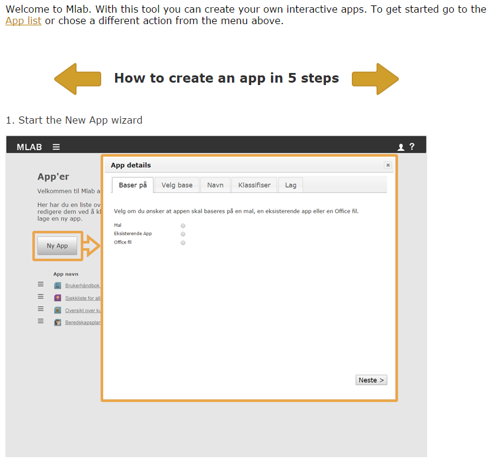

# Appyoumake development guide 

<table>
<tbody>
<tr class="odd">
<td></td>
<td></td>
<td><p><strong>Authors</strong></p>
<p>Arild Bergh, Cecilie Jackbo Gran</p>
<p>15 Juni 2017</p>
<p>This document explains how to develop Appyoumake components and templates. Appyoumake is a complete app creation framework and eco system that includes an app editor facility, an app compiler service and an app market. It facilitates the quick and easy development of mobile apps by non-developers; hence it provides opportunities for training, research and information sharing on many levels in the Norwegian defence as well as in civilian organisations. Appyoumake apps are built from templates and components, additional templates and components can be built from HTML5/CSS3/Javascript.</p></td>
<td></td>
</tr>
<tr class="even">
<td></td>
<td></td>
<td></td>
<td></td>
</tr>
</tbody>
</table>

Contents

[1 Introduction 5](#introduction)

[2 Appyoumake explained for template and component developers
7](#mlab-explained-for-template-and-component-developers)

[2.1 Who is this section for? 7](#who-is-this-section-for)

[2.2 Appyoumake overview 7](#mlab-overview)

[2.3 Summary of Appyoumake terms/concepts 8](#summary-of-mlab-termsconcepts)

[3 Appyoumake app builder code - developers’ guide
13](#mlab-app-builder-code---developers-guide)

[3.1 Tools used 13](#tools-used)

[3.2 How to code for the Appyoumake editor
13](#how-to-code-for-the-mlab-editor)

[3.3 Apps: names and versions (and the market too)
14](#apps-names-and-versions-and-the-market-too)

[3.4 Tips and tricks 15](#tips-and-tricks)

[3.5 Gotchas & tips relating to Symfony
15](#gotchas-tips-relating-to-symfony)

[4 Appyoumake App Builder: Component developers' guide
17](#mlab-app-builder-component-developers-guide)

[4.1 Who is this section for? 17](#who-is-this-section-for-1)

[4.2 The three component types illustrated and discussed
17](#the-three-component-types-illustrated-and-discussed)

[4.3 Why the difference between a feature and a storage plugin?
20](#why-the-difference-between-a-feature-and-a-storage-plugin)

[4.4 Relationship between components and templates
20](#relationship-between-components-and-templates)

[4.5 App creation workflow: Appyoumake automation and manipulation
opportunities
21](#app-creation-workflow-mlab-automation-and-manipulation-opportunities)

[4.6 App creation activities relevant to the component
21](#app-creation-activities-relevant-to-the-component)

[4.7 Practical component development information: Background
26](#practical-component-development-information-background)

[4.8 How to create a component 27](#how-to-create-a-component)

[4.9 How to create a feature 30](#how-to-create-a-feature)

[4.10 How to create a storage plugin
31](#how-to-create-a-storage-plugin)

[4.11 Deploying a component/feature/storage plugin
32](#deploying-a-componentfeaturestorage-plugin)

[4.12 Best practices + tips and tricks for creating components
33](#best-practices-tips-and-tricks-for-creating-components)

[4.13 Prerequisites/assumptions that components can rely on
37](#prerequisitesassumptions-that-components-can-rely-on)

[5 The code\_dt.js component file in detail
38](#the-code_dt.js-component-file-in-detail)

[5.1 Functions that are called in code\_dt.js
40](#functions-that-are-called-in-code_dt.js)

[6 The code\_rt.js component file in detail
45](#the-code_rt.js-component-file-in-detail)

[6.1 Components using storage plugins
45](#components-using-storage-plugins)

[6.2 Functions that are called in code\_rt.js
46](#functions-that-are-called-in-code_rt.js)

[7 The conf.yml component file in detail
47](#the-conf.yml-component-file-in-detail)

[8 The server\_code.php component file in detail
55](#the-server_code.php-component-file-in-detail)

[9 Appyoumake App Builder: Template developers' guide
59](#mlab-app-builder-template-developers-guide)

[9.1 Who is this section for? 59](#who-is-this-section-for-2)

[9.2 The role of the template illustrated and discussed
59](#the-role-of-the-template-illustrated-and-discussed)

[9.3 App creation activities relevant to the template
61](#app-creation-activities-relevant-to-the-template)

[9.4 How to create a template 63](#how-to-create-a-template)

[9.5 Naming and placing files 66](#naming-and-placing-files)

[9.6 Deploying a template 66](#deploying-a-template)

[10 The conf.yml template file in detail
67](#the-conf.yml-template-file-in-detail)

[11 The frontpage.html template file in detail
70](#the-frontpage.html-template-file-in-detail)

[11.1 Page layout (required) 70](#page-layout-required)

[11.2 Linked files (CSS3/Javascript) (some are required)
71](#linked-files-css3javascript-some-are-required)

[11.3 App initialisation (required) 72](#app-initialisation-required)

[11.4 Page initialisation (optional) 72](#page-initialisation-optional)

[11.5 Navigation support (optional, but usually a good idea)
73](#navigation-support-optional-but-usually-a-good-idea)

[11.6 General usability support (optional)
74](#general-usability-support-optional)

[11.7 Extending templates with Appyoumake variable and/or component
placeholders; why and how (optional)
74](#extending-templates-with-mlab-variable-andor-component-placeholders-why-and-how-optional)

[11.8 Accessing/using the Appyoumake API in a template, why and how (optional)
75](#accessingusing-the-mlab-api-in-a-template-why-and-how-optional)

[11.9 Example frontpage.html file 76](#example-frontpage.html-file)

[12 The page.html template file in detail
79](#the-page.html-template-file-in-detail)

[13 Appyoumake CSS(3) template styling in detail
80](#mlab-css3-template-styling-in-detail)

[13.1 CSS and Appyoumake in general 80](#css-and-mlab-in-general)

[13.2 Appyoumake specific issues 80](#mlab-specific-issues)

[13.3 CSS best practices for Appyoumake templates/styling
84](#css-best-practices-for-mlab-templatesstyling)

[13.4 CSS hierarchy/namespace 84](#css-hierarchynamespace)

[14 The Appyoumake design time API 87](#the-mlab-design-time-api)

[15 The Appyoumake runtime API 93](#the-mlab-runtime-api)

[15.1 Storage functions (to be replicated by storage plugins)
93](#storage-functions-to-be-replicated-by-storage-plugins)

[15.2 Other functions 96](#other-functions)

[16 Appyoumake compiler service - API and callbacks
97](#mlab-compiler-service---api-and-callbacks)

[16.1 Background 97](#background)

[16.2 Compiler Service data flow 97](#compiler-service-data-flow)

[16.3 Supporting non-blocking PHP calls
99](#supporting-non-blocking-php-calls)

[16.4 Reducing compilation requests 99](#reducing-compilation-requests)

[16.5 File structure 100](#file-structure)

[16.6 API overview 100](#api-overview)

[16.7 API functions 101](#api-functions)

[16.8 Sending apps to the Appyoumake App market
104](#sending-apps-to-the-mlab-app-market)

[16.9 Compilation Service configuration
104](#compilation-service-configuration)

[17 Conclusion 105](#conclusion)

[References 106](#references)

Introduction
============

This note provides information for developers and designers who want to
create components or templates for use with the Appyoumake framework.

The Appyoumake app builder framework can be used by non-experts to rapidly
create and share advanced mobile apps within an organisation or a group,
or with the general public. Apps can be created for different platforms
such as iOS or Android. This is done through three Appyoumake elements that
work together:

1.  An easy to use app editor aimed at users with no particular computer
    skills. Here the app creator will build an app by selecting a
    template that defines the look and feel of the app. They then create
    the individual pages that make up an app. Each page is made up of
    one or more components that the user adds from a list of components.
    Each component contains discrete pieces of information such as a
    map, a headline or a video.

2.  An automated process converts the content added in step 1 to a
    complete, standalone app. This app can be tested locally on your own
    smart device before being shared more widely.

3.  A standalone app market can be used in place of the publicly
    available App Store or Google Play. In this app market one can limit
    acess to specific users. Apps can be uploaded to this market by Mlab
    administrators and potential app users can search, browse and
    download apps to their mobile devices.

Appyoumake uses open standards to build and store the pages that make up an
app. HTML5 is used to display the content, CSS3 is used to format the
content and the JavaScript programming language is used to provide
advanced features such as user interaction, reading device sensors such
as GPS position or playing a video. The three Appyoumake elements discussed
above are using the same standards plus the PHP programming language for
the server side code.

Four aspects of Appyoumake make it unique:

1.  It allows the creation of very advanced apps despite being very
    simple to use.

2.  It offers full internal control of what apps look like, where the
    data is stored, and how users can access the apps.

3.  It is extensible through the use of **components**. A component
    encapsulates a discrete and self-contained piece of functionality,
    such as displaying a video, summarising information from an external
    database or collecting information through a questionnaire. The
    component will request relevant information from the app creator at
    design time, for instance by allowing the aspect ratio of a video to
    be selected, and will then use this information to display itself as
    specified by the app creator.

4.  It takes care of how an app looks to, and interacts with, the app
    user through the use of **templates**. A template takes care of
    formatting elements such as font sizes or colours, and provides
    navigation throughout the app. This means that an organisation can
    have a standard design for all their apps even though apps may be
    made by different people using different components and none of the
    app creators need to do any formatting themselves.

This note is a compilation of online documentation from the Appyoumake GitHub
repository. For the latest updates and other relevant documents we
recommend consulting the GitHub repository for Appyoumake which is found at
<https://github.com/Sinettlab/openMLAB/tree/master/DOCS>.

*The mention of a feature in this document does not imply or guarantee
that this feature is implemented at the current time!*

*  
*

Appyoumake explained for template and component developers
====================================================

Who is this section for?
------------------------

This section is for HTML/Javascript developers who wish to create
components for the Appyoumake app builder. It is assumed that the reader is
familiar with HTML5, Javascript and CSS, and has at least a passing
understanding of PHP or other server side scripting languages.

Appyoumake overview
-------------


Figure 2.1 Appyoumake app workflow

The key aspects of Appyoumake that differentiates it from other app builder
tools is that it is very extensible via components and templates (see
below) as well as server based code that is run when certain actions
take place. This means that parts of the app can consist of
automatically generated content, in combination with manually entered
content. All apps are created from individual HTML5 pages (see next
section for a definition of terms) together with Javascript and CSS
source files as well as media files such as videos or images. These
pages are built up of components that are added to a template. The pages
in the app are compiled using the open source tool
Cordova ([<u>http://cordova.apache.org/</u>](http://cordova.apache.org/)).
This tool can compile HTML5 pages into an app for a number of
smartphone/tablet operating systems such as Android, iOS and Windows
Phone.

It is important to stress that Appyoumake components can be highly
interactive; despite using HTML5 there is no limitation to information
only apps. Furthermore, through the Cordova framework Appyoumake apps can
access a number of smartphone facilities such as GPS or text messaging
to interact with the user.

Summary of Appyoumake terms/concepts
------------------------------

The Appyoumake services (and this documentation) use a few core terms to refer
to people who have different roles in the Appyoumake eco-system, various
stages in the app life cycle and the elements that make up the apps. It
is worth making sure that you understand these terms before you
continue.

### Technical terms

These terms are fairly basic, but it is worth being clear about exactly
how they are used in the Appyoumake documentation.

-   **HTML5** is really the name of the (currently) latest standard for
    the language use to make web pages. In this paper it will be used to
    mean components, pages in the app or templates for apps that also
    include Javascript code and CSS3 styling to make them fully
    interactive. In Appyoumake we have HTML5 pages as well as HTML4 components
    and templates.

-   **Compiled app** is the executable app that is installed on an *app
    user's* (see below) mobile device. It is compiled by sending all the
    HTML5 pages and related files (images, videos, etc.) to the
    Mlab *compilation service* (see below).

-   **Version numbers** are used in the templates and components source
    code to indicate to the *Appyoumake app administrator* (see below) which
    version of the component/template they are working with. Apps are
    also assigned

### People



Figure 2.2 Appyoumake eco system: roles and interactions

There are a number of different people that will interact in the Mlab
eco system, some for a short while to provide a service, others as long
term participants that create apps or use the compiled apps. Figure 2.2
shows a simple overview of who is involved and their relationship to the
three *Appyoumake services* that are as follows:

-   **User groups**: All users that access the Mlab *app builder* (see
    below) belong to one or more user groups. These groups are used by
    the *Appyoumake administrator* (see below) to decide who has access to
    different *apps*, *templates* and *components* (see below for these
    definitions).

-   **Template designer:** Before an app can be built a designer will
    usually provide a design for what a particular app type should look
    and feel/work like, this design will be applied to a HTML5 based
    template (see below).

-   **Template developer**: Not all template designers implement their
    own design, they may therefore need the help of a developer to turn
    the design into HTML5 pages and possibly program additional
    functionality (in Javascript) in the HTML5 based template (see
    below).

-   **Component developers** are responsible for creating
    the *components* (see below) used by the *app creators* (see below)
    to create a page in an app.

*Templates* (see below) are more dependent on designers than
programmers, and *components* (see below) are more dependent on
programmers than designers, but there is considerable overlap between
the roles of the designer and the developer in these two tasks.

-   **The app creator** is the person using Appyoumake to create an app. The
    app creator is anyone with access to the *Appyoumake app editor* (see
    below); it can be an instructor, a researcher or someone else who
    wants to build an app.

-   **The Appyoumake administrator** deals with accepting and publishing
    (sending apps to the app market) apps as well as giving user groups
    access to components, templates and individual apps.

-   **The Appyoumake app market administrator** deals with maintaining the app
    market, they can recall an app or set up and remove users access to
    groups which in turn decides who can access different apps.

-   **App user** / **end user** is the person that will be using
    the *compiled app* that has been developed by the *app creator*. App
    users will typically get apps by downloading them from the *app
    market*.

### Appyoumake services (see also [App stages](#app-stages))

-   **(App) builder/app editor** is the core part of the Appyoumake eco
    system. It has two parts to it, one is the tool that the *app
    creator* (see above) uses to create individual apps. This is often
    referred to as the **app editor**. The other part is the admin tools
    used by an *Appyoumake administrator* (see above) to determine who has
    access to what in Mlab.

    The app builder/editor is a web based app that requires a general
    web server that supports PHP and MySQL (or a similar database). It
    will only work in newer browsers such as Google Chrome or Mozilla
    Firefox.

-   **The (app) compiler service** is an automated service without a
    user interface that takes care of turning the Appyoumake app HTML5 pages
    into a standalone app that can be installed on an app user's mobile
    device. The Appyoumake app builder communicates automatically with this
    server through a network connection. This service requires a NodeJS
    server. Physically this can be the same server as the one running
    the app builder/editor server, or it can be somewhere different.
    Multiple app builder/editor services could pot6entially share a
    joint compilation service if required.

-   **(Mil-app) market** is the Appyoumake equivalent of Apple's App Store or
    Google's Play store. This is where the apps are made accessible
    by *app creators* (through *app administrators*) for *app users* to
    search for, browse and install apps. Unlike the official app markets
    there are no reviews and/or ratings here. It is assumed that users
    need the app to perform their jobs, so the focus is on
    categorisation and descriptions. The point is that is must be easy
    to browse and search for apps by categories or keywords, this
    hopefully means that it is easier to find apps relevant to your
    field of work.

### App elements

An app created in Appyoumake is made up of different elements, however all
these elements are based on HTML5 and/or Javascript and possible CSS3
code.

-   **App** is the term to indicate the final product, an executable app
    running on iOS, Android, etc. However it also used to discuss the
    editable collection of HTML5 pages

-   **(App) pages** are the individual HTML5 pages that make up an app.
    There are two different types of pages in an app, the first
    (index.html) page is loaded by the Cordova framework when the app is
    run

-   **Templates** contain the core styles and layout of an app in the
    form of one HTML5 file for the front page of the app, and another
    file for all other pages. The HTML in these two files is supported
    by Javascript and CSS files as per usual for HTML5 pages. App
    templates usually include the headers and footers of an app (areas
    where you put the organisation logo, tools for navigating through
    the app, menu buttons, etc.) and the font family/size/colour to use
    throughout the app.

-   A **component** is one or more valid HTML5 statements, including
    Javascript, formatted using CSS. At its simplest it can be a single
    HTML5 compatible element, such as "&lt;h1&gt;Headline". This
    particular example creates a paragraph that is a headline. However,
    it can be much more complex than this through the use of compound
    HTML5 elements and Javascript. This means that a component can have
    actions and interactions (for instance displaying a message when it
    is clicked on) in addition to the content itself. Components support
    basic inheritance, that is, a new component can inherit all the
    features of an existing component and then add their own on top of
    this.

-   **Features:** Some components may not have a visual interface or
    they are used throughout an app, and not only in a single page. An
    example of the former may be a component with the ability to track
    how students interact with an app. For example, how much time do
    they spend on each page, and in what order did they read the pages?
    This type of information is invaluable when it comes to improving
    apps and would be a useful component for an app creator to have at
    their disposal. An example of the latter could be a social media
    feature which displays a constant stream of news on top of the
    current page, regardless of which page is being viewed.

-   **Storage plugins:** A component may need to be able to store data,
    either locally on the mobile device, or on a remote server. Rather
    than each component writing its own code to deal with this, there
    will be a specific component type referred to as "storage plugin";
    this has no HTML5 code, it is just [<u>a Javascript
    file</u>](#the-code_rt.js-component-file-in-detail). As the name
    implies, this is not a standalone component, but a type of component
    that the RT API uses to store data off the mobile device it is
    running on. If a component wishes to store data but does not specify
    a storage plugin, then the data will be stored locally on the mobile
    device using HTML5 storage facilities HTML5 storage facilities
    ([<u>http://en.wikipedia.org/wiki/Web\_storage</u>](http://en.wikipedia.org/wiki/Web_storage)).
    A key aspect of the storage plugin is that if the mobile device has
    intermittent network access, then data will be stored locally until
    such a time that access is restored. Data should therefore not be
    lost due to missing network connections.

### App stages

There are different stages that an app passes through, some of them are
automated, and some involve the *app creator*. A template or component
can query the [*getMode*](#getMode) API function to get the current
execution environment.

-   **Design time** (DT) is when the app creator is building an app
    using Appyoumake. Typically this stage requires a lot of interaction with
    the app creator in terms of requesting input and showing them how
    the component will look in the app once it is ready. For instance, a
    Google map might be added. The app creator must specify where it
    should be centred and how large it should be. The resulting map will
    then be displayed in real time in the web browser so the app creator
    can confirm that everything is correct (i.e. Appyoumake components are
    What You See is What You Get (WYSIWYG,
    <https://en.wikipedia.org/wiki/WYSIWYG>). This WYSIWYG feature will
    in this case require the generation of some code on the fly to
    support the correct display of the map at design time as
    the *googlemap* component shows.

-   **Compile time** (CT) refers to the point when the app is prepared
    (by Mlab) for compilation into a standalone app (by Cordova). At
    this point some elements in a component may need to be generated,
    for instance an index page with a list of all the pages in the app
    is created by taking the titles of the individual HTML5 pages and
    add them to a single pre-defined HTML element so the user can click
    a link to jump to that location in the app.<span
    id="Theprecompilationprocess" class="anchor"></span>

    The precompilation process is a term that refers to what Appyoumake does
    with the HTML5 pages that have been created by the *app
    creator* during the *design time* editing process before it sends
    these pages to the *compilation service*. In this stage Mlab
    executes any scripts that are linked to the individual components
    and allow these scripts to update the HTML5 code in the page. This
    is a very powerful feature as it means components are not limited to
    what HTML5/Javascript offers; it can also use server side
    scripts/applications to manipulate the content. This can range from
    downloading an address book or a file for offline access to adding
    custom, native code to the app, for instance a Java applet that
    monitors sensors on the smart device.

-   **Runtime** (RT) is the time when the final, compiled app is being
    used by the intended end user on that end user's mobile device(s).
    At this point there are no more changes to the app itself, but the
    app may collect and/or display data to the user based on how it was
    built by the app creator. The components can also access the runtime
    API which facilitates data storage, etc.

From the component developers' point of view, RT represents the final
"product" whereas DT and CT are the stages where HTML/Javascript code
may be generated in response to settings and (in the case of DT) app
creator input.

A visual representation of how (most of) the different parts that make
up the Appyoumake eco-system connects and overlaps can be seen in Figure 2.3.
For the sake of clarity we have added a 4th "pseudo stage" called
distribution time, this is when the app is available in the app market,
but before it is downloaded by the end user.


Figure 2.3 Appyoumake app elements

Appyoumake app builder code - developers’ guide
=========================================

See *Install Appyoumake on server* \[1\] to get the server environment set up
and configured.

Tools used
----------

Appyoumake is written in PHP (backend) and HTML5/Javascript/CSS3 (frontend)
using the Symfony framework. Documentation on Symfony is here:
<http://symfony.com/doc/current/>. GitHub is used to store the code.

-   The admin generator tool was used to create the skeleton app:
    <http://symfony.com/blog/symfony2-getting-easier-interactive-generators>

-   You need to install Composer to download additional tools and/or
    update them. This is a tool to manage libraries and modules/bundles
    in PHP. In the example here composer is installed in
    /my/path/workspace and Appyoumake is installed
    in*/my/path/workspace/mlab*. See <http://getcomposer.org/download/>

-   To install new libraries/bundles you do:

php ../composer.phar require
name\_of\_developer/name\_of\_bundle:version\_number

-   To update existing bundles you use *php ../composer.phar update*

-   Additional tools/libraries used:

<!-- -->

-   FOSUserBundle for authentication:
    <https://github.com/Maks3w/FR3DLdapBundle/blob/master/Resources/doc/index.md>

-   Gedmo for date and tree database management:
    <https://github.com/l3pp4rd/DoctrineExtensions>

How to code for the Appyoumake editor
-------------------------------

We use an object called Appyoumake for all JS component interaction. It has
the following hierarchy (within each level *this* is set to refer to
that hierarchy):

| *mlab*        | core object, if there are properties here that are not prefixed with dt, then it is for runtime                                                  |
|---------------|--------------------------------------------------------------------------------------------------------------------------------------------------|
| *.dt*         | all code/variables for design time. Also stores variables such as "dirty" flag setting, the counter for how many saves have been attempted, etc. |
| *.api*        | API functions useful at design time                                                                                                              |
| *.app*        | properties of the app (everything from complete HTML to current page number)                                                                     |
| *.components* | array of component objects, each object contain information from the conf.yml and code\_dt.js files that make up a component.                    |
| *.design*     | functions to design page, such as moving components around                                                                                       |
| *.management* | functions to                                                                                                                                     |
| *.api*        | code that is available for components to use at runtime                                                                                          |
| *.properties* | array of properties required at runtime, such as app name                                                                                        |

Apps: names and versions (and the market too)
---------------------------------------------

Apps have a global unique id (GUID) that is a v4 UUID string, with the
letter X replacing the common hyphen. This is because hyphens are not
allowed by Android for APP IDs, whereas underscores are not allowed by
iOS!

-   Example: fe8b2033-b4df-4f02-8962-418afd8ee4f9 becomes
    fe8b2033Xb4dfX4f02X8962X418afd8ee4f9

-   This GUID never changes!

-   This GUID applies to all versions of an app until the user elects to
    start a new branch of the app (see below)

Apps can have multiple versions, however only one version can be
"active" at a time. A new branch of an app can be started; this will
start with a version number that is the last version number + 1 rounded
to the nearest round number.

Let's say we have an app called Pear, with versions 1, 1.1, 1.5, 2.0,
2.9

-   Starting a new branch will create an app called Pear with version
    3.0

-   In this example Pear, versions 1, 1.1, 1.5, 2.0, 2.9, will share a
    GUID (for example fe8b2033Xb4dfX4f02X8962X418afd8ee4f9) whereas Pear
    3.0 (and other versions of this can be
    eed35763Xd8d6X4242X9a1fXe7a2a3dd9946

-   A new version number has to be larger than the previous version
    number, but if a new branch is created it can never go to that
    number

    The user can select which version is active from the list of apps.

    All actions, such as compile, copy app, create new version, etc.;
    will use the active version as the base. So if Pear version 2.9 ends
    up with a lot of incorrect information, or pages are deleted by
    mistake, etc., the user can set 2.0 as the active version, create a
    new version which will be 2.10 and start again. 2.10 will then
    become the active version.

    When a user creates a new app it has to have a different name than
    existing apps.

-   If they create a new version or a new branch it will use the same
    name.

    A user can rename an app. If more than one version/branch exists
    they will be asked if they want to apply the new name to all app
    versions, or just to the active version.

-   If they want to apply to all versions (or only one version exists)
    the name is updated in the database, no other changes are done on
    the editor end, however when next compiled the config.xml file on
    the compiler server must be updated.
    (<https://cordova.apache.org/docs/en/5.0.0/config_ref_index.md.html>)

-   If they want to apply it only to the current version then this will
    be given a new GUID and copied to a new location and a new database
    record will be created. No matter what has happened before, this
    will count as an un-compiled and unreleased app.

-   If a new app is created as per the previous point, then the previous
    version will be made the active version, it is up to the user to
    change this if required.

-   This should avoid the issue of apps being orphaned through name
    changes.

Tips and tricks
---------------

When fix issues in compiler service and app market service, make sure
empty regular (non debug) cache when change parameters in parameters.yml
(or change references to it) as this is not updated when not running in
debug mode

Gotchas & tips relating to Symfony
----------------------------------

-   For working on design/templates see here:
    <http://symfony.com/doc/current/book/templating.html>

-   In Twig (the templating language used for Symfony) templates inherit
    from a base template, unlike many other templating languages where a
    master template includes other templates. This means that a section
    can have default content and only be overridden in some templates.

-   To keep the old content of the block and add your own use this code
    in sub-template:

{{ parent() }}

-   Translations are in
    /src/Sinett/MLAB/BuilderBundle/Resources/translations/ folder

-   To translate something do this in template: 

my string

-   Never use "hard coded" URLs for paths in templates, Twig has a
    function called url that you pass the route to get a proper URL
    relative to current installation: 

{{ url('app')}}

-   There are different config files for different runtime environments:
    config.yml goes to all environments, config\_xxx.yml (where xxx =
    environment, for instance dev or prod) adds (or overwrites if same
    name) the settings in config.yml.

-   Clearing cache: Sometime you may need to manually clear the cache
    (**especially if not running the development environment!**). Under
    Linux (check Symfony documentation for how to do this on Windows)
    there may be a different user for the web server and the developer.
    If so, use these commands from inside the Appyoumake directory:

sudo /opt/lampp/bin/php app/console cache:clear \[--env=prod\]

sudo chown nobody:nogroup /path/to/mlab/app/cache -R

sudo chmod 777 /path/to/mlab/app/cache -R

sudo chown nobody:nogroup /path/to/mlab/app/logs -R

sudo chmod 777 /path/to/mlab/app/logs –R

(nobody:nogroup = user and group for the web server)

-   To load files such as images and style sheets correctly for Cordova
    apps we change the base path:

document.getElementsByTagName("base")\[0\].href = start\_dir;

Appyoumake App Builder: Component developers' guide
=============================================

Before reading this section you should make sure you have read Mlab
explained for template and component developers section of this
document. This is important to understand in order to develop components
that fit in with the Appyoumake philosophy of re-use and extendibility.

Who is this section for?
------------------------

This section is for HTML/Javascript developers who wish to create
components for the Appyoumake app builder. It is assumed that the reader is
familiar with HTML5, Javascript and CSS, and has at least a passing
understanding of PHP or other server side scripting languages.

### Additional documentation/resources

In addition to this section you can also read more about how to create
templates for Appyoumake in the [*Appyoumake App Builder: Template developers'
guide*](#mlab-app-builder-template-developers-guide) section. Two
conference papers also provide some background information on Mlab
(requires access to IEEE Xplore) \[2, 3\].

The Appyoumake source code will be available
here: [<u>https://github.com/Sinettlab/openMLAB/</u>](https://github.com/Sinettlab/openMLAB/)

For a complete overview of the whole Appyoumake ecosystem refer to "From the
death grip of PowerPoint to mobile freedom: The Mobile Learning App
Builder (Mlab)" \[4\].

The Appyoumake source
code (<u><https://github.com/Sinettlab/openMLAB/>)</u> has a number of
core/basic components and templates that are useful examples to learn
from, it is recommended that you look at these when this section refers
to any of these components.

This section will provide all the practical information required to
actually develop a component. To do this you also need to refer to
additional documentation about the files that make up a component and
the Appyoumake APIs:

-   [The code\_dt.js component file in
    detail](#the-code_dt.js-component-file-in-detail)

-   [The code\_rt.js component file in
    detail](#the-code_rt.js-component-file-in-detail)

-   [The conf.yml component file in
    detail](#the-conf.yml-component-file-in-detail)

-   [The server\_code.php component file in
    detail](#the-server_code.php-component-file-in-detail)

The three component types illustrated and discussed
---------------------------------------------------

So far we have briefly [<u>defined</u>](#app-elements) the three
component types that Appyoumake supports; regular components, features and
storage plugins. Before we get down to the nitty-gritty of making our
own components we shall now see how these components interact, their
relationship to templates and how the app creator will access and make
use of these component types when building an app.


Figure 4.1 The architecture of a typical Appyoumake app page

In the figure above there are three different *components*, one *feature
\*and one \*storage plugin* added to a *template*. Components are
positioned within a special jQuery mobile page DIV
(attribute *data-role="page"*) in the page they are currently working
on; features and storage plugins are stored in a special DIV outside the
page area, but inside the body of the HTML5 page in *index.html*.

The first component is a simple HTML5 element for the headline. The
second one is a more complex component that displays a YouTube video, so
it relies on some Javascript, a network connection and a remote service,
YouTube. The third component uses data storage and a plugin has been
loaded so that the result of the visual component (the questions) is
stored on a remote server. Finally we have the feature, in this case an
automatically updating Twitter component which at regular intervals
checks a given hash tag.

These components are the building blocks of Mlab; without components app
users would only see pages with headers and footers and nothing else.
Yet, without templates, each component would look different and create
major usability issues in the final app for app users. Therefore, the
template frames the components, and the components frame different types
of content, from plain text to interactive maps and from videos to
quizzes.

### App creator design time interaction with the three component types

A core issue to remember about components and features is that although
they can be incredibly complex, with 1000s of lines of code, to the app
creator it is just a single clickable item. This is because Appyoumake, unlike
other HTML editors such as those used by content management systems
(CMS), does not allow **any** editing of the HTML code itself. This
ensures that the app creator cannot accidentally create HTML code that
breaks a page (which will happen if a closing bracket on an HTML tag is
missing for instance).

All changes to a component beyond text editing are therefore done
through a toolbar that is displayed by Appyoumake when a component is
activated by the app creator clicking on it. This toolbar lists
available actions that are based on information found in the files
conf.yml and code\_dt.js, thus avoiding direct editing of the HTML5
code. These commands vary depending on what type of component it is, an
image will have an upload option whereas a headline might have
bold/italic options. The image below shows where this toolbar is.


Figure 4.2 The Appyoumake app editing page explained

Components will always have a visible part that the user can click on to
make that component the current one. From the component programmer's
point of view a feature is just another component: it is a HTML5 element
combined with Javascript (and CSS3 for visible features), the key
difference being that it has [<u>a
setting</u>](#Conf_Comp_Item_Feature) called *feature* which must be set
to Boolean "true".

From the app creators' point of view however, features are separated out
in a list of additional features that the *app creator* can use, see
illustration on the right. The code for a feature is always added to the
index.html file in the app, even if a different page is being edited
when the feature is added, this ensures that they are available on all
pages in the app, and not just a single page.

Additionally, if the feature does not have a visible interface, then the
icon of the feature will be displayed at the bottom of the page during
editing (regardless of which page is being edited). If the app creator
wants to edit settings of such "invisible" features they click on the
icon, and the usual component toolbox of available actions will be
displayed.

When it comes to storage plugins, the app creator specifies which one
they want to use for a particular component (if that component's
storage\_plugin setting is true in the conf.yml file) at design time.
This is done by selecting a storage plugin for the currently selected
component that requires storage from a list of available plugins.

At RT Appyoumake will tell the API object to load this plugin before
initialising the component, the standard [<u>storage
API</u>](#storage-functions-to-be-replicated-by-storage-plugins) will
then call on identically named functions inside the plugin to store or
retrieve the data whenever the component calls a method that saves or
loads data. This is not dissimilar to inheritance in object oriented
programming, although it is implemented in a much simpler way.

Why the difference between a feature and a storage plugin?
----------------------------------------------------------

Could a storage plugin not be written as a feature without a visible
interface? In principle, yes. However, different components may need to
store data in different locations. For instance, a simple quiz that is
meant for students to test themselves may only require local data
storage, whereas a location tracking component may need to upload the
data to an online cloud service.

Thus the key difference is that features are "applied" once per app (for
instance "turn on user interaction tracking") whereas storage plugins
are set up for each component (for instance "store my data on a MySQL
server") as a part of the general component configuration by the app
creator.

Furthermore, storage plugins have special support in the Appyoumake runtime
API to help it store data locally when there is no network connection
available, and then attempt to store the data later when a network
connection is re-established. The illustration below shows how this
works at RT when a component wants to store some user input.

Relationship between components and templates
---------------------------------------------

Components rely on
the [<u>template</u>](#mlab-app-builder-template-developers-guide) to
define its look and feel. This is achieved by following HTML5
conventions and assigning CSS3 classes to the HTML5 elements that make
up the component and then defining the properties of these classes (such
as background colour or font size) in the style sheets of the template.
One should as far as possible use standard generic classes that are
defined in the [<u>template
specifications</u>](#mlab-app-builder-template-developers-guide). One
could use specific class names as long as they are clearly documented in
the component and use the correct *namespace* for the component

Components are formatted using CSS; but these CSS rules should be part
of the template, and not the component itself. However, components may
use a number of [<u>classes that have been
pre-defined</u>](#styling-for-components-predefined-classes) by Appyoumake to
indicate the desired format for the component (or parts of the
component).

Components should under no circumstances hardwire design into the
component. Remember that your component can be used in many different
templates, so they should be as flexible as possible.

App creation workflow: Appyoumake automation and manipulation opportunities
---------------------------------------------------------------------

A final bit to understand about the Appyoumake app builder before we tackle
how to create your own components is how Appyoumake has a certain workflow
when it comes to creating apps, and how this can be used to your
advantage when you create your own components. A component needs to
support the addition, manipulation and modification of data by the app
creator and should ideally enhance and extend the app creators work at
different point of the life cycle by using the opportunities found in
Mlab.

Earlier we saw a simple map of the different app stages showing who and
what were involved in these stages. In Figure 4.1 we have the same
overview, but now with an added line that illustrates when files in a
component are loaded, and what code within them are automatically
executed at certain stages. These bits of code will be discussed in the
timeline below.


Figure 4.3 Appyoumake app stages with code execution

App creation activities relevant to the component
-------------------------------------------------

**User action:** App creator creates app from template.

This may be a generic template for your local organisation, focusing on
look and feel, or it can be a specialist task oriented template, such as
a learning & testing knowledge template.

> **Content:** In addition to providing navigation tools (such as search
> or next page, previous page buttons) and a general look and feel, the
> template can have two types of placeholders. One is for components
> that are inserted at compile time, for instance an index of all the
> pages in the app. The second one is for custom functions available in
> Appyoumake, currently (March 2016) this is a single function called
> "*getNumberOfPages*". These custom functions are added at Appyoumake level
> in the *CustomPreProcessing* class.
>
> **Appyoumake actions:** A new folder structure for the new app is created
> and the template files, which can include CSS and Javascript files as
> well as the basic index.html, are copied over to this new folder
> structure. When this is done the index.html files from this skeleton
> app is loaded via AJAX and Appyoumake prepares the DIV that has the
> "role='page'" for the app creator to add components to.

**User action:** The app creator adds *components* to the page.

This is done by selecting them from a pre-defined list of available
components. The screenshot in Figure 4.2 in section 4.2.1 shows the
foldable list of the core components for use in Mlab.

> **Content:** Whatever HTML5 content is defined by the component
> creator in the conf.yml file under
> the [html setting](#Conf_Comp_Item_HTML). This HTML5 code can be
> different for design time and runtime to facilitate better interaction
> when the app creator is working with the component.
>
> **Appyoumake actions:**

-   Appyoumake retrieves the HTML5 code for the component.

-   If the component relies on any additional files (CSS styles or
    > Javascript libraries) these are loaded into the browser. A script
    > on the server is called through an AJAX call, and any such file
    > dependencies are copied from the component folder into the
    > relevant subfolder of the current app, this makes them available
    > for the app at runtime.

-   Appyoumake adds a DIV element around this HTML5 which is used to
    > manipulate it (for drag'n'drop, etc.). This container DIV will
    > have a *data-mlab-type \*attribute which tells us what component
    > type it is, for instance the basic headline element is "*h1\*".

-   In addition, if the component is set to resizable=true in the
    > conf.yml file, then another intermediate resizing DIV is added
    > between the container DIV mentioned above, and the internal
    > content. This is used to manipulate the size of the visual
    > elements (for instance scale a video or change the size of an
    > image).

> In Figure 4.2 you can see how a component is "framed" by Appyoumake, here we
> also see two additional script containers, one stores JSON variables
> through the design time API function setVariable/setVariables, the
> other can be used to add scripts that need to be present when
> component is first loaded through the setScript API function. The
> latter should be avoided unless absolutely necessary.
>
> 
>
> Figure 4.4 Schematic of the elements that make up a component

-   Using an AJAX call to the server, the onCreate function in the
    > file [<u>server\_code.php</u>](#the-server_code.php-component-file-in-detail) will
    > be run (**if it exists**). Here you can have code that performs
    > special preparation required by the component, for example
    > downloading certain library files.

-   When the AJAX call is completed, then the function onCreate in the
    > code\_dt.js file is run in the browser. Here you can put any type
    > of initialisation code that is required before the component has
    > been displayed. One example would be to call an external API to
    > display a map for instance.

-   Finally Appyoumake will call any function that is specified in
    > the *autoexecute* setting of conf.yml. This would mostly be used
    > to call the function that is used to obtain info from the user,
    > such as which YouTube video to display.

    **User action: **Add feature

> **Content:** Same as above
>
> **Appyoumake actions:** Appyoumake will perform an AJAX call to the server to add
> the content to the index.html file. If this feature is visible (as
> specified in
> the [<u>conf.yml</u>](#the-conf.yml-component-file-in-detail) file),
> the content will then be displayed in a footer or header, as specified
> by the component, if it has no visible elements, then it will be shown
> as an icon in the footer of all pages.
>
> After this, Appyoumake will perform the same actions as in the previous
> step.

**User action:** Select storage plugin for component or feature

> **Content:** Not applicable
>
> **Appyoumake actions:** Appyoumake will request any credentials specified in the
> components configuration, typically these would be what is required to
> log into the service used by this storage plugin, for instance an
> Oracle server. After the user has supplied these credentials they will
> be stored with the component or feature using the Appyoumake API
> call *setVariables*. No callbacks are used as the storage plugin
> setting is only an information component.

**User action: **Delete component/feature

> **Content:** Not applicable
>
> **Appyoumake actions:** The onDelete function in the code\_dt.js file is
> called in the browser if it exists. Here you can perform any
> additional actions required, such as removing variables or stopping a
> connection to a remote server. After this function is completed (or if
> it does not exist) Appyoumake will delete the outer container DIV and all
> HTML inside it.

**User action: **Save current page

> **Content:** Existing content of the component
>
> **Appyoumake actions:**

-   Appyoumake templates can have *rules* embedded that specify best practices
    > for different elements. For instance it can be that a text
    > component should have max 500 words, and that one should only use
    > one video per page. Before saving page, Appyoumake checks to see if
    > these rules in the template have been followed. It does not
    > enforce them by removing content, but the app creator is notified
    > about any breeches so they can manually rectify them.

-   Then, before saving the component content as a part of the overall
    > page, Appyoumake calls the onSave function for each component. onSave is
    > a required function. This function should return the HTML5 code to
    > be stored on the Appyoumake server for the current page. Together with
    > the onLoad function which is called when a user opens an existing
    > page (see below) it provides a "round trip conversion" between the
    > design time and runtime code. The reason for this approach (i.e.
    > allowing for code to be different at design time and runtime) is
    > that at design time you may need to preview information that will
    > be live at runtime or you have to provide editing functionality
    > that must be stripped out at runtime, etc. For instance if the
    > component has editable text elements, then you need to remove the
    > "contenteditable='true'" attribute for these elements. Otherwise
    > the compiled app would also allow the app user to edit these text
    > elements which you probably do not want to happen.

    **User action: **Open existing page

> **Content:** Content of the component as stored in Appyoumake on the server
>
> **Appyoumake actions:** The component's HTML5 content **as saved** in the
> previous step is loaded as part of the overall page. The onLoad
> function (which all components must have) is then called and the
> component should perform any manipulation required of the HTML5 DOM
> inside the component container. For instance if the component has text
> elements that the app creator should be able to edit, then you need to
> add the "contenteditable='true'" attribute for these elements.
>
> **Comment:** There are no limits to the manipulations that the
> component can do in the onSave/onLoad functions, see for instance the
> *quiz* component for some advanced examples.

**User action: **Setting size of aspect ratio of component

> **Content:** Existing content of the component
>
> **Appyoumake actions:** The data
> attributes *data-mlab-aspectratio* and/or *data-mlab-size* in the
> container DIV are updated and the Appyoumake API is used to set the current
> size on the surrounding [<u>resizer
> DIV</u>](#Conf_Comp_Item_Resizable). The onResize function in the
> code\_dt.js file is called in the browser if it exists. Here you can
> manually resize or refresh any elements in the component that does not
> automatically get updated when the surrounding DIV is adjusted. See
> the *googlemap* component for an example of this.

**User action: **Preview app in browser

> **Content:** Entire app
>
> **Appyoumake actions:**

-   Appyoumake initiates what we have previously referred to as
    > the [<u>precompilation process</u>](#Theprecompilationprocess). In
    > this process Appyoumake goes through all the pages in the app, and for
    > each page it processes all the components on that page. For the
    > first replaces the component and custom function placeholders
    > discussed in the first stop of this timeline.

-   Then it calls the onCompile function in the [<u>server\_code.php
    > file</u>](#the-server_code.php-component-file-in-detail) where the
    > component can do further manipulation/replacement of HTML5 DOM
    > elements. It can choose to replace any placeholders altogether
    > (see the index component for an example of this) or it can amend
    > the HTML5.

-   The returned HTML5 from the previous step is added to a page that is
    > saved in a cache directory, the content of this directory
    > represents the final code to go into the compiled app. The root of
    > this directory is the same as for the current version of the app.
    > For instance, if your apps are located in /my/path/apps, then the
    > files would go from here to here:

    Start directory: /my/path/apps/unique\_id/1/index.html

    Destination directory: /my/path/apps/unique\_id/1\_cache/index.html

-   When all the pages have been processed and all the relevant files
    > copied over to the cache directory, Appyoumake opens a new browser
    > window pointing to the root of the cache folder:
    > /root\_url//apps/unique\_id/1\_cache/index.html. The app creator
    > can then test the app locally before compiling it.

    **User action:** Compile app

> **Content:** Same as in the previous step
>
> **Appyoumake actions:** Same as in the previous step, except that instead of
> opening up the app in a local browser window for preview, the content
> files are uploaded to the compilation server where Cordova is called
> to turn these files into a standalone app for the target platforms.
> The compiled file is then downloaded to the Appyoumake server where the app
> creator can be download it from to test on mobile devices before
> sending it to the (mil-)app market.

Practical component development information: Background
-------------------------------------------------------

A component should have a clearly defined purpose, and it is recommended
to break up components into multiple component that inherit
functionality from each other, rather than having a single component
that requires a lot of configuration. This makes it easier for the app
creators to find what they are looking for, and the component can have
less intricate configuration options; both these aspects makes it more
user friendly. For instance, a quiz and a questionnaire are very similar
in terms of what it needs to do and the code that it requires. But by
splitting this into one questionnaire component and one quiz component
it is much clearer what each of them does.

In principle a component can do anything that is possible (and valid) in
standard HTML5, Javascript and CSS3 code, as long as it also works under
Cordova (see Cordova's own
documentation at <http://cordova.apache.org/docs/en/4.0.0/> with regard
to Javascript abilities/issues). However, components have to follow
certain "rules" for it to work with the Appyoumake development tool. These
rules include names of files, elements that have to be present in the
files and certain namespaces that have to be applied. These rules are
discussed in this section.

In addition component builders can rely on a range of tools made
available by Appyoumake. These include jQuery core libraries, API functions
and predefined CSS classes; these are listed under the
[Prerequisites/assumptions that components can rely
on](#prerequisitesassumptions-that-components-can-rely-on) heading
below.

Finally, components may use Cordova specific *events*
([<u>http://cordova.apache.org/docs/en/4.0.0/cordova\_events\_events.md.html\#Events</u>](http://cordova.apache.org/docs/en/4.0.0/cordova_events_events.md.html#Events))
and
APIs ([<u>http://cordova.apache.org/docs/en/4.0.0/cordova\_plugins\_pluginapis.md.html\#Plugin%20APIs</u>](http://cordova.apache.org/docs/en/4.0.0/cordova_plugins_pluginapis.md.html#Plugin%20APIs))
that give Javascript access to common mobile devices features, such as
GPS or accelerometer information.

How to create a component
-------------------------

### Planning the component

-   Start by drawing up a simple specification: What should the
    component do, who would use it?

-   Decide whether this should be a component, feature or storage
    plugin. If it's the latter, go to [How to create a storage
    plugin](#how-to-create-a-storage-plugin). For features, as they are
    very similar to components, first go through these steps that you
    are currently reading, and then continue with [How to create a
    feature](#how-to-create-a-feature).

-   Look at existing components, whether they are installed on your
    server or shared on GitHub or similar. Is there something already in
    existence that would do what you need to achieve?

-   If not, see if there is something that is quite close. You could
    then use this as the basis for your component through the
    inheritance facility in Mlab.
    See [<u>here</u>](#Conf_Comp_Item_Inherit) for a full explanation of
    how this works.

-   If you find nothing that you can base your code on, we would still
    strongly recommend that you look at a few examples to get an
    understanding of how to code a component.

-   Draw a diagram of what the component should look like both at design
    time and runtime.

-   Plan which of the standard Appyoumake template classes you should use to
    achieve this look. Under [Styling for components / predefined
    classes](#styling-for-components-predefined-classes) you find a
    complete list of predefined classes that use a special Appyoumake name
    space to avoid clashes with other classes. So for instance if you
    want to use a dropdown list in a dialog box requesting information
    from the app creator, then use the classes mc\_text, mc\_display and
    mc\_medium for the label, and mc\_text, mc\_entry, mc\_input for the
    drop down list. Make sure you understand the rationale behind the
    predefined classes so you can support them properly and fit in with
    other Appyoumake elements.

-   Make sure you choose a unique name for your component. These unique
    names are used by Appyoumake to manage components at design time. The core
    components have simple names like quiz and img; you may need to use
    a prefix to ensure uniqueness.

-   Think carefully about translation issues and make sure you have a
    default set of translation strings in the conf.yml file for all
    required or custom settings.

-   Decide what you can achieve using settings, what you need to
    create code for and if you need to get app creator input.

-   **Settings** that are updated in the [<u>conf.yml
    file</u>](#the-conf.yml-component-file-in-detail) will be applied
    automatically by the Appyoumake framework and are the quickest way to add
    functionality to your component. It is worth going through the
    documentation for the conf.yml file and decide what you can use
    there. For instance, to make your component resizable, all you need
    to do is to set the resizable setting to true.

-   **Code**: If you need more advanced functionality, then you should
    write some Javascript functionality to support that functionality,
    this gives you considerable flexibility.
    The [<u>code\_dt.js</u>](#the-code_dt.js-component-file-in-detail) and [<u>code\_rt.js
    file</u>](#the-code_rt.js-component-file-in-detail) sections give
    detailed info on how to create these files.

    Plan your code to see what will be needed both at runtime and design
    time (and hence should be in a shared Javascript file), and what
    code is required for just one of them. Split the code accordingly.

    Decide on what functionality needs to be exposed to the app creator
    through component toolbox icons (for instance requesting settings
    information). This must then be written as custom functions
    in [<u>code\_dt.js</u>](#the-code_dt.js-component-file-in-detail),
    however you can of course have library functions that are called
    from these functions (i.e. they act as wrappers to library
    functions).

    Does your component need (or can it benefit from) automated actions
    that are running when the component is added and as a part of the
    automated precompilation process? Using these to lessen the work
    load and decision making for the app creator will help the component
    be perceived as useful.

    Determine if and how you need to modify the HTML5 DOM in the control
    at design time or runtime to support user interactions, and if you
    need to support automated precompilation functions that modify the
    control or download data. Make sure what you want to do can go
    through the onSave/onLoad process without losing data.

    Which of the event callbacks (onSave, onDelete, etc.) do you need to
    support? Read documentation for
    [<u>code\_dt.js</u>](#the-code_dt.js-component-file-in-detail) to
    see what you should potentially cover.

-   **Getting app creator input**: As components should never expose
    their HTML5 to the app creator you need to create one or more dialog
    boxes to interact with the app creator for any settings that they
    should provide. For instance, if you create a map component it is
    natural to ask the app creator where they want to centre the map on
    start-up.

    First check if
    automated [<u>credentials</u>](#Conf_Comp_Item_Credentials) setting
    can be used to request login type information, such as URL,
    password, etc. If you need more, see if you should create a single
    dialog box with a single page, if you need so many settings that
    a wizard style dialog box will work better or if you multiple
    different dialog boxes. Either way, make a simple diagram for
    yourself as to what the dialog box(es) should look like. Then you
    can make sure choices are clearly defined, that translation strings
    exists in the conf.yml file and make sure a function prefixed
    with [<u>custom\_</u>](#Conf_Comp_Item_Custom) (the word “custom” +
    underscore) leads to the relevant dialog box so that the user can
    access it from the component toolbox. Also consider adding the
    relevant function to
    the [<u>autorun\_on\_create</u>](#Conf_Comp_Item_Autorun) setting so
    that the user can be prompted for the details automatically without
    having to manually click a button.

    In addition to the visual aspect of a component, the component may
    need to store data to configure the component's behaviour. For
    instance, the "googlemap" component needs to request information
    from the app creator as to where the centre of the map is, the zoom
    level, etc. To store this data the component can utilise the Mlab
    API setVariable() method. setVariable() uses this HTML element
    "&lt;script class=mlab\_storage&gt;" inside the surrounding DIV to
    store variables in a JSON format like this: {myPlace: xxx,
    last\_edited: date, and: so on}. There is also
    a setVariables() method that will erase all old settings and replace
    them with the object sent to this function.

### Implementing the component

A component is made up of three required files, two optional files and
external libraries. Together these files define how a component looks,
what it can do, and can even generate HTML and Javascript on the fly to
create advanced interactive behaviour in the final RT app. At this stage
you should have made a clear plan, as outlined in the previous section,
and the time has come to do the practical implementation.

-   Edit the conf.yml file (Required)

> This YAML format file (<http://en.wikipedia.org/wiki/YAML>) contains
> all the configuration info for a component. This includes any HTML to
> display, image placeholders, version number, etc. All supported
> entries in this file are
> described [<u>here</u>](#the-conf.yml-template-file-in-detail); go
> through this list and edit your conf.yml accordingly. It is worth
> copying an existing example to get the right syntax. To validate your
> YAML syntax
> use [<u>http://codebeautify.org/yaml-validator</u>](http://codebeautify.org/yaml-validator)
> or [<u>http://yaml-online-parser.appspot.com/</u>](http://yaml-online-parser.appspot.com/).
>
> Pay particular attention to the [HTML
> entry](#Conf_Comp_Item_HTML) here, this is what will be displayed to
> the app creator/app user. It is a HTML fragment, and it can be
> different for design time and runtime, and the final (i.e. runtime)
> code can also be modified at design time (when the page it is on is
> saved) or it can be changed in the precompilation process.

-   Create the icon.png file (Required)

    This is the icon for the component that the app creator sees in the
    Appyoumake app editor once the component is installed. Make sure the icon
    is meaningful, if well-known software such as Microsoft Office has a
    familiar icon it is worth creating something that resembles this so
    your users can recognize it. Preferably the icon should be a 40x40
    pixels image; it must be in the PNG file format. If the size is
    different it will be resized by the browser to fit.

-   Create and code the code\_dt.js file (Required)

    This Javascript file is the main file for the design time component
    code. It is described in
    detail [<u>here</u>](#the-code_dt.js-component-file-in-detail), but
    in short you should add the functions onLoad and onSave as a
    minimum, and also add onCreate for components that require some
    initialisation. Apart from that this file can contain any Javascript
    necessary for design time interaction with the app creator.

-   Create and code the code\_rt.js (Optional)

    This file should contain all Javascript functionality that will be
    required when the component is loaded as part of an app installed on
    smartphones/tablets. This includes both initialisation methods
    (connecting to services for instance) and code that is providing the
    functionality within the app, such as providing user interaction
    with the component. It is described in
    detail [<u>here</u>](#the-code_rt.js-component-file-in-detail).

-   Create and code server\_code.php (Optional)

    Add any code that needs to run on a server (and not inside the web
    browser) in response to certain Appyoumake events, such as when the
    component is added to a page in the app at design time or before the
    app is compiled. For instance, it would be possible to log on to a
    remote server and retrieve data that would be displayed inside the
    component. For more information,
    see [<u>here</u>](#the-server_code.php-component-file-in-detail).

-   <span id="Com_AdditionalComponents" class="anchor"></span>Code (if
    > necessary) or copy any additional library files and add links to
    > them (Optional)

> To facilitate the use of libraries and/or reuse existing code you can
> tell Appyoumake to include additional external files with the app. These
> files could be existing libraries (for instance jQuery plugin) or
> libraries that you write to share code between design time and runtime
> (as the code\_dt.js and code\_rt.js files are only loaded at design
> time and runtime respectively). The files can be of Javascript or CSS3
> format and must be in the /css and /js directories. As well as
> creating/copying these files their names must be added to
> the [<u>required\_libs setting in the conf.yml
> file</u>](#Conf_Comp_Item_Required_Libs).
>
> You can also load external (i.e. online) libraries but keep in mind
> that Appyoumake apps may be used in situation where Internet connectivity is
> not available, or intermittent. You use the same
> the [<u>required\_libs setting in the conf.yml
> file</u>](#Conf_Comp_Item_Required_Libs) as above.

How to create a feature
-----------------------

Features are broadly similar to regular components; here we will only
discuss the differences between the two in terms of developing a
feature. The key thing to remember is that a feature is available
throughout the app, and not on a particular page only, this is the main
cause for the differences outlined below.

-   A feature is always added to one of three shared "features DIVs" on
    the index.html page, and not the current page. There is one DIV for
    components without a UI, and two for visible features, one for those
    displayed at the top of the pages (header) and one for those
    displayed at the bottom of the page (footer).

-   Because of this, the onSave call is executed when the component is
    changed by the app creator and NOT when the rest of the current page
    is saved. Likewise, the onLoad function is called immediately after
    an onSave is executed, and not when a page is loaded into the app
    editor.

-   The [feature](#Conf_Comp_Item_Feature) setting in conf.yml must be a
    Boolean true.

-   Decide whether your feature requires a UI or not. If you do have a
    UI make sure you set [visible](#Conf_Comp_Item_Visible) to true in
    the conf.yml file. If not it should be false or left out.

-   Without a GUI make sure your app creator configuration dialog
    explains enough about the feature so that the lack of GUI does not
    stop the app creator from understanding what is going on. For
    instance, if you plan to track how a user reads pages in the app
    (how long, how many at a time, when stop, etc.), then mention this.

How to create a storage plugin
------------------------------

A storage plugin consists of a basic conf.yml file plus a single
Javascript file, code\_rt.js. No other files are required. The key
purpose of the storage plugin is to provide functions for storing and
retrieving data remotely, these functions should mirror those generic
functions found in the [<u>Appyoumake runtime API
file</u>](#the-mlab-runtime-api).

-   The [<u>conf.yml</u>](#the-conf.yml-component-file-in-detail) file
    is typically much smaller than for components, the required settings
    are:

<!-- -->

-   *category*: storage\_plugin (**must be storage\_plugin**)

-   *name*: mysql\_dummy (can be anything without a space, must be
    unique as for components)

-   *tooltip* (Same as tooltip for regular components)

-   *credentials*: optional but very useful, see above for a discussion
    on this. If the storage plugin handles this at runtime by asking for
    info then, or it is embedded in the storage plugin this is not be
    required.

<!-- -->

-   The [<u>code\_rt.js
    file</u>](#the-code_rt.js-component-file-in-detail) contains storage
    functions with the same names as those found in the
    standard [<u>runtime API file</u>](#the-mlab-runtime-api). The idea
    is that the plugin "shadows" the local storage functions in the
    original API, such as getAllConfig() or setState(). At runtime the
    component will always call the relevant function in the API to store
    or retrieve data through the *mlab.api* object. The API then checks
    to see if a plugin is assigned to the component. If so, it calls the
    same named function in the plugin, otherwise it executes the local
    code.

A storage plugin must provide support for ALL the data storage functions
in the API,
see [here ](#storage-functions-to-be-replicated-by-storage-plugins)for a
complete list of these.

All storage functions you create should use callbacks, the function that
calls the callback should always return true to avoid bad network
connectivity causing the app to hang. The callback should check that
parameters returns and take appropriate actions if they are empty, set
to false, etc.

The API has many functions not related to the storage of data at all.
These should not be replicated by the storage plugin, but they may
however be used by the storage plugin. For example, it may use the
[getCredentials()](#getCredentials) method in the RT API to get login
details for the service it provides (if required). Refer to [<u>API
Other Functions</u>](#other-functions) for more information on this. The
plugin will have access to these additional functions through the
*this.api* object which is added by Appyoumake as the plugin is loaded.

At design time, when a plugin is selected for a component by the app
creator a number of automated actions take place. This is an alternative
to the calling of the onCreate function that happens when a component is
added. These actions are as follows:

-   The code\_rt.js \*file on the server is copied to the application
    and renamed to \*PLUGINNAME\_code\_rt.js, where PLUGINNAME is the
    unique name given to the plugin.

-   The copied file is added to the include\_comp.txt file so it is
    added to the app and loaded at runtime by code in the
    [<u>mlab.api.js</u>](#the-mlab-runtime-api) function
    [onMlabReady()](#api_onMlabReady).

-   If [*credentials*](#Conf_Comp_Item_Credentials) is set to an array
    in the [<u>conf.yml</u>](#the-conf.yml-component-file-in-detail)
    file, then the credentials will be requested from the app creator
    and stored in the component.

-   The name of the storage plugin selected (and the credentials if
    specified) are saved to the component through the
    [<u>setVariable()</u>](#setVariable) API.

Deploying a component/feature/storage plugin
--------------------------------------------

When you are finished coding / updating all the files in your
component/feature/storage plugin, you must package it and then deploy it
to a working Appyoumake app builder installation.

-   Packaging the component: This is just a matter of "zipping" the
    files that make up a component. When doing this you must perform the
    zip operation from **inside** the folder that contains the files,
    i.e. **no** folders should be surrounding the first set of files.
    Sub-folders named *css* or *js* are allowed and [<u>must be used as
    described above</u>](#Com_AdditionalComponents).

-   Deploying the component: To do this you need admin rights in Mlab
    (see Admin areas/pages in *Appyoumake user guide* \[5\]). Components
    should always be installed through the Appyoumake admin tools rather than
    uploaded to the website. The reason for this is that Appyoumake will check
    the validity of the component files before adding the component to
    Appyoumake, plus components must be added to the Appyoumake database so that
    different user groups can be given access (or not) to the individual
    components.

    

> Figure 4.5 Appyoumake App Admin dialog box

-   When you are logged in to Appyoumake with admin rights select *App
    > admin* from the main menu; a dialog box similar to what you see in
    > Figure 4.3 will be displayed.

-   Once inside the App admin page, click on the *Components* tab.

-   Next click the **+** (plus sign) button and a small dialog box will
    be displayed.

-   Here you check the *Enabled* box to give immediate access to the
    component, select which groups should have access to this component
    and finally click the *Choose file* button to select the ZIP file
    created in the previous step.

-   When all this is done click on the *Save*, if there are no problems
    with the component you should now be able to use the component in
    the app editor.

Best practices + tips and tricks for creating components
--------------------------------------------------------

Appyoumake is very flexible, and in combination with external services (such
as Google Maps or Twitter) and Cordova's sensor access facilities
through Javascript it provides a lot of opportunities for innovative
components to be created. Although there are many ways to create a
component, there are some common practices that it is worth observing,
although they are not enforced. They are therefore somewhat different
from enforced rules such as filename and required functions.

### Respect your namespace

This is perhaps the most important rule to observe. As mentioned
earlier, a page in an Appyoumake app is simply a HTML5 web page. Although the
HTML DOM is hierarchical, names of classes used for
styling, *data* attributes, etc. are in effect global, i.e. anyone can
access them. So if two totally different components use the same name
(which is stored in a *data-mlab-type* attribute) it would be impossible
to refer to the correct component when changes should be applied.
Likewise, if you use something simple like "image" for a class name and
then supply some custom styles with your component, chances are that
others have used the same name on their images, and your CSS styles will
affect other components.

The solution is the idea of a
namespace ([<u>https://en.wikipedia.org/wiki/Namespace</u>](https://en.wikipedia.org/wiki/Namespace));
this is basically a voluntary hierarchical way of naming your HTML5
elements, Javascript functions/variables and CSS3 classes. These
elements/variables may be attached to components inside the component,
or be used temporary for a dialog box requesting information from the
app creator.

The Appyoumake namespace hierarchy is as follows:

-   mlab\_ (fixed top level name for anything relating to Appyoumake, means
    that it will not be confused with names in external libraries such
    as a jQuery plugin)

<!-- -->

-   dt\_/ct\_/rt\_/cp\_ (dt (design time) ct (compile time) and rt
    (runtime) indicates which of the [<u>Appyoumake app
    stages</u>](#app-stages) this should apply to. The generic cp\_ (for
    component) option should be used when the name needs to be used
    across different stages)

<!-- -->

-   componentname\_ (the unique name of your component)

<!-- -->

-   mystring (the final part of the namespace, this is anything you
    choose, you only have to make sure this part is unique within your
    own component.

> Examples:

-   mlab\_dt\_quiz\_labels (could be used to style labels used in the
    > quiz component)

-   mlab\_rt\_googlemaps\_currentlocation (could be used as a Javascript
    > variable name to hold the current location for a Google map)

Related to the namespace issue we have a few other issues:

-   Avoid the use of global variables. Appyoumake cannot enforce this, but it
    is bad practice and should be avoided at all costs. Instead use
    this.my\_variable to store data inside the component, or for longer
    term storage, the *setVariable()* API function.

-   If, despite all this, you do have to use a global variable, attach
    it to the system wide *document* variable and use a namespace that
    starts with *mlab\_dt\_mycomp\_* (or *rt* instead of *dt* for
    runtime variables); see above for an explanation of this namespace.

-   Generally one should avoid the use of the ID attributes for an HTML
    element. The HTML5 ID attribute must be unique for an entire
    document and in Appyoumake multiple pages may be loaded into the document
    at the same time, and/or the component is used several times. This
    would cause any use of this ID (for instance in calls to jQuery) to
    fail. Instead you should identify elements inside your component
    using unique combinations of HTML data tags and/or classes. For
    instance, if you have two images, a thumbnail and a full size
    version of the image, these could be identified by assigning them
    classes such as mlab\_cp\_img\_thumb and mlab\_cp\_img\_full, this
    would be for CSS3 styling purposes. To manipulate the element or
    read information from it, it would be more appropriate to use the
    data attribute, again using a namespace. You then get, for instance,
    data-mlab-dt-mycomponent-element="somevalue".

If it is necessary to use unique IDs then you should use the getGUID()
API call, this will return a guaranteed unique ID. Use cases for this
include some Javascript APIs that use a unique ID to identify a DIV to
use for its content. In such cases you should set the unique ID of the
DIV before calling other Javascript functions. See the *googlemap*
component for an example of this.

### Make sure you work on the correct element when you access parts of your component

There is an external DIV that is added to your component to manipulate
it at design and runtime, for resizable components there is one more
inside the first DIV used to set the size of your content. The outer DIV
is always passed as an argument to Javascript functions contained in the
component's code\_dt.js. This code therefore needs to use jQuery to find
the actual content before trying to manipulate it. For instance, an
image component (refer to the *img* component code) will obtain the
actual element to work on like this:

this.myFunction = function (el) {

var my\_actual\_component = $(el).find("img");\*

}

If you are using Javascript functions internally that are not invoked by
Appyoumake (for instance buttons that register user clicks), then you should
have your own code for accessing the correct element, the first step
would be to traverse the HTML5 DOM upwards until you find the outer,
surrounding, DIV. In the example below you get the
event variable ([<u>https://developer.mozilla.org/en-US/docs/Web/Guide/Events/Event\_handlers</u>](https://developer.mozilla.org/en-US/docs/Web/Guide/Events/Event_handlers))
as a parameter. Here the object that was clicked (for instance) is found
in the event.currentTarget variable, using this we search for the first
DIV that has a data attribute called *data-mlab-type*, this is always
present in the added outer DIV.

this.myOtherFunction = function (event) {

el = $(event.currentTarget).parents("DIV\[data-mlab-type\]");

var my\_actual\_component = $(el).find("img");\*

}

### Keep Javascript inside the actual component HTML5 code to a minimum.

Appyoumake supports the storage of Javascript code inside the component
through the setScript() DT API function, but it should only be used when
absolutely necessary. In general you should rely on storing variables
(usually obtained from the app creator at design time) inside the
component using the *setVariable()/setVariable()* API functions and then
use these in conjunction with the code in code\_dt.js or code\_rt.js
files to add design or runtime user interactivity.

However, this is not always possible, hence the existence of this
function, for instance the ***googlemap*** component requires very
specific code to run when page of component is loaded.

-   Use %% (double percentage signs) around placeholders that are to be
    > replaced by data either at DT, CT or RT. For example you may have
    > an index component that replaces a placeholder with a list of all
    > the pages in the app. This list is not final until CT, but you may
    > want to show an indicator at DT and replace it with the final
    > index at CT. In this case use (for instance) %%index%% and replace
    > it using Javascript at DT and the backend PHP code at CT.

-   Use placeholders for content that depends on user input to avoid
    > components that are initially empty. This way the user will always
    > see something on screen to relate to. For instance if you want to
    > upload an image, use a placeholder image until the user has
    > selected an image to use. This can be set in the [<u>predefined
    > HTML</u>](#Conf_Comp_Item_HTML) for the component (for instance as
    > a background image) or in the [<u>onCreate
    > function</u>](#Conf_Comp_Code_onCreate) called by Appyoumake when the
    > component is first added.

-   Use URI (text) encoded images wherever possible and not image files.
    > This makes components more portable and requires no file
    > management behind the scenes.

-   Use the *custom* entry in the conf.yml to store anything that is
    > used at DT but is not part of the core Appyoumake functionality. This
    > could be default settings for the component or an API key to use
    > for a service. Such items should not be stored in the HTML code
    > itself.

-   Support locales by using them as "keys" in objects that have the
    > translated strings as the value. There are certain entries in
    > conf.yml (such as tooltip) that requires this, but you can also
    > store your own messages under the *messages* key in the conf.yml
    > file. The format is like this:

> my\_key: { nb\_NO: Norsk melding, en\_GB: English message, default:
> Default message }\*

### Use inheritance to avoid asking for too much configuration information

When a component can have different uses, break it up into multiple
inheriting components rather than creating a single massive component
with many configuration options for the app builder to fill in.

Map components are a good example of this philosophy. You can, if you
want to, make a single component with all the functionality of, let's
say, Google Maps. Then you would need a myriad of configuration options
that would go against the core idea of a simple to use app builder.
Instead you could create a simple map component as the parent, and then
inherit this in multiple components, for example one for using pins to
show positions of something, another to track and display your current
position, a third one to display incoming data by location, and so on.

Prerequisites/assumptions that components can rely on
-----------------------------------------------------

Appyoumake is relying heavily on the open source jQuery Javascript framework,
both at DT and RT. Component can therefore safely assume the presence of
the core jQuery library, the core jQuery UI library (although you may
need to add your own jQuery plugins if required) and the jQuery Mobile
library. These are loaded both at design time and runtime, although
specific plugins (such as the jQuery
slider ([<u>http://jqueryui.com/slider/</u>](http://jqueryui.com/slider/)))
must be loaded by the component itself by adding them to the [<u>library
requirements</u>](#Conf_Comp_Item_Required_Libs).

In addition to these libraries, Appyoumake has a design time and runtime API
that provides support for common tasks. Click on the titles below for a
complete summary of the functions available in these APIs.

### [API - Designtime](https://github.com/Sinettlab/openMLAB/blob/master/DOCS/COMPONENTS%20REFERENCE%20-%20mlab.dt.api.js%20file.md)

These API functions are for use by components at DT (i.e. these are not
available at RT). When a component is initialised this object is added
by Appyoumake to an internal variable called *api*. The functions are then
invoked through the component's this.api variable, so to set the global
dirty flag for instance, you use "*this.api.setDirty();*"

### [API - Runtime](https://github.com/Sinettlab/openMLAB/blob/master/DOCS/COMPONENTS%20REFERENCE%20-%20mlab.api.js%20file.md)

These API functions are for use by components at RT (i.e. these are not
available at DT). When a component is initialised this object is added
by Appyoumake to an internal variable called api. The functions are then
invoked through the component's this.api variable, so to get all
configuration data for example, one can use "*this.api.getAllConfig();*"

The code\_dt.js component file in detail
========================================

Before reading this section you should make sure you have read the Mlab
explained for template and component developers and [Appyoumake App Builder:
Component developers'
guide](#mlab-app-builder-component-developers-guide) sections of this
document.

Please note that when you work with components they in effect consist of
two parts. One is one particular instance of the component represented
by the (visible or not) HTML5 code on the currently loaded page of the
app, the other is the code in this file which is shared among all
instances of the component. For all callback functions that are called
by Appyoumake the currently selected component is passed as a jQuery object.
Please refer to [App creation activities relevant to the
component](#app-creation-activities-relevant-to-the-component) for
information about what happens when a component is added to a page, and
what additional HTML5 code is added to facilitate design time
manipulation of the component.

Although a lot of useful content can be presented by using only static
(i.e. display only) HTML elements, such as paragraphs and images, Appyoumake
becomes more powerful when (inter)active components are used. Such
components may be used to play videos, display maps, request data from
the user and send it to a cloud service, connect different users of the
same app, provide quiz elements or gather statistics on app use. The
primary tool to achieve this is Javascript (and the jQuery Javascript
libraries); Appyoumake supports the use of Javascript through the code\_dt.js
and code\_rt.js files. The latter of these are explained after this
section.

Code\_dt.js is used only at design time, the code here provides
functionality that enables the app creator to enter and format data in
the component. For instance an image component would have an "upload
image" method, whereas a text component would have methods to set text
to bold or italic.

This file takes care of the following tasks.

-   Request user input, for instance selecting where to centre a map or
    a YouTube video to show.

-   Manipulate the HTML of the component at DT, either based on settings
    in the conf.yml file or input from the app creator.

-   Upload files required by the component, for instance videos.

-   Provide standard Appyoumake functionality, such as changing the HTML tag
    type.

-   Provide custom formatting functionality, for instance make
    selections bold or italic.

-   Collect variables for use at runtime and store these using the
    setVariable() API function.

-   Generate basic Javascript (if required) and store it using the
    setScript() API function.

    *NB: Such Javascript usage should be kept to a minimum; ideally
    components use code\_rt.js for functions and use variable storage
    instead.*

The functionality in code\_dt.js is wholly determined by what the
component is trying to achieve. If one is writing a component that
displays a Twitter feed it would be natural to have functions that
requests which tags and/or user feeds to follow, perhaps coupled with
some formatting options such as size of the font, if it should have a
border or not, if it should fill the whole screen, etc. These formatting
options should as far as possible rely on predefined styles (through the
use of CSS3 classes) that Appyoumake templates provide, please refer to
the [template](#mlab-app-builder-template-developers-guide) section
which lists these classes.

The choices made by the app creator must be stored in the app at DT,
either by updating the HTML or storing Javascript variables through the
Appyoumake DT API, then the RT part of the component code
([code\_rt.js](#the-code_rt.js-component-file-in-detail)) will use this
information to display the component and/or interact with the user.

This file must be structured as the "inner content" of an object due to
the way Appyoumake loads the code and assigns it to an internal structure
outside the control of the component itself. This is the correct way of
doing this:

//first line of file

this.onCreate = function (el) {

this.onLoad (el);

};

this.onLoad = function (el) {

if ($(el).find('video').attr("poster") == "") {

$(el).find('video').attr("poster", this.config.placholder);

}

};

//last line of file

There are some required methods that code\_dt.js must always support,
and some that are required if certain actions are to be supported. There
are also certain naming conventions to be followed for custom actions.

The code in this file will be loaded into the
mlab.dt.components.*mycomponent*.code object, and two new members will
be added to this new object, .api which is the design time API code, and
.config which is the content of
the [conf.yml](#the-conf.yml-component-file-in-detail) file. These can
then be accessed through this.api.*func* and this.config.*object* from
within all functions. If for some reason you cannot use
the *this* object due to scope issues, then you can use the absolute
paths: *mlab.dt.api.&lt;func&gt;* and
*mlab.dt.components\[my\_component\_name\].code.config.&lt;object&gt;*
respectively.

Functions that are called in code\_dt.js
----------------------------------------

<span id="Conf_Comp_Code_onCreate"
class="anchor"></span>**function:** *onCreate(el)* (required)

> This is called when a component is first added to a page (and not when
> the component is reloaded as a result of opening the same page again
> later). It is only called if the [server side
> code](#the-server_code.php-component-file-in-detail) (if any) is
> successfully executed. If this code fails, through a missing
> connection to the server or due to some error on the server, then the
> app creator is alerted and the component is removed to avoid
> incorrectly initialized components from existing on the page.

this.onCreate = function (el) {

this.onLoad (el);

$(el).find('video').css("width", "100%");

};

Parameters**:**

-   *el* - jquery object that contains the outer DIV for the component
    > being added

    <span id="Conf_Comp_Code_onLoad"
    class="anchor"></span>**function:** *onLoad(el)* (required)

> Please also read [onSave](#Conf_Comp_Code_onSave) below to get a full
> understanding of the implications of the onLoad/onSave round trip used
> by Appyoumake to support advanced manipulation of the HTML5 DOM tree that
> constitutes the components visible aspect.
>
> onLoad is called every time the page containing the component is
> loaded *after* the component has been added initially (i.e. it is NOT
> called when the component is first added by the app creator, then
> onCreate is called). Some components may need to modify the HTML5 DOM
> considerable between the design time and runtime implementations. For
> instance you want all your plain text elements to be editable when you
> are in design mode, so the app creator can just click on the text to
> edit it. This clearly enhances usability and is how most users would
> expect the Appyoumake app builder to work. However, at runtime one should
> not be able to edit the text, otherwise the app would become corrupted
> and simply not reflect the original intention.

//support the above example of allowing direct editing of text on a page

this.onLoad = function (el) {

$(el).find('p').attr("contenteditable", true);

};

Parameters:

-   *el* - jQuery object that contains the outer DIV for the component
    > being loaded

Comments:

-   See the quiz component for some advanced examples on DOM
    > manipulation in the onLoad() function.

-   onCreate may share some code with onLoad and do any creation
    > specific actions before or after calling the shared code. Whether
    > this is useful or not depends on how much manipulation of the DOM
    > happens, for more advanced components this might not be very
    > useful to do.

    <span id="Conf_Comp_Code_onSave"
    class="anchor"></span>**function:** *onSave(el)* (required)

> Please also read [onLoad](#Conf_Comp_Code_onLoad) above to get a full
> understanding of the implications of the onLoad/onSave round trip used
> by Appyoumake to support advanced manipulation of the HTML5 DOM tree that
> constitutes the components visible aspect. Returns the HTML5 code that
> should be stored in the HTML page that is saved on the server. This
> has to take into consideration the re-display of the component next
> time this page is opened for editing as well as any runtime use.
>
> You can also use the Appyoumake setVariable() function in onSave() to store
> variables that are persistent across the page openings at design time,
> or to use at runtime, before returning the HTML code.

this.onSave = function (el) {

var local\_el = $(el).clone();

local\_el.find("p").removeAttr("contenteditable");

return local\_el\[0\].outerHTML;

};

Parameters:

-   *el* - jQuery object that contains the outer DIV for the component
    > being saved. 

Returns:

-   the HTML5 code to save, including any manipulations that have been
    > done.

Comments:

-   See the quiz component for some advanced examples on DOM
    > manipulation in the onSave() function.

    **function:** *onDelete(el)* (optional)

> Any clean-up actions (such as removing in-memory variables or telling
> a remote service you are no longer connected) should be performed
> here. Most of the time Appyoumake takes care or removing the entire
> component with all stored variables, so this is only for very specific
> cases.

this.onDelete = function (el) {

delete document.my\_global\_variable;

};

Parameters:

-   *el* - jQuery object that contains the outer DIV of the component
    > being deleted

    <span id="Conf_Comp_Code_onKeyPress"
    class="anchor"></span>**function:** *onKeypress(e)* (required if
    the [*process\_keypress*](#Conf_Comp_Item_Process_Keypress) setting
    has been set in [conf.yml](#the-conf.yml-component-file-in-detail))

> This function is called if process\_keypress is set to true in the
> conf.yml file. This is where the component checks which keys have been
> pressed and perform actions in response to certain keys being pressed.
> The most common use for this is to override formatting that the
> browser inserts. For instance when you press Enter in a paragraph,
> some browsers insert extra DIV or SPAN tags. To avoid this you may
> want to block the enter key, and insert a plain &lt;br&gt; tag which
> will not disturb any formatting. A component may also want to "eat"
> certain keys, so you cannot have enter (new line) in a headline for
> instance.

//this shows how to avoid different browsers inserting spurious HTML
codes when all we want is a new line.

//for example Chromium inserts some DIVs and SPANSs

this.onKeyPress = function (e) {

if (e.keyCode == 13) {

e.preventDefault();

var sel, range, html;

sel = window.getSelection();

range = sel.getRangeAt(0);

range.deleteContents();

var linebreak = document.createElement("br") ;

range.insertNode(linebreak);

sel.modify("move", "forward", "character");

}

};

Parameters:

-   *e* - jQuery event object

    **function:** *onReplace(el, replacement\_id,
    replacement\_html)* (required if the *compatible* setting has been
    set in [conf.yml](#the-conf.yml-component-file-in-detail))

> Modifies the HTML of the component so that it becomes a different
> component type. For instance you may want to change
> a *header* component to a plain *paragraph*. As the Appyoumake app builder
> or other components would not know how the content is stored in your
> component, you must support the changes required.

this.onReplace = function (el, replacement\_id, replacement\_html) {

var content = $(el).find("h1").html();

$(el).empty().html(replacement\_html).data("mlab-type",
replacement\_id).children(0).html(content);

};

Parameters:

-   *el* - Outer div of the component to be replaced (your component).

-   *replacement\_id* - the unique id (or name) of the new component,
    > for instance *p*.

-   *replacement\_html* - The "starting" HTML of the component that will
    > replace this. For instance "&lt;h1&gt;Add headline&lt;/h1&gt;".

    **function:** *onResize(el)* (required if the *resizable* setting
    has been set in [conf.yml](#the-conf.yml-component-file-in-detail))

> Appyoumake cannot know exactly how a component should be modified when a
> user selects the ratio (4:3 for instance) or size (medium for example)
> for a component. Instead this code is called to let the component
> handle the resizing itself. It should read the data-mlab-aspectratio
> and/or data-mlab-size attributes (which are updated by Appyoumake before
> this function is called) to see what size the app creator has
> specified.

//example for a YouTube video component

this.onResize = function (el) {

var w = $(el).innerWidth();

var h = $(el).innerHeight();

var aspectratio = $(el).attr("data-mlab-aspectratio").split(":");

$(el).find("iframe").attr({"data-aspectratio" : (aspectratio\[1\] /
aspectratio\[0\]), "width": w + "px", "height": h + "px"});

}

Parameters:

-   *el* - jQuery object that contains the outer DIV for the component
    > that we want to resize 

Comments:

-   Sizes can be "small", "medium", "large" and "fullscreen"; aspect
    > ratios can be 16:9, 4:3 and 1:1.

-   An alternative to using the built in resize functionality of the
    > Appyoumake API is to create a [custom function](#Conf_Comp_Code_custom).

    **function:** *getContentSize(el)* (optional, but recommended)

> A template can specify certain suggestions (not rules) for app
> creators to follow so the content being added follows best practices.
> For instance it may be that a paragraph should only contain 300 words,
> or that there should only be one video per page. To support this, a
> component has to have a function named getContentSize() which returns
> the size of the content in a way that makes sense depending on the
> type of component.

//For video and audio this should be the length.

this.getContentSize = function (el) {

return $(el).find("video").duration;

};

//For image type components (including maps), this should be x/y size.

this.getContentSize = function (el) {

var ctrl = $(el).find("img");

return { "width": ctrl.width(), "height": ctrl.height() }

}

//For text this should be the number of words.

this.getContentSize = function (el) {

return $(el).find("p").text().split(' ').length;

}

Parameters**:**

-   *el* - jQuery object that contains the outer DIV for the component
    > that we want the size of.

    <span id="Conf_Comp_Code_custom"
    class="anchor"></span>**function:** *custom\_xx(el)* (optional)

> Any custom code that should be made available to the app creator, not
> as a prompt, but as an option, can be added by prefixing the function
> name with custom\_. xx = the name of the functionality, such as
> toggle\_bold.
>
> Appyoumake will then display the icon specified by the custom: xx: icon
> setting in the conf.yml file, with custom: xx: tooltip as the tooltip.
> This is displayed in the component toolbar when the component is
> selected as the current component.

this.custom\_toggle\_bold = function (el) {

document.execCommand('bold', null, null);

};

Parameters**:**

-   *el* - jQuery object that contains the outer DIV for the component
    > being edited

The code\_rt.js component file in detail
========================================

Before reading this section you should make sure you have read the Mlab
explained for template and component developers and [Appyoumake App Builder:
Component developers'
guide](#mlab-app-builder-component-developers-guide) sections of this
document.

This file resembles
the [code\_dt.js](#the-code_dt.js-component-file-in-detail) file. It has
the same coding style, functions are either called by the Appyoumake runtime
API in response to (for instance) the page containing the component
being loaded, whereas other methods are called "directly" by the
component itself in response to user actions such as clicks and touches.
Whereas [code\_dt.js](#the-code_dt.js-component-file-in-detail) is
responsible for letting the **app creator** tell Appyoumake how a component
should look and behave during the design time process, code\_rt.js is
used (if required) at runtime for the benefit of the **app user**,
partly by applying or acting upon settings that the app creator defined
at design time.

This file is optional, but for more advanced components it will take
care of a) the display of the component by using settings provided by
the app creator (for instance the *googlemap* component uses this to
centre the map as specified) and b) the interaction required, i.e.
responding to touches or clicks on buttons, etc. (the *quiz* component,
for example, uses this file to store responses and evaluate if answers
are correct).

The code in this file will be loaded into the
mlab.api.components.mycomponent object. A new member will be added to
this new object, namely the .api object which is a reference to the
[runtime API code](#the-mlab-runtime-api) which can then be accessed
through this.api.function\_to\_call from within all functions. If for
some reason you cannot use the this object due to scope issues, then you
can use the absolute path: mlab.api.function\_to\_call

Functions called directly by Appyoumake will have the DIV element surrounding
the component as the first parameter (by convention it is called "el" in
existing code).

Components using storage plugins
--------------------------------

When a component has specified that it wants to use a storage plugin by
setting the configuration
parameter [<u>storage\_plugin</u>](#Conf_Comp_Item_Storage_Plugin) in
the [conf.yml](#the-conf.yml-component-file-in-detail) file and the app
creator has specified which plugin to use, the component should
initialize the plugin before use, typically in the onPageLoad function.
This is done by calling the relevant API function like this:

this.api.db.setupStoragePlugin(myself, callback\_function);

The parameter *myself* is the jQuery object that represents the DIV that
surrounds the object. This is passed in the initial call to onPageLoad,
and can be stored in a local Javascript variable for future reference.
The *callback\_function* parameter is optional and is a function that
the runtime API will call after it has successfully initialised the

Functions that are called in code\_rt.js
----------------------------------------

**Function:** *onPageLoad()* (optional)

> Called when the page with the component is loaded. This is where
> component specific code would go, for example for a map this is

this.onPageLoad = function (el) {

alert("Welcome to my component");

}

Parameters:

-   *el* - jQuery object representing the DIV that surrounds the
    > component

The conf.yml component file in detail
=====================================

Before reading this section you should make sure you have read the Mlab
explained for template and component developers and [Appyoumake App Builder:
Component developers'
guide](#mlab-app-builder-component-developers-guide) sections of this
document.

Conf.yml is a YAML format file
(<http://en.wikipedia.org/wiki/YAML>) that defines most aspects of a
component. A lot of a component's functionality can be achieved simply
by defining the right settings in this file. In addition, these settings
tell the Appyoumake editor how to handle the component; should it receive all
keys that are pressed, what HTML should be displayed in the page when it
is added, can there be more than one instance of it on a page, etc.

Below is a list of all possible entries with some explanations and an
example

**Item:** *\#* (String, optional)

> Comment line, ignored by Appyoumake.

\#this is my first component<span id="Conf_Comp_Item_Autorun"
class="anchor"></span>

**Item:** *autorun\_on\_create* (string, optional)

> If a particular function in this component should be run when the
> component is added (after the onCreate function which is always run if
> it exists) you can add the name here. For instance the image control
> uses this to automatically call the function that asks the app creator
> for an image to upload. In this case it saves the user from having to
> manually click an option that is always required, but it could also be
> used to run other functionality in addition to the onCreate function.

autorun\_on\_create: custom\_upload\_image

**Item:** *category* (String, required)

> The name of the category of components that the component belongs to.
> All components that have the same category will be grouped together in
> the Appyoumake app builder web page. The actual name used can be anything,
> however, it should fit in with existing categories, such as text, map,
> image, etc. Thus it is worth looking at the conf.yml file of existing
> components to see what they use and determine whether you can join an
> existing category, or require a new one.

category: text

Comment:

> Storage plugins must set this to storage\_plugin. You could also use
> this to group all components for a particular organization together

**Item:** *compatible* (array of Strings, optional)

> This indicates which other component types this could be replaced by.
> So for instance standard text components are all interchangeable, thus
> a headline could be changed to a paragraph, and so on.

compatible: \["h1", "h2", "p"\]

Comment:

> To support this functionality the component must also have an
> onReplace() method. This method must extract the content of the
> existing component and replace the HTML around it with the HTML code
> submitted to the function.

<span id="Conf_Comp_Item_Credentials"
class="anchor"></span>**Item:** *credentials* (array of Strings,
optional)

> If the component requires some credentials from the app creator (for
> instance URL and login details to a database, or an API key to an
> online service) then you can use the runtime API
> function *getCredentials* to request these details. The credentials
> supplied are then sent back to a callback function supplied with the
> call to *getCredentials*. See also the [API
> reference](#the-mlab-design-time-api).

credentials: \["apikey"\]

<span id="Conf_Comp_Item_Custom"
class="anchor"></span>**Item:** *custom* (Object (key/value style),
required if custom functions are written in the
[code\_dt.js](#the-code_dt.js-component-file-in-detail) code, see
comment)

> This is an entry that is used to store a list of sub-entries that can
> be anything from a single string to an array of objects. This is used
> by the component creator to store values that are not supported by the
> Appyoumake editing tool, so for instance it may be an API key to use or an
> initial value for the component. See comments below with regards to
> specific settings here for custom functions.

custom:

my\_array: \["test", "test2"\]

Comment:

> A component can have custom functions. These functions are unique to
> the component but should be accessible to the app creator through a
> clickable icon that the app creator can see in the component toolbox.
> In these cases you need to specify four elements under a new heading
> under the custom setting. The icon is a URI encoded image (see here:
> [<u>http://websemantics.co.uk/online\_tools/image\_to\_data\_uri\_convertor/</u>](http://websemantics.co.uk/online_tools/image_to_data_uri_convertor/) for
> a tool to encode an image) which is displayed in the component toolbox
> when the component is selected by the app creator.
> The [<u>tooltip</u>](#Conf_Comp_Item_Tooltip) setting is identical to
> the top level setting of the same name. If you have several custom
> functions you can group them together by specifying the order of the
> icon in the toolbox and whether the icon should be placed at the start
> of a new row. This helps the app creator to see what type of actions
> belong together, and for instance avoid that new and delete icons are
> next to each other. So, if you have a custom function
> called custom\_upload\_image then you need entries similar to these:

custom:

upload\_image:

icon: data:image/png;base64,iVBORw0KGgoAAAANSUhErkJggg==

tooltip: { nb\_NO: Last opp et bilde eller velg et bilde allerede i
denne appen, en\_GB: Upload a picture or select one already in the app,
default: Upload a picture or select one already in the app }

order: 10

newline: true

**Item:** *developer* (String, optional)

> Name(s) of the developer(s) of this component.

developer: Harold Spruce

<span id="Conf_Comp_Item_Display_Dependent"
class="anchor"></span>**Item:** *display\_dependent* (Boolean, optional)

> Indicates whether this component needs to know the size of other DOM
> elements at runtime. This is the case for Google Maps for instance.
> When this is true, the component will be loaded after all other
> components have been loaded during page loading.

display\_dependent: true

Comment: 

> Resizable (see below) set to true will force the component to be
> treated as if this setting is set to true.

<span id="Conf_Comp_Item_Extended_Name_Tooltip"
class="anchor"></span>**Items:** *extended\_name/extended\_tooltip* (Object/String,
optional but highly recommended)

> A longer explanation than
> the [<u>name</u>](#Conf_Comp_Item_Name) and [<u>tooltip</u>](#Conf_Comp_Item_Tooltip) values
> provides, about what the component is/does. The former is used in
> various prompts to the user; the latter is displayed to the app
> creator in footer of the Appyoumake app builder page when the mouse hovers
> over the component icon. The value of this setting is the text to
> display, see [<u>tooltip</u>](#Conf_Comp_Item_Tooltip) further down
> for formatting information.

<span id="Conf_Comp_Item_Feature"
class="anchor"></span>**Item:** *feature* (Boolean, optional)

> If the component is a feature, then this setting must be true. A
> feature is available on all pages automatically, and can be visible or
> not (see [visible](#Conf_Comp_Item_Visible)). Examples of features can
> be a GPS tracker that stores the location of the user at set
> intervals, or a newsfeed that is visible on all pages.

feature: true

<span id="Conf_Comp_Item_HTML"
class="anchor"></span>**Item:** *html* (String or object, required)

> Contains the **initial** HTML5 content of the component. It can be an
> object or a string. If it is a string the same value will be used for
> DT and RT, if it is an object they must be
> named *designtime* and *runtime* and these must both be strings.
> Usually this will be a multiline entry, refer to YAML documentation
> for how to create a multiline entry.

html: &lt;h1&gt;Enter headline&lt;/h1&gt;

or

html: &lt;p&gt;%%index%%&lt;/p&gt;

or

html: \|

&lt;figure class="mc\_container mc\_picture\_and\_text"&gt;

&lt;img class='mc\_figure mc\_display mc\_figure\_with\_caption
mc\_figure\_in\_text' alt="sample image"&gt;

&lt;figcaption class='mc\_text mc\_display mc\_figure\_text'
contenteditable="true"&gt;Caption&lt;/figcaption&gt;

&lt;/figure&gt;

&lt;p class='mc\_text mc\_display mc\_medium'&gt;Your text goes
here&lt;/p&gt;

&lt;div style="clear: both;"&gt;&lt;/div&gt;

Comments:

-   You can also use placeholders in the HTML that can be substituted at
    > design time (for instance %%unique\_id%%) or compile (for instance
    > %%index%%). The placeholders should as a convention use double
    > percentage signs before and after and have no spaces. In either
    > case it is the component itself, either in this file or
    > in [server\_code.php](#the-server_code.php-component-file-in-detail)

-   If you need to style the HTML, please refer to
    > the [template](#styling-for-components-predefined-classes) section
    > which will list predefined styles (applied by using CSS3 classes)
    > that should be used where possible.

    <span id="Conf_Comp_Item_Inherit"
    class="anchor"></span>**Item:** *inherit* (String, optional)

> The name of the component that the current component will be based on,
> i.e. that it will inherit variables and functions from. For example,
> the numbered list component (named ol) is to all intents and purposes
> identical to the bullet point list (ul) component; this can therefore
> inherit all the functionality of the h1 component. Inheritance can be
> on multiple levels, so in the core components the heading component is
> the parent that the paragraph component inherits from, and then the
> ordered list inherits from paragraph
>
> The way it works is that all components are loaded at design time.
> Then components that inherit another component will have the objects
> in the parent component that does not already exist copied across to
> itself. What is copied across are configuration settings (i.e. what is
> described in this file) and individual functions
> from [code\_dt.js](#the-code_dt.js-component-file-in-detail).

inherit: h1

Comments:

-   One important thing to make inheritance work is to create a separate
    > function to access the inner HTML item you want to work on. For
    > the heading (h1) component this is $(el).find("h1"), whereas for
    > the paragraph (p) component this is $(el).find("p"). A simple
    > wrapper function, for instance called getHtmlElement, could be
    > used to search for the different element, and the rest of the code
    > would then be identical.

-   If you want to make a component that should not support a particular
    > function (let us say that the parent component has a function to
    > set selected text to bold), then create an empty function with the
    > same name. Alternatively, review which component should be the
    > parent.

-   At runtime inheritance has no meaning as the pre-compilation process
    > generates and stores the static HTML before the page is being
    > compiled into the app.

    **Item:** *messages* (Array of objects of strings, optional)

> By convention you can store messages (i.e. strings) you need to
> display to the user under this heading. Each element under this
> heading should be an object similar to a key/value pair, where the
> keys are the locale code (en\_GB for instance) and the value is the
> message in that locale's language. The Appyoumake runtime API
> function *getLocaleMessage* can then be used to retrieve these
> messages by specifying the path to the string you want.

messages:

connection\_failure: { nb\_NO: Klarte ikke å logge på tjenesten, en\_GB:
Unable to log on to the service, default: Unable to log on to the
service }

<span id="Conf_Comp_Item_Name"
class="anchor"></span>**Item:** *name* (String, required)

> The name of the component, for instance h1 or img\_text.

name: googlemap

Comments:

-   This must match the name of the folder it is in. If you use Appyoumake's
    > internal component installer (read about deployment in the
    > installation guide \[1\]) the component folder will be created
    > from this setting when it is installed, so this is automatic.

-   This must be unique. You must therefore check existing Appyoumake
    > components before naming it. If you try to install a component
    > with a non-unique name, then it will attempt to replace the
    > existing component with the same name.

-   This must be lower case and cannot have spaces in it! This is partly
    > due to how the pre-compilation processing of components works and
    > partly for compatibility with different web servers on different
    > platforms.

    **Item:** *paste\_allowed* (Boolean, optional)

> This must be set to true or Appyoumake will not let the app creator paste
> text into the component. This is to avoid possibly corruption of the
> layout when random HTML is copied in.

paste\_allowed: true

Comment:

> If paste\_allowed is set to true, Appyoumake will still convert the text
> being pasted into plain text, i.e. formatting such as tables, bold
> font, etc., will not be allowed. This is because all formatting should
> be done through
> the [template](#styling-for-components-predefined-classes) being used.

**Item:** *plugins* (array of Strings, optional)

> The Cordova framework uses plugins to enable different functionality
> that is linked to the underlying OS/hardware, such as the GPS
> location. Without a plugin the app can only use standard
> HTML5/Javascript functionality either locally or over the internet.
> When a plugin is added, Cordova automatically adds the permission
> required on the different operating systems that the app is compiled
> for.
>
> In this string array you specify the plugins required by the
> component, it is an array, so can take one or more entries.
>
> See[ https://cordova.apache.org/docs/en/5.1.1/cordova\_plugins\_pluginapis.md.html](https://cordova.apache.org/docs/en/5.1.1/cordova_plugins_pluginapis.md.html) for
> available plugins. The list of plugins for a component is added to an
> app specific file called conf.json which is sent to the Mlab
> compilation service and ensures that the plugin is added to the final
> app before it is compiled.

plugins: \["cordova-plugin-geolocation, cordova-plugin-battery-status"\]

**Item:** *placeholder* (String, optional)

> This is either a simple string (for text based components) or a URI
> encoded (see here:
> [<u>http://websemantics.co.uk/online\_tools/image\_to\_data\_uri\_convertor/</u>](http://websemantics.co.uk/online_tools/image_to_data_uri_convertor/) for
> a tool to encode an image) which is used as a placeholder whilst
> requesting data from a user for the content of the component.

placeholder: { nb\_NO: Rediger kapittel overskriften her, en\_GB: Enter
your chapter headline here, default: Enter your chapter headline here }

OR

placeholder:
data:image/png;base64,iVBORw0KGgoAAAANSUhEUgAAAAIAAAACCAIAAAD91JpzAAAABmJLR0QA/wD/AP+gvaeTAAAACXBIWXMAAAsTAAALEwEAmpwYAAAAB3RJTUUH3gsdBDEc5BaajQAAABZJREFUCNdj+M/AoKKiwqCiovKfgQEAFeYC18kngsoAAAAASUVORK5CYII=

Comment:

> When inheriting component values this is useful to specify and then
> refer to as a display prompt when component is empty.

<span id="Conf_Comp_Item_Process_Keypress"
class="anchor"></span>**Item:** *process\_keypress* (Boolean, optional)

> If this is true then the component wants to trap and perform actions
> in response to certain keys being pressed. The most common use for
> this is to override formatting that the browser inserts. For instance
> when you press Enter in a paragraph, some browsers insert extra DIV or
> SPAN tags. To avoid this you may want to block the enter key, and
> insert a plain &lt;br&gt; tag which will not disturb any formatting. A
> component may also want to "eat" certain keys, so you cannot have
> enter (new line) in a headline for instance.

process\_keypress: true

Comment:

> To support this functionality the component must have a method
> in [code\_dt.js](#the-code_dt.js-component-file-in-detail) called
> [onKeyPress()](#Conf_Comp_Code_onKeyPress).

<span id="Conf_Comp_Item_Required_Libs"
class="anchor"></span>**Item:** *required\_libs* (Object of string
arrays, optional)

> This is an object that can have two
> members: *designtime* and *runtime*. It is used to specify additional
> Javascript or CSS libraries to copy and/or add to an app. It is very
> useful to access external services (such as Twitter) or use additional
> Javascript libraries for a component (a calendar component could for
> instance use a jQuery calendar library).
>
> **Design time**: If the string points to a local file (just a
> filename) then Appyoumake will load this file into the current Appyoumake app
> builder page from the Appyoumake server. The file should be stored in a sub
> folder called either *js* or *css* (depending on the file type) under
> the main component folder (see the mlab server setup document for more
> information \[1\]). If it starts with *http* it will be loaded from
> the remote server using the URL as is.
>
> **Runtime**: When the component is added to the page, Appyoumake will copy
> any specified LOCAL files from the *js* or *css*(depending on the file
> type) sub folder in the component folder and into the app directory
> using a matching sub folder as the destination. Appyoumake will then add a
> link in either the include.js or include.css file so that it is loaded
> when the app starts. Remote files (i.e. those that have a value
> starting with HTTP) will just be added as links to the relevant
> include file and Appyoumake will load this from the remote server at
> runtime.

required\_libs: { designtime: \["google\_maps.css"\], runtime:
\["http://maps.google.com/maps/api/js?v=3"\] }

<span id="Conf_Comp_Item_Resizable"
class="anchor"></span>**Item:** *resizable* (Boolean, optional)

> Indicates whether this component can be resized at design time. This
> means that it can have its aspect ratio and/or size set from popup
> menus displayed when a user clicks two additional icons, **aspect
> ratio** and **size**. Aspect ratio can be 1:1, 4:3 and 16:9, size can
> be small, medium, large and full screen. The latter will fill the
> screen in any orientation.

resizable: true

Comments:

-   When this setting is true, Appyoumake will add an additional DIV between
    > the outer component DIV and the HTML5 content that makes up the
    > component.

-   resizable set to true will force the component to be treated the
    > same as components with the
    > [<u>display\_dependent</u>](#Conf_Comp_Item_Display_Dependent) setting
    > set to true.

    <span id="Conf_Comp_Item_Storage_Plugin"
    class="anchor"></span>**Item:** *storage\_plugin* (Boolean or array
    of strings, required if component is a storage plugin)

> Indicates whether this component will require a storage plugin. If
> this is set to true, then Appyoumake will add an icon to the component
> toolbar which will list all plugins as a drop down menu, and the app
> creator can then indicate which plugin they want to use. If it is an
> array of strings, then each of these strings should match the name of
> an existing storage plugin.

storage\_plugin: true

or

storage\_plugin: \[\]

Comment:

> If the component only requires local storage on the mobile device,
> then this should be left empty.

<span id="Conf_Comp_Item_Tooltip"
class="anchor"></span>**Item:** *tooltip* (Object/String, required)

> A brief explanation about what the component does which is displayed
> to the app creator in the Appyoumake editor when the mouse hovers over the
> component. This should be an array of key - value objects with the
> locale name as the key and the content as the value. If this is a
> string, locale will be ignored and tooltip will be displayed as is. If
> locale is not found it will look for a key called "default". If not
> found then tooltip will be left blank. Locale is defined in the
> backend parameters.yml file and is obtained via the
> mlab.dt.api.getLocale() function.

tooltip: { nb\_NO: Skaler bildet opp med 10%, en\_GB: Scale image up by
10%, default: Scale image up by 10% }

Comment:

See also the [<u>extended\_tooltip</u> and <u>extended\_name</u>
settings](#Conf_Comp_Item_Extended_Name_Tooltip)

**Item:** *unique* (Boolean, optional)

> Indicates whether there can be only one instance of this component on
> each page in the app. Appyoumake will automatically block adding another
> component if this setting is true and one already exists.

unique: true

**Item:** *version* (String, optional but recommended)

> Version number of component, useful to know that one has the correct
> version installed in case of debugging issues.

version: 1.1

<span id="Conf_Comp_Item_Visible"
class="anchor"></span>**Item:** *visible* (Boolean)

> Used only in conjunction with
> the [feature](#how-to-create-a-feature) type of component. If this
> setting is true, then only an icon representing the feature will be
> displayed to the app creator at design time, otherwise the [HTML of
> the component is displayed](#Conf_Comp_Item_HTML).

visible: true

The server\_code.php component file in detail
=============================================

Before reading this section you should make sure you have read the Mlab
explained for template and component developers and [Appyoumake App Builder:
Component developers'
guide](#mlab-app-builder-component-developers-guide) sections of this
document.

This is an optional file containing code that is run on the server
(**not** in the browser) at certain points in the app creation process.
See *App creation workflow and Appyoumake automated action* in [Appyoumake App
Builder: Component developers'
guide](#mlab-app-builder-component-developers-guide) for more
explanation on these automated actions. The file is specific to each
component and is stored in the component directory together
with [code\_dt.js](#the-code_dt.js-component-file-in-detail) and [code\_rt.js](#the-code_rt.js-component-file-in-detail).
It is written in the server scripting language PHP (which is also used
for the Appyoumake App Builder).

The purpose of this is to a) support functions that can only run on the
server (such as converting images and videos to a standard format), and
b) support modifications to a component's HTML through advanced
processing on the server (for example generating an index of the pages
in an app just before it is being compiled).

In addition to three fixed functions
([onCreate](#Conf_Server_Code_onCreate), [onUpload](#Conf_Server_Code_onUpload) and [onCompile](#Conf_Server_Code_onCompile))
you can have any custom function in this file and have Appyoumake execute the
code at compile time. This is done by creating a function called (for
example) myfunction, and then putting a placeholder in
your [template](#mlab-app-builder-template-developers-guide) (or even
inside another component!) that must look like this:
%%MLAB\_CT\_FUNC\_MYFUNCTION%%. The double percentage signs indicate to
Appyoumake that this is a placeholder and the prefix MLAB\_CT\_FUNC\_ is used
to distinguish this from other types of placeholders, and it also uses
the MLAB -&gt; compile time name space. See [this
example](#Conf_Comp_Code_custom) for more on custom functions.

This file is not required, thus none of the functions in it are required
either. If they are present then they must be wrapped in a class
called *mlab\_ct\_xx*, where *ct* indicates compile time and *xx* is the
name of the component. So for the *index* component this would
be *mlab\_ct\_index* (always use lower case).

Comment: If you prefer to use another scripting language such as Ruby or
Python you can of course do this by spawning the other script from the
PHP code, but for now PHP is the only supported language for the initial
code.

<span id="Conf_Server_Code_onCreate"
class="anchor"></span>**Function:** *onCreate($path\_app,
$path\_component, $comp\_id)*

> This is called when a component is first added to a page on the
> browser side. It can do some processing that is required by the
> component, for instance downloading files/data required to ensure that
> the app can be used offline as well as online.

class mlab\_ct\_index {

public function onCreate($path\_app\_html\_root, $path\_component,
$comp\_id) {

$curdir = getcwd();

chdir($path\_app);

exec("wget http://myurl.com/getAddresses.php");

chdir($curdir);

return true;

}

}

Parameters:

-   $path\_app: The full path to the app directory. This will typically
    > be /path/to/mlab/app\_directory/this\_app/1, where this\_app = a
    > unique 32 bytes ID that each Appyoumake app has and 1 = the version
    > number. Under this path you can expect to find /css and /js
    > directories where you place Javascript or CSS files. This will let
    > you edit files, download files into this directory, etc.

-   $path\_component: The full path to the path where the component
    > files are, this could for instance be used to load the conf.yml
    > settings if you need access to the component's settings. This
    > would typically be
    > /path/to/mlab/component\_directory/this\_component/1, where
    > this\_component = the name (also sometimes called ID as it is
    > unique) of the component.

-   $comp\_id: The unique name of the component, for instance *index*.

    <span id="Conf_Server_Code_onUpload"
    class="anchor"></span>**Function:** *onUpload($path\_uploaded\_file,
    $path\_app, $path\_component, $comp\_id)*

> Code to run after a file is uploaded by the component. Used to process
> the uploaded file, for instance to create a thumbnail for a video
> file, convert files to a particular format, validating file content,
> etc.

class mlab\_ct\_index {

public function onUpload($file\_uploaded, $path\_app, $path\_component,
$comp\_id) {

chdir($path\_app\_html\_root . "/video");

$temp\_filename = explode(".", basename($file\_uploaded));

array\_pop($temp\_filename);

$thumbnail\_filename = implode("\_", $path\_app\_html\_root . "/images/"
. $temp\_filename) . "jpg";

exec("ffmpeg -i '$file\_uploaded' -an -f mjpeg -t 1 -r 1 -y -filter:v
scale='640:-1' " . $thumbnail\_filename);

}

}

Parameters:

-   $file\_uploaded: the full path to the file just uploaded, typically
    > this will be in a directory below the main app directory. If this
    > is a video it goes into /video subdirectory, images go into /img
    > subdirectory, etc.

-   $path\_app: The full path to the app directory. This will typically
    > be /path/to/mlab/app\_directory/this\_app/1, where this\_app = a
    > unique 32 bytes ID that each Appyoumake app has and 1 = the version
    > number. Under this path you can expect to find /css and /js
    > directories where you place Javascript or CSS files. This will let
    > you edit files, download files into this directory, etc.

-   $path\_component: The full path to the path where the component
    > files are, this could for instance be used to load the conf.yml
    > settings if you need access to the component's settings. This
    > would typically be
    > /path/to/mlab/component\_directory/this\_component/1, where
    > this\_component = the name (also sometimes called ID as it is
    > unique) of the component.

-   $comp\_id: The unique name of the component, for instance *index*.

    <span id="Conf_Server_Code_onCompile"
    class="anchor"></span>**Function:** *onCompile($app\_config,
    $html\_node, $html\_text, $app\_path, $variables)*

> Code to execute for each compilation, will typically replace content
> in component with own code. An example is to replace variables in a
> component with content that is only available after all pages are
> saved, such as an index.
>
> This function should return the HTML5 code that will replace the
> component's visual content. It can also contain Javascript, although
> this is not recommended, any Javascript should be in a separate file
> and added through the conf.yml file.

class mlab\_ct\_h1 {

public function onCompile($html\_node, $html\_text) {

$plain\_text =
$html\_node-&gt;getElementsByTagName("h1")-&gt;item(0)-&gt;nodeValue;

return "&lt;h1&gt;PrOcEsSeD " . $plain\_text . " OK?&lt;/h1&gt;";

}

}

Parameters:

-   $app\_config: Content of the conf.json file as a PHP object that is
    > created for each app, and used by Appyoumake to store details such as
    > the last compilation checksum, title of the app, permissions
    > required, etc.

-   $html\_node: The components visible HTML5 code (i.e. NOT the two
    > additional elements that are script elements for storing data and
    > on the fly generated Javascript) as a PHP
    > DOMNode (<http://php.net/manual/en/class.domnode.php>).

-   $html\_text: The same as above, but as HTML text.

-   $app\_path: The full path to the app directory. This will typically
    > be /path/to/mlab/app\_directory/this\_app/1, where this\_app = a
    > unique 32 bytes ID that each Appyoumake app has and 1 = the version
    > number. Under this path you can expect to find /css and /js
    > directories where you place Javascript or CSS files.

-   $variables: The variables stored at design time by this component.
    > For instance the *googlemap* component stores information about
    > where the map should be centred, the zoom level, etc. in these
    > variables. This is an associative array.

    **Function:** \*MLAB\_CT\_FUNC\_MYFUNCTION($app\_config,
    $app\_object, $app\_path)

> These functions replace a placeholder in the page that Appyoumake is
> currently processing before compiling an app. You can create any PHP
> function that returns HTML5 code back to the calling function.

class mlab\_ct\_h1 {

public function myfunction($app\_config, $app\_object, $app\_path) {

return "&lt;em&gt;Compiled on " . $app\_object-&gt;getName() + date('l
jS \\of F Y h:i:s A') + "&lt;/em&gt;";

}

}

Parameters:

-   $app\_config: Content of the conf.json file as a PHP object that is
    > created for each app, and used by Appyoumake to store details such as
    > the last compilation checksum, title of the app, permissions
    > required, etc.

-   $app\_object: A Doctrine (<http://www.doctrine-project.org/>) object
    > which contains the row from the *app* table in the Appyoumake database
    > that represents the current app. Can be read, but not written to.
    > You access value through a traditional "getter", so to get the
    > current version you can
    > use *$app\_object-&gt;getActiveVersion();* for instance.

-   $app\_path: The full path to the app directory. This will typically
    > be /path/to/mlab/app\_directory/this\_app/1, where this\_app = a
    > unique 32 bytes ID that each Appyoumake app has and 1 = the version
    > number. Under this path you can expect to find /css and /js
    > directories where you place Javascript or CSS files.

Appyoumake App Builder: Template developers' guide
============================================

Before reading this section you should make sure you have read the Mlab
explained for template and component developers section of this
document. This is important to understand in order to develop templates
that fit in with the Appyoumake philosophy of re-use and extendibility.

Who is this section for?
------------------------

This section is for web designers and HTML/Javascript developers who
wish to create templates for the Appyoumake app builder. It is assumed that
the reader is familiar with general design rules for mobile apps as well
as general web technologies such as HTML5, Javascript and CSS.

### Additional documentation

In addition to this section you can also read more about how to create
components for Appyoumake in [Appyoumake App Builder: Component developers'
guide](#mlab-app-builder-component-developers-guide). Two conference
papers also provide some background information on Appyoumake (requires access
to IEEE Xplore) \[2, 3\].

The Appyoumake source code will be available
here: <https://github.com/Sinettlab/openMLAB/>

For a complete overview of the whole Appyoumake ecosystem refer to "From the
death grip of PowerPoint to mobile freedom: The Mobile Learning App
Builder (Mlab)" \[4\].

The Appyoumake source
code (<u><https://github.com/Sinettlab/openMLAB/>)</u> has a basic
template that is a useful example to learn from, it is recommended that
you look at the files that this template consists of in reference to
this section.

The current section will provide all the practical information required
to develop a template, but you also need to refer to additional
documentation about the files that make up a component and the Mlab
APIs:

-   [The conf.yml template file in
    detail](#the-conf.yml-template-file-in-detail)

-   [The frontpage.html template file in
    detail](#the-frontpage.html-template-file-in-detail)

-   [The page.html template file in
    detail](#the-page.html-template-file-in-detail)

-   [Appyoumake CSS(3) template styling in
    detail](#mlab-css3-template-styling-in-detail)

The role of the template illustrated and discussed
--------------------------------------------------

In the [Appyoumake App Builder: Component developers'
guide](#mlab-app-builder-component-developers-guide) section we
discussed the different parts that make up an Appyoumake app. Before we get
down to the nitty-gritty of making our own templates we shall now see
what their relationship to components and the overall app building
process is.


Figure 9.1 The architecture of a typical Appyoumake app page

In the figure above some different types of *components* have been added
to a *template*. These components are the building blocks of Mlab;
without components app users would only see pages with headers and
footers and nothing else. Without templates however, each component
would look different and create major usability issues for app users in
the final app. We can say that templates frame the components, and
components frame different types of content, from plain text to
interactive maps; from videos to quizzes.

Components are formatted using CSS classes; but to ensure that
components have a matching look the CSS rules for these classes must be
part of the templates, and not each individual component. To support
present and future components component developers should use standard
generic classes that are defined in the [style
specifications](#mlab-css3-template-styling-in-detail), the template
designers then style these classes.

One should ideally have different templates for different app types;
this way one can better support the app creators and app users by
providing relevant navigation tools and formatting that matches the
content in the best possible way.

App creation activities relevant to the template
------------------------------------------------

As a template has to support Appyoumake apps both at design time and runtime
it is worth going through briefly how the process works for creating,
editing and running the app. The complete flow of the design time to
runtime process will be like this:

-   App creator creates a new app from a template.

> A folder structure for the new app is created and the template files,
> which can include CSS and Javascript files as well as the basic
> index.html (called frontpage.html in the template), are copied over to
> this new folder structure. When this is done the index.html file from
> this skeleton app is loaded via AJAX and Appyoumake prepares the DIV that
> has the "role='page'" for the app creator to add components to.
>
> **Template relevance:** At this point not much, the app editing
> displays only the content of the "role='page'" DIV, i.e. the
> navigation tools are not show to the app creator at design time. Mlab
> adds the HTML that the component consists of inside

-   App creator adds a *component* to the page.

> The screenshot in Figure 4.2 in section 4.2.1 shows the foldable list
> of the components available for use in Appyoumake, a component is added by
> selecting it from this list. When added, Appyoumake adds a DIV element
> around the HTML5 that the component consists of, this DIV is used to
> manipulate the component (for drag'n'drop, etc.). This container DIV
> will have a *data-mlab-type* attribute which tells us what component
> type it is, for instance the basic headline element is called "*h1*".
> In addition, if the component is set to resizable=true in the conf.yml
> file, then another intermediate resizing DIV is added between the
> container DIV mentioned above, and the internal content. This is used
> to manipulate the size of the visual elements (for instance scale a
> video or change the size of an image).
>
> If the component relies on any additional files (CSS styles or
> Javascript libraries) these are loaded into the browser. A script on
> the server is called through an AJAX call, and any such file
> dependencies are copied from the component folder into the relevant
> subfolder of the current app, this makes them available for the app at
> runtime.
>
> 

Figure 9.2 Schematic of the elements that make up a component

> **Template relevance:** At this point any CSS rules whose selector(s)
> match elements in the component will be applied by the browser. These
> rules *may* be overwritten by component specific CSS. Although
> component developers are encouraged not to use custom CSS if at all
> possible it may be required by jQuery plugins for instance.

-   App is viewed at runtime (either in-browser preview window or as a
    > compiled app)

> First Cordova loads the index.html file into a web viewer on the
> mobile device, or a new browser window opens up with the same file if
> you are previewing the app. Index.html will then load all the
> Javascript and CSS3 files that are linked from this page, this
> includes the template specific files plus any files that are required
> by any of the components in the app.
>
> Next the mlab.api global object is created, this is the Appyoumake API as
> discussed in
> the [frontpage.html](#the-frontpage.html-template-file-in-detail)
> section. This is then accessible to use by Javascript code in the
> template. Next the mlabInitialiseApp function is called (if it exists
> in the template, it is optional), here the template can initialise its
> own variables, run Javascript code that manipulates the HTML DOM if
> required, initialise the mlab.api.navigation object if used., etc.
>
> Finally the content of the first page (stored in 000.html) is loaded
> and the app is ready to be used.
>
> **Template relevance:** Any elements outside the main page content
> (such as navigation buttons, etc.) is displayed in full and all the
> CSS styling will be applied both to the template content and the
> components on the page. In other word it is now that you see the full
> template implementation. In addition you now have access to Javascript
> and the [Appyoumake runtime API functions](#the-mlab-runtime-api) which can
> be useful to perform Mlab/app specific actions.

How to create a template
------------------------

### Planning

-   Start by drawing up a simple specification: What type of apps is
    this template for, who would use it?

-   Decide on what you need to support apart from the content that will
    be available through components. Do you need navigation features? Do
    you need to have standard disclaimers built in? Are there any
    usability features you need, such as font size change? Should you
    have a help function?

-   Look at existing templates, whether they are installed on your
    server, shared on GitHub or similar. Is there something already in
    existence that would do what you need to achieve, perhaps only
    requiring a change of logos, colours, etc.?

-   If you find nothing that you can base your template on, it is still
    recommend that you look at a few examples to get an understanding of
    how to code a template.

-   Draw a diagram of what the template area(s) that frame the content
    should look like at runtime/preview (at design time it is only the
    main content area that is visible).

-   Look at some existing components to get an idea of how they should
    be styled using the standard Appyoumake classes hierarchy [described
    here](#styling-for-components-predefined-classes).

-   Determine if you need any advanced functionality that you need
    Javascript to achieve (and not pure CSS rules) and/or if you need to
    use external Javascript/CSS libraries.

-   Make sure you choose a unique name for your template. These unique
    names are used by Appyoumake to manage templates at design time.

### Putting together the template elements

A template is made up of several HTML5, Javascript and CSS files plus
images and configuration files. Some of these are required, others are
optional. Some of these files are standard Appyoumake files that you simply
copy into your template, others you create yourself, either from scratch
or from existing files you amend. Together these files constitute the
overall template which the app creator can use to create a new app, and
the template frames the content (as mentioned before), without the app
creator needing to worry about it.

-   Create the [conf.yml](#the-conf.yml-template-file-in-detail) file
    (required)

> This YAML format file (<http://en.wikipedia.org/wiki/YAML>) contains
> configuration information for the template. This includes best
> practices rules, name of the template, etc. All supported entries in
> this file are described [here](#the-conf.yml-template-file-in-detail);
> go through this list and edit your conf.yml accordingly. It is worth
> copying an existing example to get the right syntax. To validate your
> YAML syntax use
> <http://codebeautify.org/yaml-validator> or <http://yaml-online-parser.appspot.com/>.

-   Create
    the [frontpage.html](#the-frontpage.html-template-file-in-detail) file
    (required)

> This is the core file of the template, all pages in an app will be
> loaded into this HTML5 file at runtime and at design time a specially
> designated DIV is used by Appyoumake to display any components that the app
> creator adds to the app. It contains the layout that frames the
> content of the components in an app as well as links to Javascript,
> CSS and media files. See the detailed description of this file to
> learn more about what it should contain.

-   Edit the [page.html](#the-page.html-template-file-in-detail) file
    (required, but existing example may be enough)

> This should contain only the basic outline of a HTML5 file, in most
> cases you can simply use a copy of this file from an existing
> template.

-   Create the thumbnail.jpg file (required)

> This is a small image of what the template looks like. 300 x 500
> pixels are recommended, it will be scaled to this size on the fly if
> it uses a different size. This image is displayed in the list of
> templates available to give the app creator a basic idea of what the
> template looks like. In addition to the name of the template this will
> help them select the right template for their project. You may
> therefore want to create a simplified version that gives a good idea
> of different elements it contains rather than just taking a screenshot
> of a page and resizing it.

-   Copy standard style sheet files (not required, but highly
    recommended)

> It is recommended to use a so called reset style sheet
> (<http://meyerweb.com/eric/tools/css/reset/>) as the first CSS file in
> your template, and additionally use the main jQuery Mobile style
> sheet. The former ensures that all web viewers display the app
> template the same by setting line spacing, font type, etc., to
> standard values. The latter provides the basic jQuery mobile features
> by styling buttons, check boxes etc. in a way that makes it easy to
> use on a smaller screen. See the end of this section about naming and
> placement these files.

-   Create the core style sheet files (required)

> By convention Appyoumake places the majority of the styling for the template
> in two main files, with two subsidiary files if required. The styling
> needs to carefully consider the special requirements of the Appyoumake app
> editor development, as discussed above, however the actual styling
> itself is no different than standard web based styling. See the end of
> this section about naming and placement these files.

-   [style.css (and possibly, style\_dt.css and/or
    style\_rt.css)](#mlab-css3-template-styling-in-detail)

> The custom styling for the template (but not the components, see
> below) goes in this file, the files with the \_dt and \_rt suffixes
> are for design time and runtime specific styling if and when required.
> This file should contain all the styles required to position the
> template elements, assign the design (colours, font sizes, etc.) and
> so on.

-   [mlab\_component.css](#mlab-css3-template-styling-in-detail)

> This is the styling for all Appyoumake components, read the [Appyoumake CSS
> documentation](#mlab-css3-template-styling-in-detail) carefully to
> learn how to use this file.
>
> Additional style sheets can also be added if required, Mlab/Cordova
> apps follow general web page rules, so as long as the CSS file links
> are added
> to [frontpage.html](#the-frontpage.html-template-file-in-detail) then
> these style sheets will be added to the compiled app.

-   Copy the core Javascript files (required)

> Three standard jQuery libraries must be included as a minimum: The
> main jQuery library (jqueryXXX.js), the UI library jquery-uiXXX.js and
> the mobile apps functionality in jquery-mobileXXX.js (XXX is the
> version numbers which obviously varies). See the end of this section
> about naming and placement these files.
>
> Then there is the [Appyoumake API file](#the-mlab-runtime-api) called
> mlab.api.js which is also required for all templates. This contains
> custom functionality related to Appyoumake that many components will make
> use of. You can also use the functions here in
> [frontpage.html](#the-frontpage.html-template-file-in-detail) for
> custom functionality such as navigating between pages.
>
> This API file is likely to be updated over time to add new features
> and/or fix bugs. You should use the latest version when you create a
> new template, you may also need to copy this file manually to your
> existing templates and then update the template by deploying it again
> \[1\].

-   Create any additional Javascript files for custom functionality/copy
    additional libraries (optional)

> As with CSS files, there is no limit to the number of Javascript files
> you can add to a project. So if you create a very advanced template
> you may want to put this functionality in separate Javascript files,
> rather than have it all in the frontpage.html file. You may also use
> additional Javascript libraries that need to be copied into the
> template, for instance jQuery plugins. See the end of this section
> about naming and placement these files.

-   <span id="Template_Media_Files" class="anchor"></span>Add any media
    files required (optional)

> If you use any additional media files you should also copy these into
> the relevant directories in your template (see the end of this section
> about naming and placement these files). However, for image files we
> strongly recommend that these are embedded in style sheets and/or
> HTML5 files as data
> URIs (<https://developer.mozilla.org/en-US/docs/Web/HTTP/data_URIs>).
> Data URIs allow a text version of a file to be embedded in the main
> file, this reduces the chance of files missing from the final compiled
> app and makes it easier to update the template in the future. It also
> reduces the risk of incorrect paths to images resulting in broken
> links.

Naming and placing files
------------------------

Javascript and CSS libraries frequently have version numbers in the file
name. These embedded version numbers (such as jquery.mobile-1.4.0.css)
makes it easy to distinguish between different version when you use
these libraries. However, it is recommended that this is removed and a
standard Appyoumake naming convention is used. This means that updated files
can be applied to a template (and potentially to existing apps based on
the template) without requiring editing of the frontpage.html (or
index.html) file. If you follow the Appyoumake convention the files should
have this naming format: *library-sublibrary-title.ext*. For example
will the jQuery mobile library be called *jquery-mobile.js* whereas the
CSS for a mobile plugin called dropdown would
be *jquery-mobile-dropdown.css*.

The layout of a template directory is as follows:

| Path     | Explanation                                                                                                                                     |
|----------|-------------------------------------------------------------------------------------------------------------------------------------------------|
| /        | The root folder, put frontpage.html, page.html, conf.yml and thumbnail.jpg here                                                                 |
| /css     | All style sheet files should go in here                                                                                                         |
| /css/img | Images for style sheets go in here (but see about [media files and data URIs](#Template_Media_Files) for why this should be avoided if possible |
| /img     | Any images not applied by CSS, such as logos, go here                                                                                           |
| /js      | Javascript files go here                                                                                                                        |
| /media   | Additional media files, for instance videos                                                                                                     |

Deploying a template
--------------------

Templates must be uploaded as a ZIP archive using the built in *Add
Template* facility in the *App Admin* section of Appyoumake. When "zipping"
the files one must do this from **inside \**the folder that contains the
files, i.e. \**no** folders should be surrounding the first set of
files. Sub-folders (such as *css* or *js*) are allowed and must be used
as described below. The name of the ZIP file (excluding the .zip
extension) must match the name of the template itself. So if the
template is named *mytemplate*, then the filename should
be *mytemplate.zip*.

The conf.yml template file in detail
====================================

Before reading this section you should make sure you have read the Mlab
explained for template and component developers and <u>Appyoumake App Builder:
Template developers' guide</u> sections of this document.

Conf.yml is a YAML format file
(<http://en.wikipedia.org/wiki/YAML>) that provides certain settings for
a template that cannot be stored in the HTML5 files themselves. Below is
a list of all possible entries with some explanations and an example

**Item:** *\#* (String, optional)

> Comment line, ignored by Appyoumake.

\#this is my first template

<span id="Template_Conf_Component"
class="anchor"></span>**Item:** *component* (String, optional)

> Appyoumake can use rules embedded in the template's conf.yml file to verify
> that the app creator is following certain best practices for the app
> type they are creating. These may vary from app type to app type,
> hence they are rather flexible, for instance a learning app may find
> it best to have only one video per page, whereas some instructional
> app types may find it beneficial to allow several videos per page.
>
> The template itself does **NOT** need to take any actions beyond
> listing the rules in the conf.yml file, it is the Appyoumake editor that
> actually applies the rules. Here the limits for each
> component **category** (and not individual component) are specified,
> for page related rules se [*pages*](#Template_Conf_Pages) below.

> * components (top level header indicating the rules that applies to each component on a page)
>   * video: (the component category, for instance text, headline, video, audio, image)
>     * min: (next level is min or max, indicating the bottom and top values acceptable)
>       * count: (final level has three settings, count = min/max number of )
>       * size: (for video & audio this is length in seconds, for text it is number of words and the size in bytes for images)
>       * message: (message to display if the rule is not followed)

>Example:
```yml
components: 
  video:
    min: 
      count: 0
      size: 15
      message: Your videos should be at least 15 second long.
    max: 
      count: 2
      size: 600
      message: We recommend maximum 2 videos of 10 minutes length per page
  text:
    max: 
      count: 3
      size: 300
      message: You should have max 3 text boxes with max 300 words per page
```

**Item:** *developer* (String, optional)
> Name(s) of the developer(s) of this template.
```yml
developer: Harold Spruce
```

**Item:** *name* (String, required)
> The name of the template, for instance "todo\_list".
```yml
name: todo_list
```

Comments:

-   **This must match the name of the folder it is in. If you use Appyoumake's internal template installer (read about deployment [here](#deploying-a-template)) the template folder will be created from this setting when it is installed, so this is automatic.

-   **This must be unique. You must therefore check existing Appyoumake templates before naming it. If you try to install a template with a non-unique name, then it will attempt to replace the existing template with the same name.

-   **This must be lower case and cannot have spaces in it! This is partly for compatibility with different web servers on different platforms.

    <span id="Template_Conf_Pages"
    class="anchor"></span>**Item:** *pages* (array of arrays, optional)

> Template best practices rules for the entire page.
> See [<u>components</u>](#Template_Conf_Component) for more info on the
> purpose of these rules. The page rules apply only to the total number
> of pages in the app (minimum/maximum), and not to the content of the
> pages.

```yml
pages:
  min:
    count: 1
    message: You should have at least 1 pages in an app of this type
  max:
    count: 60
    message: You should have max 60 pages in an app of this type
```

**Item:** *plugins* (array of Strings, optional)

> The Cordova framework uses plugins to enable different functionality
> that is linked to the underlying OS/hardware, such as the GPS
> location. Without a plugin the app can only use standard
> HTML5/Javascript functionality either locally or over the internet.
> When a plugin is added, Cordova automatically adds the permission
> required on the different operating systems that the app is compiled
> for.
>
> In this string array you specify the plugins required by the template,
> it is an array, so can take one or more entries. See
> [<u>https://cordova.apache.org/docs/en/5.1.1/cordova\_plugins\_pluginapis.md.html</u>](https://cordova.apache.org/docs/en/5.1.1/cordova_plugins_pluginapis.md.html) for
> available plugins. The list of plugins for a template is added to a
> file called conf.json which is sent to the Appyoumake compilation service
> and ensures that the plugin is added to the final app before it is
> compiled.

```yml
plugins: ["cordova-plugin-geolocation, cordova-plugin-battery-status"]
```

**Item:** *tooltip* (Object/String, required)

> A brief explanation about what the template is suitable for. This is
> displayed to the app creator in the Appyoumake new app wizard when they
> select template from a dropdown menu. This should be an array of key -
> value objects with the locale name as the key and the content as the
> value. If this is a string, locale will be ignored and tooltip will be
> displayed as is. If locale is not found it will look for a key called
> "default". If not found tooltip will be left blank. Locale is defined
> in the backend parameters.yml file and is obtained via the
> mlab.dt.api.getLocale() function.

```yml
tooltip: { nb_NO: Mal for gjøremålsliste apptyper, en_GB: Template for todo list style app, default: Template for todo list style app }
```

**Item:** *version* (String, optional but recommended)

> Version number of template, useful to know that one has the correct
> version installed in case of debugging issues.

```yml
version: 0.9
```

The frontpage.html template file in detail
==========================================

Before reading this section you should make sure you have read the Mlab
explained for template and component developers and <u>Appyoumake App Builder:
Template developers' guide</u> sections of this document.

This is the core template file that is copied to an app's index.html
file (the first HTML5 page that the Cordova framework displays when an
app is started) when a new app is created based on a template. It
contains the physical layout for an app and links to all the initial CSS
and Javascript files that an app requires (components may add their own
Javascript and CSS files later). The layout should be based on the
jQuery Mobile framework (<https://jquerymobile.com/>) as Appyoumake is using
this framework to support smart device specific features, for instance
the use of swiping to move between pages. In addition it can contain
Javascript code to perform certain tasks such as navigation, etc.

Below we will go through the different elements that can be present in
the frontpage.html file. Some of these are required for Appyoumake apps to
function properly, other elements are optional and meant to enhance the
experience of using Appyoumake apps on smart devices. As Appyoumake apps are based
on HTML5 and related technologies there is nothing stopping you from
adding additional features as long as they are HTML5 compatible and do
not interfere with how Appyoumake works. This section is describing required
and optional but common functionality to support, but if something is
not mentioned here it does not disqualify it from being added to a
template if it is useful.

When creating this file it is important to remember that you need to
support both the Appyoumake app editor functionality, i.e. all the design time
features of Appyoumake, as well as the final runtime app. The former
represents a particular challenge as you are in effect editing and
modifying HTML5 pages inside another HTML5 page so care must be taken to
avoid accidentally affecting the editing tools when trying to do
something to the app page(s).

**Page layout (required)**
--------------------------

The basics of the layout will be familiar to anyone who has designed a
website (or indeed an app). You will have some repeating elements on
every page, typically navigation features such as forward/backward
buttons and tools such as search, zoom, change colour scheme, etc., and
some elements that are unique for each page. The latter are typically
the title/headline of a page and the content of the page itself. Appyoumake is
following jQuery Mobile conventions with regards to creating the layout,
see <https://learn.jquery.com/jquery-mobile/getting-started/> and
<http://demos.jquerymobile.com/1.4.5/pages/> for more information on
this, here we will focus on Appyoumake specific aspects of the layout.

This page *must* have a div with **both** an ID and class of
"mlab\_editable\_area". This DIV is where the HTML5 code for components
is put when the app creator adds a component to the app at design time.
The reason for using both an ID attribute and a class name is that we
cannot locate the DIV by ID when it is manipulated in the Appyoumake editor
tool. Typically this DIV goes inside the DIV marked as being for content
in jQuery Mobile.

You may also need to add some wrapper DIVs for layout or styling
purposes for formatting of the content during design time. Then we will
have something like this for the core content (see a [complete
frontpage.html here](#example-frontpage.html-file)):

```HTML
    <div data-role="page">
        <!-- The CONTENT of the page - filled in via the App builder -->
        <div class="mlab_content_wrapper">
            <div role="main" class="mlab_main_body_content">
                <div id="mlab_editable_area" class="mlab_editable_area">
                    <!-- Where the content/components is placed -->
                </div>
            </div>
        </div><!-- /Content -->
    </div>   
```

When index.html is saved at design time, the *mlab\_editable\_area* DIV
will contain the initial page that users see when they open the app.
During the [precompilation process](#app-stages) this content is removed
from the DIV and stored in a separate page named 000.html. This ensures
that all pages in an app are initialised in the same way during runtime.

**Linked files (CSS3/Javascript) (some are required)**
------------------------------------------------------

The content of frontpage.html is only part of what makes up a template.
In addition there are several supporting files, just as with web pages,
that provide styling information (CSS3 files) and custom programming
code to perform tasks related to user interaction, validation of input,
etc. (Javascript) and additional media files (images for tools, etc.).
The required files are listed below, those marked with an asterisk are
libraries you just need to add to your template folders, the rest you
must create yourself, either from existing examples or from scratch:

```HTML
    <link rel="stylesheet" href="./css/jquery-mobile.css"> *
    <link rel="stylesheet" href="./css/style.css">
    <link rel="stylesheet" href="./css/style_rt.css">
    <link rel="stylesheet" href="./css/mlab_component.css">
    <script src="./js/jquery.js"></script> *
    <script src="./js/jquery-ui.js"></script> *
    <script src="./js/jquery-mobile.js"></script> *
    <script src="./js/mlab.api.js"></script> *
```

During the design phase, Appyoumake updates the value of the base href
**(**<https://developer.mozilla.org/en-US/docs/Web/HTML/Element/base>**)**
tag to the path of the app that has been opened. This is done every time
an app is either created new, or an existing app is opened. The base
href tells the browser what it should use as the starting path for all
files that it loads, such as CSS, Javascript and image files. The reason
for doing this is that the apps that are created by the app creator may
be stored (by the Appyoumake server) at a different location/URL than where
the Appyoumake app editor code is stored. This is in fact encouraged for
security reasons. As mentioned above, we are editing HTML pages inside a
HTML page, without this modification to the base href Appyoumake would fail to
load any linked files of an app.

Because of this, all paths to secondary files loaded by the browser must
be relative (i.e. "./img/myfile.png" and not "/img/myfile.png"). So for
Javascript and CSS files we have this code:

```HTML
    <link rel="stylesheet" href="./css/include.css">
    <script src="./js/jquery.js"></script>
```

Additionally, images for style sheets must be in a folder below the /css
folder: ./css/img or ./css/images for example.

**App initialisation (required)**
---------------------------------

When the compiled app is started on a mobile device the index.html file,
i.e. the file discussed here, is loaded first. As a part of this, jQuery
Mobile triggers certain events
(<https://api.jquerymobile.com/category/events/>). Appyoumake uses this to
perform some internal initialisation work through the [Appyoumake runtime
API](#the-mlab-runtime-api), such as connecting to remote databases.
When this is done Appyoumake will call a function named
*mlabInitialiseApp()* which you need to create in frontpage.html. The
function takes no parameters, and it will look something like this:

 ```Javascript
   function mlabInitialiseApp() {
     alert("Welcome to my app");
   };
```

It must be a global function, see end of this section for [an example of
this function](#example-frontpage.html-file). You can use this for
anything, but often it is used to initialise the navigation variables
for your app.

**Page initialisation (optional)**
----------------------------------

Every time an Appyoumake app loads a different page (typically by calling the
Appyoumake API function *navigation.pageDisplay()* in response to the user
interacting with some navigational elements, [see
below](#navigation-support-optional-but-usually-a-good-idea)), the
jQuery Mobile framework issues a number of event calls
(<https://api.jquerymobile.com/category/events/>). If you wish to
support any of these, for instance to update a page number in a footer,
etc., you can assign your own Javascript handlers to specific event.

See these pages for a detailed description on when these events are
triggered, and how:
   * [<u>https://jqmtricks.wordpress.com/2014/03/26/jquery-mobile-page-events/</u>](https://jqmtricks.wordpress.com/2014/03/26/jquery-mobile-page-events/)
   * [<u>https://jqmtricks.wordpress.com/2014/07/13/pagecontainerbeforechange/</u>](https://jqmtricks.wordpress.com/2014/07/13/pagecontainerbeforechange/) and
   * [<u>https://jqmtricks.wordpress.com/2014/05/23/jquery-mobile-page-events-extra/</u>](https://jqmtricks.wordpress.com/2014/05/23/jquery-mobile-page-events-extra/).

One useful thing is to filter what page(s) an event is handled for, the
example below is only triggered for the page with id
*mlab\_index\_page*, this has been set on the body tag of the
frontpage.html file, so will only trigger when the index.html file is
initially loaded. Here we tell jQuery that when the element with the
class of *mlab\_nav\_previous\_page* is clicked we should move to the
previous page.

```Javascript
   $(document).on('pagecreate', '#mlab_index_page', function(e) {
     $(".mlab_nav_previous_page").on("click", function () { mlab.api.navigation.pageDisplay("previous"); });
    });
```

**Navigation support (optional, but usually a good idea)**
----------------------------------------------------------

If the template does not support navigation between different pages in
an app, each page would need to individually support it. This is
obviously not optimal, therefore it is recommended that your template,
through the frontpage.html file, support some form of navigation. This
includes, but is not limited to, the navigation code which is required
to move from one page to another.

Navigation support typically entails two parts, first there is some
visual element that the user presses to trigger an event, and secondly
there is some code to load the page that the visual element indicates.
The latter can use the Appyoumake runtime API functions found in
the [navigation
object](#navigation-support-optional-but-usually-a-good-idea) to move
between pages, typically through the use of the navigation.pageDisplay
function. Some examples of visual elements you could deploy include:

-   An index of all pages/sections in the app displayed as text. When a
    text string is pressed the template code opens that specific page.

-   Previous/next buttons that move one page back or forth.

-   A slider control to quickly scroll through the app, similar to the
    scrollbar in desktop applications.

You may also have "invisible" triggers. For instance you can use the
swipe event to determine if the app user has swiped left or right and
then open the previous or next page accordingly. **The Back-button on
Android is automatically supported to move to the previous page you
viewed.**

In all of these examples you would typically listen to a jQuery Mobile
page event and initialise the page loading functionality in response to
yet another HTML element event, for instance when someone clicks on a
"Next" button. This could look like this in Javascript executed when the
index.html page is loaded:

```Javascript   
   $(document).on('pagecreate', '#mlab_index_page', function(e) {
     $(".mlab_nav_previous_page").on("click", function () { mlab.api.navigation.pageDisplay("previous"); });
     $(".mlab_nav_next_page").on("click", function () { mlab.api.navigation.pageDisplay("next"); });
   });
```

**General usability support (optional)**
----------------------------------------

Exactly what constitutes *usability* depends very much on the audience
for the apps you plan to make with your template, what the apps will
(typically) do, etc. For instance, if this template is meant for step by
step instructions on different topics, and the users will be using it
outside an office, then being able to zoom the text and change the
colour scheme (to counter issues with too much sunshine, or dark at
night) would be important. If the template is meant for task lists, then
perhaps adding support for bookmarking your currently viewed step would
be useful.

Usability features would typically have an interface element to trigger
it (i.e. a button to press) in this file, whereas the actual
implementation would likely be a mixture of CSS applied through
Javascript amending classes for content containers.

Some common usability features include:

-   Show/hide any header/footer/navigation elements, typically to provide more space to read. Done by trapping single touches on the main content of the page.

-   Scale text.

-   Switch between dark and light colour schemes for the pages.

-   Remember last position (i.e. page) in the app.

Code that changes the colour could look like this:

```html
     <div class="mlab_btn_color_toggle" onclick="$('#mlab_page_body').toggleClass('mlab_color_toggle');")">Toggle</div>
```

```css
     #mlab_page_body.mlab_color_toggle {
       background-color: white;
       color: black;
     }
```

**Extending templates with Appyoumake variable and/or component placeholders; why and how (optional)**
------------------------------------------------------------------------------------------------

As mentioned in [*The three component types illustrated and
discussed*](#the-three-component-types-illustrated-and-discussed)
section, the Appyoumake templates frame what is known as Appyoumake components, and
a component is a self-contained set of HTML5/Javascript/CSS3 code that
provides the app creator with tools to build an app. The user of the
compiled app will experience it as a single set of pages, but each page
will in fact have one or more components in it.

Sometimes it can be useful for a template to contain one or more
components, rather than having to recreate all the functionality of a
component. A good example of this is the *index* component. This is a
core component that generates an index when an app is compiled, this
index can be in one of three formats. 1) It can use just an outline of
chapter headings; 2) if can use an outline of chapter headings + page
titles under each chapter or 3) same as 2, but each chapter is foldable.
Reusing, rather than recreating, this component will obviously save
considerable time.

The template designer can add components to a template by using what is
known as a placeholder. A placeholder tells Appyoumake where to put the
component when the app is compiled, the placeholder will then be
replaced with HTML5 code. All placeholders must start and end with two
percentage signs (%%), the name of the component must be prefixed with
MLAB\_CT\_COMP\_ (MLAB tells Appyoumake that this is an Appyoumake placeholder, CT
indicates that it should be acted upon at compile time and COMP shows
that this is a component) and the name of the component as defined in
the [conf.yml](#Conf_Comp_Item_Name) such as INDEX for a component named
index. As you can see the entire string must be in uppercase, and the
full placeholder should then be like this:

```html
   <div class="mlab_menu_text">%%MLAB_CT_COMP_INDEX%%</div>
```

The other type of placeholder will be replaced by a single value, this
is typically used for data that we do not know the value of until the
app is completed. One example of this is the number of pages in an app.
You may need this value to display a slider to move from page 0
(index.html) to the last page in the app. It is not possible through the
Cordova framework to get this value, neither would it be reliable to ask
the app creator to enter this number when he has finished the app.

The solution is to use functions built into the Appyoumake precompilation
process. Like the component placeholders it is made up of four elements,
the first two are the same, then you use FUNC to indicate that this is a
function (and not a component) followed by the name of the function that
will return the value to replace the placeholder with. Currently (April
2016) there is only one function, *getnumberofpages*, that is available.
To use this you will have some Javascript code like this:

```javascript
   mlab.api.navigation.initialise(0, "%%MLAB_CT_FUNC_GETNUMBEROFPAGES%%");
     $(function(){
       $("[data-role=header],[data-role=footer]").toolbar();
       $( "[data-role='panel']" ).panel();
     });
```

The placeholder in the example above is used in the initialisation of
the navigation functionality built into Appyoumake. Once it is initialised the
Appyoumake navigation functions will automatically refer to this value when
determining which is the last page that can be opened.

**Accessing/using the Appyoumake API in a template, why and how (optional)**
----------------------------------------------------------------------

To provide support for some common app facilities there is an Appyoumake API
available. An API is simply a set of Javascript functions, you can
access the Appyoumake API functions through the global mlab.api object. To use
the functionality that display a page for example, you would use the
following code:

```javascript
   mlab.api.navigation.pageDisplay("next");
```

It is worth looking through the [*Appyoumake runtime API
documentation*](#the-mlab-runtime-api) to see a list of functions and
what you can use it for, it can save you considerable time when adding
interactive elements to your template.

Example frontpage.html file
---------------------------

```HTML
<!DOCTYPE html>
<html>
<head>
<title>Add page title here</title>
<meta name="viewport" content="width=device-width, initial-scale=1">
<meta http-equiv="Content-Type" content="text/html; charset=utf-8" />
<meta name="mlab:app_uid" content="%%APP_UID%%" />
<link rel="stylesheet" href="./css/jquery-mobile.css">
<link rel="stylesheet" href="./css/style.css">
<link rel="stylesheet" href="./css/style_rt.css">
<link rel="stylesheet" href="./css/mlab_component.css">
<link rel="stylesheet" href="./css/include.css">
<script src="./js/jquery.js"></script>
<script src="./js/jquery-ui.js"></script>
<script src="./js/jquery-mobile.js"></script>
<script src="./js/mlab.api.js"></script>
<script src="./js/include.js"></script>

<script>
    //<![CDATA[
    // When document is ready we assign the mlab.api.navigation.pageDisplay call to various page navigation elements
    function mlabInitialiseApp() {
        mlab.api.navigation.initialise(0, "%%MLAB_CT_FUNC_GETNUMBEROFPAGES%%");
				$(function(){
				   $("[data-role=header],[data-role=footer]").toolbar();
				   $( "[data-role='panel']" ).panel();
				});
    };
    $(document).on('pagecreate', '#mlab_index_page', function(e) {
        $(".mlab_nav_previous_page").on("click", function () { mlab.api.navigation.pageDisplay("previous"); });
        $(".mlab_nav_next_page").on("click", function () { mlab.api.navigation.pageDisplay("next"); });
        $(".mlab_btn_color_toggle").on("vclick", function () { mlab.api.settings.pageColorToggle("mlab_page_body", "mc_text"); });
        $(".mlab_btn_txsize_toggle").on("vclick", function () { mlab.api.settings.pageTextSizeToggle("mlab_main_body_content"); });
    });
</script>

</head>
<body id="mlab_page_body">
<!-- MENU Panel -->
        <div data-role="panel" id="mlab_menu_panel" data-position="left" data-display="overlay" data-theme="a" class="mlab_menu_panel mlab_hide_in_app_builder ui-panel ui-panel-position-left ui-panel-display-overlay ui-body-a ui-panel-animate ui-panel-open">
            <div class="ui-panel-inner">
                <!-- Menu panel content goes here -->
                <a href="#" data-rel="close"><div class="mlab_btn_close_menu"></div></a>
                <div class="mlab_menu_heading">Meny</div>
                <hr class="mlab_hr_panel">
                <div class="mlab_menu_text">%%MLAB_CT_COMP_INDEX%%</div>
            </div>
        </div>
<!-- /Menu panel -->
        
<!-- SETTINGS Panel -->
        <div data-role="panel" id="mlab_settings_panel" data-position="right" data-display="overlay" data-theme="b" class="mlab_settings_panel mlab_hide_in_app_builder ui-panel ui-panel-position-right ui-panel-display-overlay ui-body-a ui-panel-animate ui-panel-open">
            <div class="ui-panel-inner">
                <!-- Settings panel content goes here -->
                <div class="mlab_creators">Made by Sinett</div> 
                <a href="#" data-rel="close"><div class="mlab_btn_close"></div></a>
                <div class="mlab_settings_heading">Settinger</div>
                <hr class="mlab_hr_panel">
                <div class="mlab_btn_color_toggle"></div>
                <div class="mlab_btn_txsize_toggle"></div> 
            </div>
        </div>
<!-- /Settings panel -->
        
<!-- The HEADER with navigation, menu and settings -->
        <div data-role="header" data-theme="a" class="mlab_header mlab_hide_in_app_builder" data-position="fixed">  
            <div class="mlab_header_box">
                <a href="#mlab_menu_panel"><div class="mlab_btn_menu btn_secondary"></div></a>
                <div class="mlab_nav_previous_page"></div>
                <div class="mlab_btn_heraldisk"></div> 
                <div class="mlab_page_name"></div> 
                <a href="#mlab_settings_panel"><div class="mlab_btn_settings"></div></a>
                <div class="mlab_nav_next_page"></div>
            </div>
        </div>
<!-- /Header -->
        
<!-- Main content area -->
    <div data-role="page" id="mlab_index_page">
        <div class="mlab_content_wrapper">
            <div role="main" class="mlab_main_body_content">
                <div id="mlab_editable_area" class="mlab_editable_area">
                    <!-- Where the content/components is placed -->
                </div>
            </div>
        </div>
    </div>   
<!-- /Content -->
        
    <script>
        $( document ).on( "pagecreate", function ( event ) {
            if (mlab.api == null) {
               var curr_page = 0;
            } else {
                var curr_page = mlab.api.navigation.current_page;
            }

            var last_page = Number("%%MLAB_CT_FUNC_GETNUMBEROFPAGES%%");
            switch (curr_page) {
                case 0:
                    //First page in the app
                    if ($(".mlab_nav_previous_page").hasClass('mlab_hide')) { // do nothing
                    } else { //hide the previous button on the first page
                        $(".mlab_nav_previous_page").addClass('mlab_hide'); 
                    }
                    if (last_page == 0) { //the app only has one page - hide the next button
                        $(".mlab_nav_next_page").addClass('mlab_hide'); 
                    } else if ($(".mlab_nav_next_page").hasClass('mlab_hide')) {
                        $(".mlab_nav_next_page").removeClass('mlab_hide');
                    }
                    break;

                case last_page: //Last page in the app and the app has more than one page
                    if ($(".mlab_nav_next_page").hasClass('mlab_hide')) { // do nothing
                    } else { //hide the next button on the last page
                        $(".mlab_nav_next_page").addClass('mlab_hide');
                    }
                     if ($(".mlab_nav_previous_page").hasClass('mlab_hide')) {
                        $(".mlab_nav_previous_page").removeClass('mlab_hide');
                    }
                    break;

                default:
                    if ($(".mlab_nav_next_page").hasClass('mlab_hide')) {
                        $(".mlab_nav_next_page").removeClass('mlab_hide');
                    }
                    if ($(".mlab_nav_previous_page").hasClass('mlab_hide')) {
                        $(".mlab_nav_previous_page").removeClass('mlab_hide');
                    }
                    break;
            }
    });
    </script>
</body>
</html>
```

The page.html template file in detail
=====================================

Before reading this section you should make sure you have read the Mlab
explained for template and component developers and <u>Appyoumake App Builder:
Template developers' guide</u> sections of this document.

This file is the template used for all pages in an app except the first
(index.html) page. It should be a complete HTML5 page that passes the
standard W3C Markup Validation Service (<https://validator.w3.org/>)
without fail. As Appyoumake uses the jQuery
Mobile (<https://jquerymobile.com/>) framework it should use the basic
layout of a jQuery mobile page, where data-role tags are used to
indicate what part of a page each DIV has.

Unlike the index.html page (which originates from the
template's [frontpage.html](#the-frontpage.html-template-file-in-detail))
this file does not require navigation tools, etc. The content of this
page is simply loaded into the index.html file, so all subsequent pages
in an app will utilise the tools found in index.html. The loading of
these pages are done using the jQuery Mobile pageContainer change method
(<https://api.jquerymobile.com/pagecontainer/#method-change>), this
method uses AJAX to load the page and inserts just the title and page
content in the index.html page. There is therefore no need for a very
complex page.html.

The example below is adequate in most cases although you may need to
change the class names and the data-role settings if you want elements
displayed in a different order. In the example you can see two
placeholders, one for the title of the page (as entered by the app
creator when a new page is added), and the other for the actual content.
These placeholders are replaced by the Appyoumake app builder when the page is
stored on the server.

Do you think you need to add something here? If so, don’t! Add it to
the [frontpage.html](#the-frontpage.html-template-file-in-detail) and
simply hide it when the first page is displayed as adding it here would
have the same effect: showing it on all pages in the app except the
first page.

Example of a page.html file:

```HTML
<!DOCTYPE html>
<html>
<head>
<title>%%TITLE%%</title>
<meta http-equiv="Content-Type" content="text/html; charset=utf-8" />
</head>
<body>
    <div data-role="page" data-title="%%TITLE%%">
        <div class="mlab_content_wrapper">
            <div role="main" class="mlab_main_body_content">
                %%CONTENT%%
            </div>
        </div>
    </div>   
</body>
</html>
```

Appyoumake CSS(3) template styling in detail
======================================

Before reading this section you should make sure you have read the Mlab
explained for template and component developers and <u>Appyoumake App Builder:
Template developers' guide</u> sections of this document.

CSS and Appyoumake in general
-----------------------

Generally speaking you use CSS rules in Appyoumake apps just as you would do
on a web page, within the restrictions imposed by small screen sizes of
mobile devices. You should make sure you have a responsive
design (<https://en.wikipedia.org/wiki/Responsive_web_design>) that
adjusts to different screen sizes. It is also worth using a reset style
sheet (<http://meyerweb.com/eric/tools/css/reset/>) to create a baseline
style for all elements.

Appyoumake specific issues
--------------------

### Styling for components / predefined classes

As well as styling general template features such as header, footer,
navigation tools etc., you also need to consider the fact
that [components](#the-role-of-the-template-illustrated-and-discussed),
the building blocks for Appyoumake apps, do **in general** not have any
styling of their own. It *is* possible to include separate styling for a
component by adding a CSS file to the component, but it is recommended
to avoid this as much as possible. Instead it is expected that the style
sheets included with the template also style the components, this is to
ensure that all components have a matching design. A component can be as
simple as a single *h1* heading, or it can consist of a large number of
design time generated elements, such as the quiz component.

Given that there are a wide range of Appyoumake components available, and that
new ones will be created in the future, how can you possibly design for
this situation? Appyoumake has solved this by predefining a range of classes
that relate to how elements will be used, and not how they should look
(with two exceptions). So rather than using classes for a label called
something like "red\_label" we use a three level hierarchy which works
as follows, always using mc\_ (Appyoumake Component) as the prefix to avoid
clashing with other styles:

  * Level one, basic element type
   * .mc_text (all text elements, regardless of whether it is \<input type=textare"> or \<h1>)
   * .mc_container (elements that contain other elements, like a DIV)
   * .mc_figure (all that is not text or container)

  * Level two for mc_text or mc_figure, related to the possible actions for the element
   * .mc_link (clickable link leaning to something else, either a popup dialog box, another page, etc.)
   * .mc_interactive (typically video or audio elements that you can start/stop, etc)
   * .mc_display ("output" only, i.e. it is for showing information)
   * .mc_entry ("input" only, i.e. the opposite of the previous one)

  * Level three, additional action type classes
   * .mc_correct
   * .mc_blurred
   * .mc_required
   * .mc_info
   * .mc_output
   * .mc_input
   * .mc_resizable 
   * .mc_heading 
   * .mc_chapter 
   * .mc_ingress 
   * .mc_figure_with_caption 
   * .mc_figure_in_text 
   * .mc_numeric 
   * .mc_bullet 
   * .mc_enabled 
   * .mc_disabled 
   * .mc_emphasize 
   * .mc_depreciate 
   * .mc_internal 
   * .mc_external 
   * .mc_map 
   * .mc_timebased 
   * .mc_live_output 
   * .mc_list

  * Level three (potentially four), display related classes

    The following classes are utility classes which are used to indicate
    the size of an element relative to other HTML5 elements on a page.
    You can for instance have a headline which uses the mc\_large as top
    level headlines, mc\_medium for subheadline and mc\_small for
    sub-subheadlines. Like the other classes above, the component
    developer can use these inside their component. However, these
    classes are also used by the Appyoumake app editor to let the app creator
    change the size of resizable component, for instance
    the *youtube* component can be resized through these classes. So
    they can be changed at design time, something that must be
    considered when the classes are defined in the style sheet.

   * .mc_large 
   * .mc_medium 
   * .mc_small

    The following classes are only used to overrule the default horizontal
    positioning of elements, style sheets may choose not to support them
    if they want to enforce certain positions for all component elements.

   * .mc_left 
   * .mc_right 
   * .mc_center 

### **Some examples of component styling**

This can be used for data entry text boxes that are disabled (for
example):

 ```css
  #mlab_editor .mc_text.mc_entry.mc_blurred,
  .mlab_main_body_content .mc_text.mc_entry.mc_blurred {
    color: lightgray;
  }
  ```

Another example, useful for labels of input fields that are required

  ```css
  #mlab_editor .mc_text.mc_display.mc_required,
  .mlab_main_body_content .mc_text.mc_display.mc_required {
    color: red;
  }
  ```

These classes should be put in a separate style sheet, by convention
this is usually named *mlab\_component.css*. You need to style all
possible combinations of these, but this is mainly achieved through the
use of the CSS inheritance, so for the mc\_large class setting a single
rule using 130% as the size is usually enough.

### Styling for two different situations

A key difference for Appyoumake templates when compared to regular web pages
is that they need to support two distinctly different modes of
operation. The runtime mode (when a completed and compiled app is
running on a device) is quite simple, here each HTML5 page is displayed
on its own, so a change to all DIV elements would only affect the DIVs
in the app.

At design time however, the Appyoumake app pages are displayed inside another
HTML5 page (and **not** inside an iframe). This other HTML5 page
contains all the Appyoumake editing tools. This means that unless HTML
elements are carefully styled (through a strong hierarchy of classes and
in some cases IDs from the app editor environment) they will take on the
styling of the surrounding editing page. This requires careful attention
to the "styling paths" available.

For example, if you want to display all images (in apps based on your
template that is) with a red solid border you cannot simply create a
rule like this:

```css
    img {
      border: 5px solid red;
    }
```

This would not only set the image borders in the apps being created to
red, it would also affect all the other image elements, such as the
component tools in the toolbox. In other words, your attempt at
highlighting the images in apps would also highlight tools that are used
for the app, but are not part of the app. Instead you need to do
something like:

```css
    .mlab_main_body_content img {
      border: 5px solid red;
    }
```

The second example uses a class that should be applied to the main page
content DIV (see [example here](#example-frontpage.html-file)), thus
ensuring that the style is only applied to the app page content, and not
any of the surrounding app editor tools.

Sometimes you may need to use many CSS selectors to make sure that a
particular element is given a specific style. This is known as
specificity in
CSS (<https://developer.mozilla.org/en-US/docs/Web/CSS/Specificity>), in
short the more selectors (classes, HTML element types, data tags, etc.)
you use to specify an element, the more weight it carries when the
browser selects which style to apply for this element.

If there are certain design time only styles you need to use (for
instance to make something stand out for the app creator), then you
could start with the ID of the design time page (mlab\_editor), then the
ID of the editable area (mlab\_editable\_area), then the class of the
content area (mlab\_main\_body\_content) and finally the element you
want to do something about (for instance img). Then you would have a
rule like this:

```css
    #mlab_editor #mlab_editable_area .mlab_main_body_content img {
      box-shadow: 10px 10px 5px #888888;
    }
```

This would only apply to the design time styling. If you needed strong
specificity for design time **and** runtime you can do something like
this (assuming you follow convention and gives an ID of mlab\_page\_body
to
the [frontpage.html](#the-frontpage.html-template-file-in-detail) body):

```css
    #mlab_editor #mlab_editable_area .mlab_main_body_content img, #mlab_page_body .mlab_main_body_content img {
      box-shadow: 10px 10px 5px #888888;
    }
```

Finally, you need to be careful when using the "position" property in
components. If you use the *position: absolute;* for components,
elements in the component are likely to be displayed somewhere else than
you expected as there will be additional elements around a component
that will distort the actual position. So the top of a component will
never be at the 0 absolute position, instead it will be "height of
template elements above component + height of other components over the
component being styled".

*As jQuery Mobile is always included in apps you can also use jQuery
styles (<https://api.jquerymobile.com/category/css-framework/>) if this
is useful.*

CSS best practices for Appyoumake templates/styling
---------------------------------------------

### Z-Index positioning

The Z-Index referred to here is the CSS setting of the same name which
is used to determine which HTML elements should be displayed on top of
others. This is an issue when using floating headers/footers, dialog
boxes, toolbars, etc. The Appyoumake editor is rather intricate with regard to
Z-index issues. Firstly there are the interactions between components in
pages that are being created, which themselves will be using different
Z-index values for the runtime display of elements. Then there is the
always updated WYSIWYG display in the editor. Finally we have the
editor's own elements such as menus and popup dialog boxes requesting
information. It is therefore very important that component developers
carefully assign Z-indices in the correct ranges as specified below.

<table>
<thead>
<tr class="header">
<th>Elements</th>
<th>Level<br />
(z-index)</th>
<th>Comments</th>
</tr>
</thead>
<tbody>
<tr class="odd">
<td>Elements in components on top of others</td>
<td>100-149</td>
<td>For instance Google map markers</td>
</tr>
<tr class="even">
<td>Tooltips etc. in components</td>
<td>200</td>
<td></td>
</tr>
<tr class="odd">
<td>Menu for page</td>
<td>1000</td>
<td></td>
</tr>
<tr class="even">
<td>Settings dialog box for content</td>
<td>400</td>
<td>use $.fn.qtip.zindex in a global place.</td>
</tr>
<tr class="odd">
<td>Content of settings dialog box</td>
<td>401-449</td>
<td></td>
</tr>
<tr class="even">
<td>Popup menus for component tools</td>
<td>600</td>
<td></td>
</tr>
<tr class="odd">
<td>Dropdown list for page selection</td>
<td>980</td>
<td></td>
</tr>
<tr class="even">
<td>Tooltips etc. in editor</td>
<td>990</td>
<td></td>
</tr>
<tr class="odd">
<td>Modal "loading" message</td>
<td>1100</td>
<td></td>
</tr>
</tbody>
</table>

CSS hierarchy/namespace
-----------------------

Just as one has to carefully consider how to use Z-index settings to
avoid affecting other elements, one also needs to avoid creating CSS
rules that unintentionally affect content is added to components by an
app creator during the design of the app. As we cannot know for sure
what components are or will be created in the future we need to follow
certain rules when naming CSS classes or other identifying attributes of
HTML tags, for instance data attributes. These rules (often referred to
as a name space) create a hierarchical style of naming that ensures that
we do not duplicate these identifiers.

Ideally you should use the [predefined
classes](#styling-for-components-predefined-classes) discussed above,
but if not you must use follow the Appyoumake name space rules. This would
typically be the case for HTML elements surrounding the main page
content where the predefined classes may prove to be too simple. The
name spaces defined take into consideration three issues: Components (or
parts of components) may have to be displayed slightly differently in
design time and runtime; components (or HTML elements in a component)
can override standard styles for them to be displayed correctly; or some
elements in the dialog box used by Appyoumake to request app creator input at
design time must be customised to work properly.

The Appyoumake namespace hierarchy is as follows:

-   mlab\_ (fixed top level name for anything relating to Appyoumake, means that it will not be confused with names in external libraries such as a jQuery plugin)

-   dt\_/ct\_/rt\_/cp\_ (dt (design time) ct (compile time) and rt (runtime) indicates which of the [Appyoumake app stages](#app-stages) this should apply to.

-   templatename\_ (the unique name of a template)

-   mystring (the final part of the namespace, this is anything you choose, you only have to make sure this part is unique within your own component.

Examples:

-   mlab\_dt\_mytemplate\_labels (could be used to style labels used by the template)

-   mlab\_rt\_mytemplate\_fontsize (could be used as a Javascript
    variable name to hold the current font size)

Related to the namespace issue we have a few other issues:

-   Avoid the use of global variables if you need to add Javascript to
    your template. Appyoumake cannot enforce this, but it is bad practice
    and should be avoided at all costs. Instead create an object using
    the above namespace rules, and then add the variable to this, so
    you will have my\_object.my\_variable to store the data.

-   If, despite all this, you do have to use a global variable, attach
    it to the systemwide *document* variable, again using the above
    name space rules.

-   Generally one should avoid the use of the ID attributes for an HTML
    element. The HTML5 ID attribute must be unique for an entire
    document and in Appyoumake multiple pages may be loaded into the
    document at the same time. This would cause any use of IDs (for
    instance in calls to jQuery) to fail. Instead you should identify
    elements inside your component using unique combinations of HTML
    data tags and/or classes. For instance, if you have two images, a
    thumbnail and a full size version of the image, these could be
    identified by assigning them classes such as
    mlab\_dt\_mytemplate\_thumb and mlab\_dt\_mytemplate\_full for
    styling purposes. To manipulate the element or read information
    from it, it would be more appropriate to use the data attribute,
    again using a namespace. You then get, for instance,
    data-mlab-dt-mytemplate-element="somevalue".

The same name spaces should also be used for other HTML attributes. For
instance to add a data attribute to an element use data-mlab-dt-xxxx for
design time relevant data tags, or data-mlab-mytemplate-xxxx for data
tags that are used both at runtime and design time but are specific to
templates.

The Appyoumake design time API
========================

The code described here can be found in the mlab.dt.api.js file

**closeAllPropertyDialogs**()

> Simple wrapper function which will ensure that any jQuery plugin qtip2
> dialogs are closed.

**displayPropertyDialog**(el,, title, content,, func\_render,,
func\_visible,, func\_hide)

> Displays the property input dialog for the specified component. This
> uses the jQuery plugin qtip2 for the actual dialog, and fills it with
> the specified content. The component is responsible for adding buttons
> such as Cancel and OK with call back to relevant functions in the
> component.

Parameters:

-   *{jQuery DOM element}* el**,** the component that the dialog should
    > be attached to

-   *{string}* title

-   *{HTML string}* content**,** valid HTML5

-   *{function object}* func\_render**,** callback function when the
    > property dialog is created, can be used to manipulate dialog, add
    > content, etc.

-   *{function object}* func\_visible**,** callback function when the
    > property dialog is displayed

-   *{function object}* func\_hide**,** callback function when the
    > property dialog is closed

    **editContent**(el)

> Makes the currently selected component editable, using the HTML5
> contenteditable attribute. Only works on text elements, such as
> heading or paragraph

Parameters:

-   *{jQuery DOM element}* el

    <span id="getCredentials"
    class="anchor"></span>**getCredentials**(el)

> This retrieves the credentials for the component, such as API keys for
> Google maps, or url/username/password for remote databases.

Parameters:

-   *{jQuery DOM element}* el

Returns:

> *{object} credentials,* object in key/value pairs such as {username:
> harold, password: pass}

**getEditorElement**()

> Get the ID of the DIV that is the container for the editable area. The
> string name is specified in the parameters.yml file and can be
> changed, but there really is no reason to do this.

Returns:

> *{String }*

**getGUID**()

> Creates a unique ID starting with the prefix *mlab\_*, followed by an
> rfc4122 version 4 compliant GUID. This is typically used to create an
> ID for a component that must not clash with any other IDs.

Returns:

> *{String}*

**getLibraries**(comp\_id,)

> Loads all js/css files required by a component at design time. Files
> loaded are specified in the
> [conf.yml](#the-conf.yml-component-file-in-detail) parameter
> [required\_libs](#Conf_Comp_Item_Required_Libs).

Parameters:

-   *{string}* **comp\_id,** the unique ID for the component that needs
    > to load the files

    **getLink**()

> Creates the HTML5 code required for a link either to an external page
> or to a page in the current app. Links to pages must use the API call
> pageLoad, links to external pages must use \_new as the target value.
> TODO: Can be improved by listing existing pages instead of just
> requesting the page number.

Returns:

> *{Boolean\|String}*

**getLocale**()

> Returns the local (for instance nb\_NO) as specified in the backend
> Symfony environment. Loaded as a temporary variable on initial Appyoumake
> editor page load as it has to be passed from the backend.

Returns:

> *{Mlab\_dt\_api.parent.parent.locale}*

**getMedia**(extensions)

> Returns a list of files already uploaded, it is synchronous so we can
> return data to the calling function which may do any number of things
> with it.

Parameters:

-   *{String}* **extensions**

Returns:

> *{Array}* list of options for select element

**getSelectedComponent**()

> Get currently selected component (the DIV, not the internal HTML
> code).

Returns:

> *{jQuery object that represents the DIV surrounding the component}*

**getUrlAppAbsolute**()

> Requests for the absolute URL to where apps are stored, we work with
> the /wwwork directory inside here. Used to load pages in an app, and
> related CSS/JS/media files.

Returns:

> *{String.origin\|Location.origin\|Mlab\_dt\_api.parent.config.urls.app}*

**getUrlAppRelative**()

> Requests for the relative URL to where apps are stored, we work with
> the /wwwork directory inside here Used to load pages in an app, and
> related CSS/JS/media files

Returns:

> *{Mlab\_dt\_api.parent.config.urls.app}*

**getUrlComponentAbsolute**()

> Requests for the absolute URL to where components are stored. Used to
> load components when designing an app (components consist of
> configuration file and JS code) and related CSS/JS/media files.

Returns:

> *{Mlab\_dt\_api.parent.config.urls.component\|String.origin\|Location.origin}*

**getUrlComponentRelative**()

> Requests for the relative URL to where components are stored. Used to
> load components when designing an app (components consist of
> configuration file and JS code) and related CSS/JS/media files.

Returns:

> *{Mlab\_dt\_api.parent.config.urls.component}*

**getUrlTemplateAbsolute**()

> Requests for the absolute URL to where templates are stored. Not
> really used much by the Appyoumake editor front end, the files are usually
> copied on the server. However we have it here for completeness.

Returns:

> *{String.origin\|Location.origin\|Mlab\_dt\_api.parent.config.urls.template}*

**getUrlTemplateRelative**()

> Requests for the relative URL to where templates are stored. Not
> really used much by the Appyoumake editor front end, the files are usually
> copied on the server. However we have it here for completeness.

Returns:

> *{Mlab\_dt\_api.parent.config.urls.template}*

**getUrlUploadAbsolute**(comp\_id)

> Requests for the absolute URL used to upload files, used by components
> that let users use own files, such an image component, video player,
> etc.

Parameters:

-   *{string}* **comp\_id,** is the unique ID of the component, for
    > instance img or video

Returns:

> *{Mlab\_dt\_api.prototype@pro;parent@pro;urls@pro;component\_upload\_file@call;replace@call;replace\|String.origin\|Location.origin}*

**getUrlUploadRelative**(comp\_id)

> Requests for the relative URL used to upload files, used by components
> that let users use own files, such an image component, video player,
> etc.

Parameters:

-   *{string}* **comp\_id**, is the unique ID of the component, for
    > instance img or video

Returns:

> *{string} URL of path to uploaded files*

**getVariable**(el, key,)

> Reads in the Javascript values stored for the specified element,
> extracts the value of the key specified. This only works on top level
> variables, further processing must be done inside the JS code for the
> component. Variables are stored in a of type application/json as
> stringified JSON, on the same level as the main component HTML5 code.
> These are all contained within a wrapper DIV that is the actual DOM
> element passed to this function.

Parameters:

-   *{jQuery DOM element}* **el**

-   *{string}* **key,** the key name in the object

Returns:

> *{Mlab\_dt\_api.prototype.getVariable.vars\|Array\|Object}*

**getVersion**()

> Get API version for designtime API, different from runtime API version
> (which is anyway a different file/object).

Returns:

> *{Number}*

**setDirty**()

> Set the global dirty flag, this tells the page\_save function that the
> page needs to be updated on the server.

**setCredentials**(el, credentials)

> This updates the credentials for the component, such as API keys for
> Google maps, or url/username/password for remote databases.

Parameters:

-   *{jQuery DOM element}* **el**

-   *{text}*\**credentials, \**object in key/value pairs such as
    > {username: harold, password: pass}

Returns:

> *{Boolean}*

**setScript**(el, code)

> This updates the script for a control. This is write only (i.e. there
> is no getScript) as it is typically generated from user input and
> variables! It therefore also always replaces existing content in the
> script element

Parameters:

-   *{jQuery DOM element}* **el**

-   *{text}* **code,** any Javascript compatible statements

Returns:

> *{Boolean}*

<span id="setVariable" class="anchor"></span>**setVariable**(el, key,
value)

> Stores a Javascript value for the specified element. This only works
> on top level variables, but the value can be an object which in effect
> gives lower level storage possibilities. Variables are stored in a of
> type application/json as stringified JSON, on the same level as the
> main component HTML5 code. These are all contained within a wrapper
> DIV that is the actual DOM element passed to this function.

Parameters:

-   *{jQuery DOM element}* **el**

-   *{string}* **key,** the key name in the object

-   *{anything}* **value**

Returns:

> *{Boolean}*

The Appyoumake runtime API
====================

The code described here can be found in the mlab.api.js file

**Storage functions (to be replicated by storage plugins)**
-----------------------------------------------------------

**getAllConfig**(user:)

> Gets all stored configs, or all stored configs for user (if given).

Parameters:

-   *{String}* **user,** User ID for the currently logged in user.
    > Optional.

Returns:

> *{Object}* Object containing the configs

**getAllStates**(user)

> Gets all stored states, or all stored states for user (if given).

Parameters:

-   *{String}* **user,** User ID for the currently logged in user.
    > Optional.

Returns:

> *{Object}* Object containing the states

**getConfig**(user, key)

> Gets config for given user and key.

Parameters:

-   *{String}* **user,** User ID for the currently logged in user.
    > Required.

-   *{String}* **key,** Key name for the config to be stored. Required.

Returns:

> *{any}* The config value (any type), or null

**getResult**(user, name, key)

> Get saved result for specific question

Parameters:

-   *{String}* **user,** user ID for the currently logged in user.
    > Required.

-   *{String}* **name,** yhe name of the quiz. Must be unique within the
    > app. Required.

-   *{String}* **key,** the name of the question. Must be unique within
    > the quiz. Required.

Returns:

> *{any}* The value that was saved. Normally an object, but any
> JSON-stringifiable value is allowed.

**getState**(user, key)

> Gets state for given user and key. getState() implemented in a plugin
> has to return an array with 1) Boolean (success/failure to get state),
> and 2) value.

Parameters:

-   *{String}* **user,** User ID for the currently logged in user.
    > Required.

-   *{String}* **key**, Key name for the state to be stored. Required.

Returns:

> *{Any}* Value of state

**loginRemotely**(service, username, password)

> Login on remote service, through loaded plugin. If we have a
> loginToken stored, we assume this is valid, and simply return the
> token.

Parameters:

-   *{String}* **service,** The short\_name of the service

-   *{String}* **username,** User name

-   *{String}* **password,** Password

Returns:

> *{Boolean}* or {String}. True if we have sent a login request, false
> if we haven't. Login token string if it exists.

**loginToken**(service)

> Getter/setter for the login token string.

Parameters:

-   *{String}* **service**, The short\_name of the service

-   *{String}* **token,** Token to be set. Optional.

Returns:

> *{String}* or {false}. The currently set token, or false if not set.

**logoffRemotely**(service)

> Log off the remote service, through plugin.

Parameters:

-   *{String}* **service**, The short\_name of the service

Returns:

> *{Boolean}* True if plugin has logged off, false if not.

**setConfig**(user, key, value)

> Sets config for user, also makes sure it is saved for later use.

Parameters:

-   *{String}* **user**, User ID for the currently logged in user.
    > Required.

-   *{String}* **key,** Key name for the config to be stored. Required.

-   *{any}* **value,** the config value to be stored. Required. Anything
    > that is compatible with JSON.stringify. All basic Javascript types
    > should be OK.

Returns:

> *{undefined}* 

**setResult**(user, name, key, value)

> Saves result for a question.

Parameters:

-   *{String}* **user**, user ID for the currently logged in user.
    > Required.

-   *{String}* **name**, the name of the quiz. Must be unique within the
    > app. Required.

-   *{String}* **key**, the name of the question. Must be unique within
    > the quiz. Require d.

-   *{any}* **value**, the value to be stored.

Returns:

> {undefined} 

**setState**(user, key, value)

> Sets the state for given user and key, a state can be the past opened
> page for instance, or whether or not to display navigation bar, it
> tracks states of the app based on what user has selected (by, for
> instance clicking on a button).

Parameters:

-   *{String}* **user**, User ID for the currently logged in user.
    > Required.

-   *{String}* **key**, Key name for the state to be stored. Required.

-   *{Any}* **value**, Value of the state to be stored. Required.

Returns:

> *{Bool}* Result of the storage operation

**Other functions**
-------------------

**getLocale**()

> Returns current locale, for instance no\_NB

Returns:

> string

<span id="getMode" class="anchor"></span>**getMode**()

> Get the mode and device the app is in/on and return as object: mode =
> "runtime" if in app mode, "design" if in editor mode and device =
> "mobile" if running with Cordova in a compiled app, otherwise
> "desktop".

Returns:

> *{Object}*

**setupStoragePlugin**(name)

> Loads an external JS file, containing a plugin. Stores the plugin in
> the this.plugins object. When plugin is loaded, triggers an event
> "pluginloaded".

Parameters:

-   *{String}* **name,** the name of the plugin. The JS file that is
    > loaded must be named "plugin\_.js" and must be places in the js
    > directory. Also, the plugin itself must be stored in an object.

Returns:

> string

<span id="api_onMlabReady" class="anchor"></span>**onMlabReady**()

> Runs when the *mlab* object has been set up. Loops through the
> globally defined arrays "mlab\_initialiseApp" and
> "mlab\_initialiseComponent", and calls the functions registered in
> these. In the spec, mlab\_initialiseApp and mlab\_initialiseComponent
> are defined as single functions. However, most apps and pages have
> more than one component. If they all implement functions of the same
> name in the global namespace, only the latest added will be run. So
> instead, we store the component's init methods in two global arrays,
> and loop through these, to make sure everything gets set up properly.

Appyoumake compiler service - API and callbacks
=========================================

Background
----------

Appyoumake is using the Cordova framework which takes an HTML5 app (consisting
of HTML/CSS/ Javascript + media files) and compiles this to a native app
for a wide range of mobile operating systems. It does this by creating a
skeleton app that bootstraps a web viewer and then load the HTML5 files
so it can be run on mobile devices such as Android and iOS. As Appyoumake is
meant to provide a simple way for regular users to create apps in a web
browser, a key challenge is to provide a seamless way to compile the
HTML5 apps that the user has created into apps on the different
platforms supported by Cordova.

Appyoumake uses a "compiler service" (CS) for this purpose, this service is
developed in NodeJS and runs on the server that undertakes the
compilation, presenting a very simple API through HTTP to the Appyoumake
builder. This service does NOT require any database access, it relies on
the file system / Cordova file structure.

Compiler Service data flow
--------------------------

All API calls will return an immediate response, callback functions will
be specified by the client in the call and are used to send actual data
back whereas the initial API call always returns TRUE with one
exception. This exception is getAppStatus which is used to find out the
current status of the app on the CS. The flow of these calls is shown in
Figure 16.1.

Given the architecture of Appyoumake, these are steps in the compiler process:

-   In the web browser the Appyoumake editor uses AJAX to send a request to
    the PHP backend on the Appyoumake editor server, as a part of this it
    specifies the callback name to use.

    More than one PC can use compiler service at same time, and it may
    be that same login is used on more than one PC, or that one PC has
    more than one tab opened. We therefore prefix all connections
    between PHP editor backend and NodeJS compiler service with the
    unique ID generated for the different tabs on the web client. Thus,
    all invocations of PHP functions from the frontend need to send the
    window UID as first parameter, listening clients of the websocket
    are then stored in a JS object with uid as key. On the Appyoumake editor
    server, apps are stored in folders called

{version} *compiled/{platform}*{checksum}.{ext}

> where ext = .apk or .ipa, the other variables comes from the Mlab
> editor database & user input.

-   The PHP function sets a flag and spawns a new instance and returns
    true to the calling web page.

-   The spawned process calls the relevant API function on the CS, as a
    part of this it specifies the callback URL to use.

-   The API function on the CS spawns the relevant process and returns
    true the calling PHP function.

<!-- -->

-   When the spawned process is completed, returns data to PHP function.

-   The earlier spawned PHP function returns data to browser using
    websockets.

<!-- -->

-   The PHP function returns true to the calling Javascript function.


Figure 16.1 Appyoumake editor to compiler service communication flow

The API (and related data storage on the server running the PHP code) is
designed so that the Appyoumake editor frontend can access the functionality
it requires with a single call, in other words we do away with a format
of connect, request function, close connection.

The CS will not have any knowledge about users, access rights, the app
market, etc., it simply handles the compilation process and the related
file management tasks. However, it will use a single passphrase that is
stored on both server and exchanged with each API call to ensure that
the system should be granted access. Without this anyone could use any
server for compilation purposes.

**Supporting non-blocking PHP calls**
-------------------------------------

PHP does not support non-blocking calls, i.e. natively it will not
return control to the calling web browser until all code is executed. In
order to return control immediately and then continue with the
compilation work a workaround is required. We will use *nohup* (starts a
process without waiting for it to complete) and *cURL* (loads a web or
PHP page). In this way we trigger a separate PHP function which will
have access to all the environment variables (parameters.yml, etc.).

We need to set up the Symfony route in /app/config/security.yml so it
does NOT require login (although the page will be loaded from within the
original PHP environment it will lose the cookie/session data when
calling the page via cURL).

This new "web page" will need to know only three things, the unique id
of the web browser window that we generate when an app builder window is
opened, the user id of the current user and the app id of the app to be
compiled.

Data will be sent back to the original web page using web sockets, what
to send and where will be stored in a MySQL database. The unique browser
window ID (which is also used to lock files) is used to determine the
channel/chat room to use.

**Reducing compilation requests**
---------------------------------

The following will be implemented in order to avoid requesting
compilation of the app if it has not changed or if different users on
different connections want a copy:

-   A new *compiled* field will be added to the *app* table. This will
    contain the MD5 checksum of the folder where the app source code is
    stored when it was last compiled. The PHP functions will first get
    the checksum of the app source code and compare to this, if it
    matches it will just send this file to the browser.

-   When the app file is returned from the CS, it will be stored locally
    on the webserver in a folder called /compiled, which is on the same
    level as the /www folder.

-   The checksum of current app source code is submitted to the CS, if
    another user has requested compilation the CS can then just return
    the file without further ado.

**File structure**
------------------

The CS will have one directory tree on the CS server where files should
be placed according to app\_id and version. The app\_id = the unique
reverse domain name assigned to each app, for instance , no names are
used, the version is as specified by the user and stored in the Appyoumake
backend database. The CS expects to find these files in a directory tree
like this:

*app\_root/app\_id/app\_version*

**API overview**
----------------

Below is an overview of the function names in the three different
environments; Javascript in the browser, PHP on the web server and
NodeJS on the compiler server. The callbacks are specified in the
originating call, so no hard coding is required on the receiving end.
For Javascript to PHP this will be a string which specifies the first
parameter sent back to the open websocket, here we use a SWITCH
statement to execute the relevant code. From NodeJS to PHP we'll use a
custom header called Callback to specify what URL to call, in addition a
202 status is returned, this is the correct status for a REST request
that is asynchronous.

Initially the Appyoumake frontend only uses a single call to the webserver,
csAppGet. The PHP function on the back end then takes care of everything
that is required to obtain the compiled app, gradually moving down in a
hierarchy of functions. As it calls on different functions it will send
back update messages to the front end using websockets until in the end
it calls csAppReady.


Figure 16.2 Summary of callbacks in frontend and backend

**API functions**
-----------------

The functions are listed in the order of usage as specified in the table
above. See [File structure](#file-structure) for details on the
variables app uid and app version which are used throughout.

getAppStatus(passphrase, \[app\_uid\], \[app\_version\], \[platform\])

Description: 

> This function is used to request relevant status about one or more
> apps.

Internal actions: 

> It should obtain the information described in the return and send it
> back as a JSON structure. If no ID is specified it should send back
> info for all versions of all apps. If no version is specified it
> should send back info for all versions of specified app. If no
> platform is specified it should send back info for all platforms.

Returns: 

> This call is not asynchronous. JSON structure: This can be an
> associative array of arrays (app uid and version is keys for 1st and
> 2nd level respectively), single associative array (app version is key)
> or single entity, depending on what is requested. These are the
> members (Please note: The keys below are the value of the variable
> followed by a sub level object, NOT the name of the variable followed
> by the value!):
>
> {
>
> app\_uid (uid, e.g. no.ffi.sinett.appname): {
>
> app\_version (float): {
>
> app\_name: string,
>
> platform\_name: {
>
> compiled: bool,
>
> compiled\_date: date,
>
> checksum: md5 checksum
>
> }
>
> }
>
> }
>
> }
>
> Using this structure means that one can directly access info rather
> than having to iterate through lists (the vast majority of times this
> call will be about state of the current app). This would be a valid
> call for instance:
>
> if (var\[curr\_app\_id\]\[curr\_app\_version\]\["ios"\].compiled\_date
> &gt; D) {
>
> blah blah
>
> }

createApp(passphrase, app\_uid, app\_version, tag)

Description: 

> This function is used to tell the CS about a new app, or a new version
> of the app that is being created. The **tag** is used by the PHP
> server and is echoed back to the calling server.

Internal actions: 

> It should check if the app/version exists or not, if it does not exist
> it should create it using Cordova's *create* function.

Return: 

> True

Callback:

> When task is done it calls /php.server/callback/csAppCreated,
> parameters are passphrase (loaded from local settings
> file), *app\_uid* (uid sent in the original
> call), *app\_version* (version sent in the original call), result
> (true of successful, otherwise false), tag (same as the tag parameter
> supplied in the URL from Mlab);

### Uploading files

Description: 

> To compile an app, the HTML5, js, css and other media files are
> transferred to the compiler service. Separate to the API functions
> will be a file upload facility to send these files from the Appyoumake
> backend to the CS.

Internal actions: 

> For the sake of efficiency this will be done using existing cross
> platform utilities such as RSYNC or SFTP. For the initial version only
> RSYNC will be supported. In practical terms this means that the PHP
> code on the Appyoumake backend server initiates a local system call which is
> executed synchronously until all files have been uploaded. At this
> point no calls to the NodeJS CS server are issued. The rsync module
> should be password protected and access should be limited by
> ip-address.

Return: 

> Output from RSYNC.

### verifyApp(passphrase, app\_uid, app\_version, checksum, tag)

Description: 

> This function is used to tell the CS that an upload has been done and
> ask it to verify the checksum of the /www directory content. The
> actual upload will be done through rsync. This is required so that the
> Appyoumake builder knows that it can safely ask files to be compiled etc.
> (more than one person might work on an app and initiate compilations
> at different stages)..

Internal actions: 

> It should check if the app/version exists and that the contents of the
> /www directory matches the checksum supplied.

Return: 

> True

Callback:

> When task is done it calls /php.server/callback/csAppVerified with
> parameters passphrase (loaded from local settings file), app\_uid,
> app\_version, checksum, result (if checksum matches it should
> return *true*, otherwise *false*), tag (same as the tag parameter
> supplied in the URL from Mlab).

### compileApp(passphrase, app\_uid, app\_version, checksum, platform, tag)

Description: 

> This will initiate a compilation of the app from CS. checksum = the
> file content checksum as per previous function, platform = name of
> platform to compile for (see connect for possible values), callback =
> URL to call when the file is ready.

Internal actions: 

> It should check if the app/version exists and the checksum matches
> what is supplied (can use same functions as uploadVerify), if all
> these criteria are fulfilled then it will check if the latest version
> is already compiled (so need to store code checksum and version number
> together with the app file), if not it will compile it. When done it
> will call the callback URL (with the URL of the file to download as
> the GET parameter).
>
> To avoid two users compiling an app at the same time this will set a
> flag in the root folder of the app\_id/version path, if this is set it
> will loop until it is removed or we have a timeout situation, and then
> return info as if it had compiled it itself.

Return: 

> True

Callback:

> When task is done it calls /php.server/callback/csAppCompiled.
> Parameters are passphrase (loaded from local settings file), app\_uid,
> app\_version, checksum (of app directory, as in earlier calls),
> checksum\_exec\_file (checksum of file that is output from compiler),
> platform, result (outcome of compilation, true or false), tag (same as
> the tag parameter supplied in the URL from Mlab).

### getApp(passphrase, app\_uid, app\_version, checksum, platform)

Description: 

> This function is used to request a compiled app from CS. checksum =
> the file content checksum as per previous function, platform = name of
> platform to compile for (see [Compilation Service
> configuration](#compilation-service-configuration) for list of
> possible values).

Internal actions:

> It should check if the app/version exists and the checksum matches
> what is supplied (can use same function as verifyApp).

Return: 

> This call is not asynchronous. If all the criteria above are fulfilled
> then it will return the app file, otherwise it will return a JSON
> structure with error information.

*getAppChecksum(passphrase, app\_uid, app\_version, platform)*

Description: 

> This function is used to request the checksum of a compiled app from
> CS. platform = name of platform to compile for (see [Compilation
> Service configuration](#compilation-service-configuration) for list of
> possible values).

Internal actions: 

> It should check if the app/version exists and calculate the md5
> checksum of the compiled file.

Return: 

> This call is not asynchronous. If all the criteria above are fulfilled
> then it will return the app checksum, otherwise it will return a JSON
> structure with error information.

Sending apps to the Appyoumake App market
-----------------------------------

*This will be done from the Appyoumake backend server, thus no functionality
is required for this on the CS.*

Compilation Service configuration
---------------------------------

A local configuration file stores the following information:

-   cordova\_bin\_path: Path to Cordova executable used to create,
    build, etc., apps.

-   cordova\_apps\_path: Path to root of Cordova apps data, see [File
    structure](#file-structure) above.

-   cordova\_user: User name to use to run the Cordova executables, used
    on servers where Cordova requires a user home directory.

-   passphrase: unique string to allow access.

-   platform: name of the platform the remaining information relates to.
    Can be one of the following (always lower case): android, ios,
    windows, blackberry or tizen. Further names may be specified later.

-   platform specific info, paths etc.

### **Example configuration file**

{

cordova\_bin\_path: "/opt/cordova/bin/",

cordova\_apps\_path: "/var/mlab\_elements/apps/",

key: "sinett\_is\_cool",

ios: {

sdk\_path: "/opt/ios/sdk/"

},

android: {

sdk\_path: "/opt/android/"

}

}

For additional references see:

-   <https://www.openshift.com/blogs/day-27-restify-build-correct-rest-web-services-in-nodejs>

-   <http://blog.smartbear.com/apis/understanding-soap-and-rest-basics/>

-   <http://blog.miguelgrinberg.com/post/writing-a-javascript-rest-client>

-   <http://www.sanwebe.com/2013/05/chat-using-websocket-php-socket>

Conclusion
==========

This document should have provided enough information to enable you to
extend Appyoumake with custom components, features, storage plugins or
templates. By doing this you contribute to the Appyoumake eco-system and
provide more tools for app builders to create their own specialised apps
that will cater for custom needs in the defence. Over time there will be
a Appyoumake component store available, we encourage you to submit your
components to this when it is available.

You can find out more about different aspects of Appyoumake from the documents
in the /docs folder.
