# Appyoumake App Builder User Guide 

<table>
<tbody>
<tr class="odd">
<td></td>
<td></td>
<td>
<strong>Authors</strong>

Arild Bergh, Cecilie Jackbo Gran

15 June 2017

This document explains how to use the Appyoumake app builder; both the admin section and the app editing facilities. Appyoumake is a complete app creation framework and eco system that includes an app editor facility, an app compiler service and an app market. It facilitates the quick and easy development of mobile apps by non-developers; hence it provides opportunities for training, research and information sharing on many levels in the Norwegian defence as well as in civilian organisations. Appyoumake apps are built from templates and components, additional templates and components can be built from HTML5/CSS3/JavaScript.
</td>
<td></td>
</tr>
<tr class="even">
<td></td>
<td></td>
<td></td>
<td></td>
</tr>
</tbody>
</table>

**Contents**

[1 Introduction 3](#introduction)

[2 Appyoumake explained for first time app creators
4](#mlab-explained-for-first-time-app-creators)

[3 Work areas in the Appyoumake app builder
5](#work-areas-in-the-mlab-app-builder)

[3.1 Navigating through Appyoumake 5](#navigating-through-mlab)

[4 Getting started 6](#getting-started)

[4.1 Start page before logging in 6](#start-page-before-logging-in)

[4.2 Logging in 6](#logging-in)

[4.3 Start page after logging in 7](#start-page-after-logging-in)

[5 Admin area 7](#admin-area)

[5.1 Navigating an admin page 8](#navigating-an-admin-page)

[5.2 User admin 9](#user-admin)

[5.3 App admin 9](#app-admin)

[5.4 System admin 10](#system-admin)

[6 App list, actions available 10](#app-list-actions-available)

[6.1 “Create new app” button 10](#create-new-app-button)

[6.2 App button, popup context menu 11](#app-button-popup-context-menu)

[7 App editor 13](#app-editor)

[7.1 Start “New App” wizard from app list by clicking on “Create new
app”
13](#start-new-app-wizard-from-app-list-by-clicking-on-create-new-app)

[7.2 Click on a component to add it to the current page
14](#click-on-a-component-to-add-it-to-the-current-page)

[7.3 Editing content and, optionally, any settings for the component
14](#editing-content-and-optionally-any-settings-for-the-component)

[7.4 Add additional components and pages
15](#add-additional-components-and-pages)

[7.5 Build the app and try it on your mobile or tablet
15](#build-the-app-and-try-it-on-your-mobile-or-tablet)

[8 Conclusion 16](#conclusion)

[Further reading 17](#further-reading)

Introduction
============

This note provides a user guide to the Appyoumake app builder tool for users
(app creators) who wish to build apps for smartphones or tables using
the Appyoumake framework.

The Appyoumake app builder framework can be used by non-experts to rapidly
create and share advanced mobile apps within an organisation or a group,
or with the general public. Apps can be created for different platforms
such as iOS or Android. This is done through three Appyoumake elements that
work together:

1.  An easy to use app editor aimed at users with no particular computer
    skills. Here the app creator will build an app by selecting a
    template that defines the look and feel of the app. They then create
    the individual pages that make up an app. Each page is made up of
    one or more components that the user adds from a list of components.
    Each component contains discrete pieces of information such as a
    map, a headline or a video.

2.  An automated process converts the content added in step 1 to a
    complete, standalone app. This app can be tested locally on your own
    smart device before being shared more widely.

3.  A standalone app market can be used in place of the publicly
    available App Store or Google Play. In this app market one can limit
    access to specific users. Apps can be uploaded to this market by
    Appyoumake administrators and potential app users can search, browse and
    download apps to their mobile devices.

Appyoumake uses the same open standards that you find in web pages to build
and store the pages that make up an app. HTML5 (a markup language) is
used to display the content, CSS3 (which formats text and images) is
used to format the content and JavaScript (a programming language for
HTML5 pages) is used to provide advanced features such as user
interaction, reading device sensors such as GPS position or playing a
video. The three Appyoumake elements discussed above are using the same
standards plus the PHP programming language for the server side code.

Four aspects of Appyoumake make it unique:

1.  It allows the creation of very advanced apps despite being very
    simple to use.

2.  It offers full internal control of what apps look like, where the
    data is stored, and how users can access the apps.

3.  It is extensible through the use of **components**. A component
    encapsulates a discrete and self-contained piece of functionality,
    such as displaying a video, summarising information from an external
    database or collecting information through a questionnaire. The
    component will request relevant information from the app creator at
    design time, for instance by allowing the aspect ratio of a video to
    be selected, and will then use this information to display itself as
    specified by the app creator.

4.  It takes care of how an app looks to, and interacts with, the app
    user through the use of **templates**. A template takes care of
    formatting elements such as font sizes or colours, and provides
    navigation throughout the app. This means that an organisation can
    have a standard design for all their apps even though apps may be
    made by different people using different components and none of the
    app creators need to do any formatting themselves.

This note is a compilation of online documentation from the Appyoumake GitHub
repository. For the latest updates and other relevant documents we
recommend consulting the GitHub repository for Appyoumake which is found at
<https://github.com/Sinettlab/openMLAB/tree/master/DOCS>.

*The mention of a feature in this document does not imply or guarantee
that this feature is implemented at the current time!*

Appyoumake explained for first time app creators
==========================================

For an app creator, i.e. the person who wants to make an app for others
to use, it is easy to get started with Appyoumake as this user guide will
show. It is worth bearing in mind a few things as you start developing
apps.

-   Because Appyoumake is very extensible you can always improve Appyoumake. For
    instance, you can add new components to Appyoumake that will handle
    features that you need in your apps. Do you need a Twitter feed in
    your app? Then you can ask someone with relevant programming
    experience to make it for you (or make it yourself if you can); once
    it is done you can use it again and again in as many apps as you
    like just by clicking on the icon for the component. Those
    developing components can find all the information they require in
    the *Appyoumake development guide* (FFI-Notat 2017/00119) note.

-   You don’t have to worry about how the app looks by selecting fonts,
    colours, etc. Appyoumake templates deal with everything from letting your
    app users navigate through the app to the size of headlines. You can
    focus on the content without distraction.

-   Do you need to connect your app to existing data sources or do you
    have to do something very complex? Appyoumake components can actually be
    made to run small computer programs based on a server, either when
    you first add the component or when the app you’re editing is turned
    into a standalone app. This means that parts of an app can consist
    of automatically generated content (for instance a list of contact
    details downloaded from an online database); in combination with
    content you have added manually.

-   It is important to stress that Appyoumake components can be highly
    interactive; they can be used to both show and collect information.
    Furthermore Appyoumake apps can access a number of smartphone facilities
    such as taking pictures, getting the location from the GPS or send
    text messages.

Work areas in the Appyoumake app builder
==================================

Although Appyoumake facilitates the easy editing of potentially very complex
apps for smart devices, the Appyoumake app builder has a neat and compact set
of features divided in two different areas and only three different page
types (excluding login and welcome pages).

The first area is the main app editing area; this is available to all
app creators (the users who will be using Appyoumake to edit apps). This
consists of only two interactive web pages, one where they see a list of
all the apps they have access to and where they can create a new app,
send apps to the market, create new versions, etc. The second page is
the main app editing page, this is where app creators do the editing of
the app; add pages, add components to a page, add content to components,
etc.

The other area is the admin area which provides all management functions
in only one page type. This area has two levels, regular admin and
system admin. The regular administrator can edit database information
about users and user groups, categories, components and templates, *but
only for the groups they have been assigned to by a system
administrator*. In addition they can send apps to the app market and
withdraw or delete these same apps, again only apps belonging to groups
they are assigned to. The system administrator can do everything that
the regular admin can do, but for everything/everyone that is recorded
in the system.

Navigating through Mlab
-----------------------

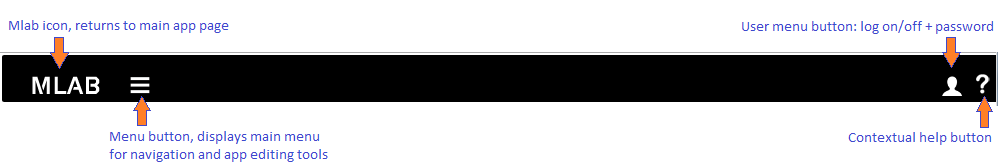

Figure 3.1 Appyoumake navigation bar

On all pages, regardless of which work area you are in, there is a menu
bar at the top of the page, this will let you navigate to different
parts of Appyoumake. The main menu is not available until you have logged in.

Getting started
===============

Start page before logging in
----------------------------

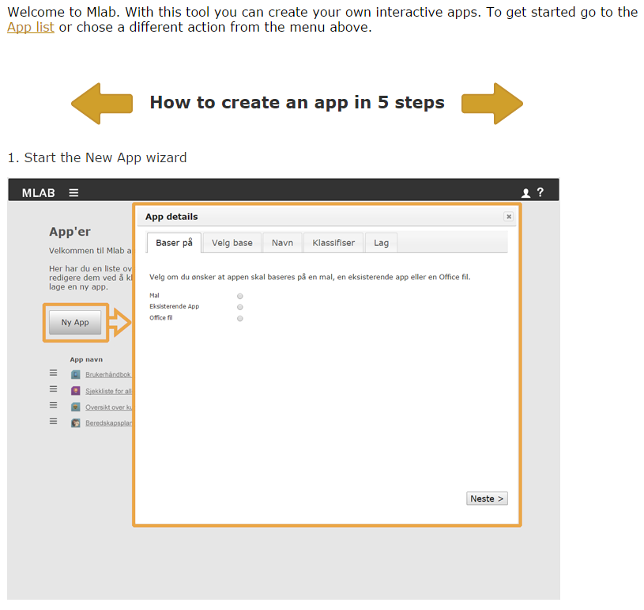

Figure 4.1 Appyoumake start page

The initial page (before login) explains the steps required to create an
app. Apart from login and help there are no actions available here.

Logging in
----------

Login is straight forward, go to <http://mlab_url/login> (replace
mlab\_url with your own server URL) or click on the “Login” option on
the menu that appears when you click on the *User menu button* on the
menu bar. Enter the email address you were set up with and your
password. 

*If you don’t have access you must contact an administrator to get an
account.*

Start page after logging in
---------------------------

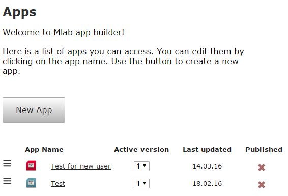

Figure 4.2 Appyoumake app list

The first page displayed for all users after they log in, regardless of
whether they are admin or not, is the app list. This lists all apps that
the currently logged in user has access to.

See chapter *6,* *App list, actions available* for more information
about this page.

Admin area
==========

The admin area is divided into three sections, each leading to a similar
looking page with multiple tabs, providing easy access to relevant and
related data editing.

The three sections are available from the main menu dropdown menu and
are as follows:

-   User admin (here you manage user accounts and group access, see
    section 5.2).

-   Users: Anyone who is allowed to log on to Appyoumake is a user. They are
    > identified by their email.

-   Groups: This is the key means of limiting access to different
    > components, templates, categories and apps. You can create any
    > number of groups, and any number of users can be assigned to any
    > number of groups.

-   App admin (used to add and manage components and templates, see
    section 5.3).

-   Components: Appyoumake apps are built up of components; this is explained
    > in the *Appyoumake development guide* document. To add or edit a
    > component, for instance a map, you go to this sub section.

-   Templates: Same as Components in the previous points, but for
    > templates which are used for formatting and navigation purposes.

-   System admin (used by the super admin when the system is first set
    up, see section 5.4).

-   Help: Here you can edit the help text displayed in Appyoumake when the
    > help question mark is clicked.

Navigating an admin page
------------------------

In Figure 5.1 below you can see a typical admin page. All admin pages
have similar features. At the top you have a row of tabs, one for each
type of data you can work with, each tab has a “add new entry” button,
clicking on this will bring up a small dialog box to edit the new entry.
When you click on add user for instance, a dialog box similar to Figure
5.2 comes up. You just enter the relevant information (Appyoumake will prompt
you if you leave out a required field) and click save. If you do not
want to add the new entry, just press the “Esc” button on your keyboard
or click the close button (**X**) in the top right hand side of the
dialog box.

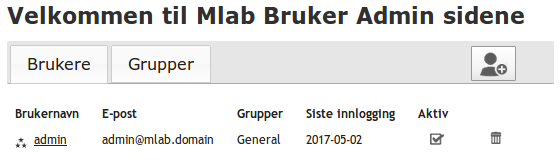

Figure 5.1 Admin page example

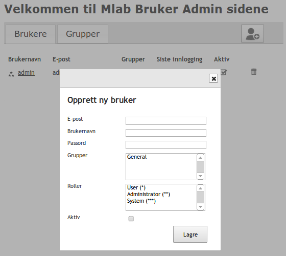

Figure 5.2 The user admin page with the new user dialog displayed.

User admin
----------

### Users, groups and access explained

There are three types of Appyoumake users; the regular app creator user, the
admin user and the super admin. The super admin role is usually just
assigned to those who need to maintain the overall Appyoumake system; this
user can add any type of user and move admin users and regular users
between different user groups. The admin user approves or rejects apps
for the (mil-)app market and can create new app creator users or modify
app creator users’ access to different components and templates. They
cannot, however, create admin or super admin users or change their own
group membership.

Access
rights for individual users are always set through group memberships.
Say for example that user *Matt* belongs to the
groups *All* and *Teaching*, and
user *Camilla* belongs *All* and *Admin*. Then there are 4 apps, apps 1
and 3 belong to the groups *All* and app 2 belongs to *Teaching* and app
4 belongs to *Admin*. In this example Matt can see apps 1, 2 and 3;
whereas Camilla can see apps 1, 3 and 4.

Figure 5.3 App access example visualised.

App admin
---------

Here you have two primary tasks: uploading new templates or components
that have been developed and setting up access to these components and
templates. Templates and components should be submitted to you as a Zip
file by the person who developed it. Once you have received it you just
click on the add button discussed in section 5.1. In the popup dialog
box you have the following options:

-   Field: **Active**  
    Check this to make the template/component available, leave it
    unchecked to hide it.

-   Field: **Enter the position in which it should be displayed.**  
    This lets you put the most common items first.

-   Field: **Select access groups**  
    You can chose who has access to the template/component by selecting
    one or more groups from the group list. In this way you can limit
    specialist items to only those who require it.

-   Finally you add the Zip file that contains the template or component
    by clicking on the “Choose file” button and select the relevant
    file.

When you submit the details to Appyoumake it will check that the template or
component has all the required files in it. If all is OK you will see
components the next time you go in to the app editor, templates you will
see in the New App wizard when you go there.

System admin
------------

This section has a list of help topics used in Mlab; basically each
individual page have one entry here. You should not need to add any
entries here, but you can amend the help text to suit your
use/organization. This is done by clicking on the name of the relevant
page and then updating the text in a popup window that is displayed.

App list, actions available
===========================

The app editing area has two pages. The first one is the app list seen
in Figure 4.2. Here you can create a new app or perform certain actions
on an existing app.

“Create new app” button
-----------------------

This will start the “New App wizard” that will guide you through the
creation of a new app. See section 7.1 for a detailed walkthrough of
this function.

App button, popup context menu
------------------------------

Clicking the button next to an app in the list brings up a popup menu
relevant to that app. This is shown in Figure 6.1 below; the button to
click is circled in red.

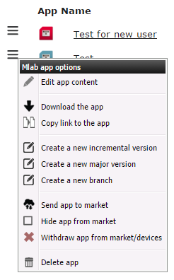

Figure 6.1 App menu (some selections are not available for
non-administrators).

This popup menu can have the following options available, depending on
your user role:

-   **Edit app content  
    > **This option opens up the app editing page, see section 7.2 and
    > onwards for more details.

-   **Download the app  
    > **When this option is selected Appyoumake will create the app in the
    > background and then provide a link to download the app to install
    > it on a local smart device (used for debugging purposes). It may
    > take some time for the app to be created before it is ready.

<!-- -->

-   **Copy link to the app  
    > **Same as the previous action, but copies the link of the
    > resulting app to the clipboard so it can be pasted into an email,
    > etc.

-   **Create a new incremental version**  
    > This option will create a new version of the app, the version is
    > incremented by 0.1.

-   **Create a new major version  
    > **Creates a new version of the app with the version number
    > incremented by 1.

-   **Create a new branch  
    > **Copies the app to a new app with a new name and version number
    > 1.0.

-   **Send app to market  
    > **Selecting this option will first compile an app, and then upload
    > the compiled app file to the app market. It will include
    > additional meta-data from the database entry for the app in
    > question (such as name, description, categories, etc.). After this
    > action is concluded the app can be browsed and searched for on the
    > app market, and users with access can install it on their devices.

-   **Hide app from market  
    > **This will hide the app on the app market so no new users can
    > install it, but it will still be working on devices where it has
    > already been installed.

-   **Withdraw app from market/devices  
    > **This will hide the app on the app market so no new users can
    > install it, in addition the app market will send a message to the
    > app itself to uninstall when next time it connects to the app
    > market.

-   **Delete app  
    > **If an app has not been sent to the app market and it has not
    > been used to create new versions (regardless of whether it has
    > been sent to the app market), then this will delete the app, both
    > the database entry for it and all related files. This cannot be
    > undone.

App editor
==========

The app editor page contains a lot of functionality, most of it hidden,
to facilitate the easy creation of app. These are the 5 steps you need
to follow in order to create an app from scratch.

Start “New App” wizard from app list by clicking on “Create new app”
--------------------------------------------------------------------

A dialog box similar to what you see in Figure 7.1 below will now be
displayed.

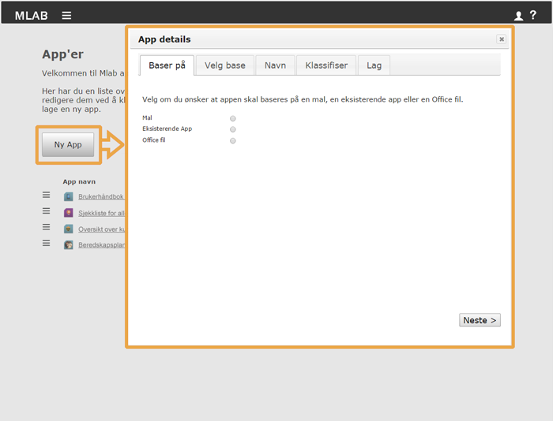

Figure 7.1 App wizard

This wizard will ask you a few questions related to the app; first and
foremost if you want to base the app on a template, an existing app
(this copies the existing app into a new app you can edit) or by
importing a Word or PowerPoint file into a template. It will also let
you enter the app name and description as well as selecting relevant
categories that the app belongs to (such as Navy or Army). These
categories are used in the app market to let people browse for apps that
can be useful for them. You can also create or upload an image to use as
an icon; this icon is displayed in the app market together with the name
and description. This icon is also what the app user will see on their
smartphone or tablets.

Once the wizard is completed the app will be opened for editing. 

Click on a component to add it to the current page
--------------------------------------------------

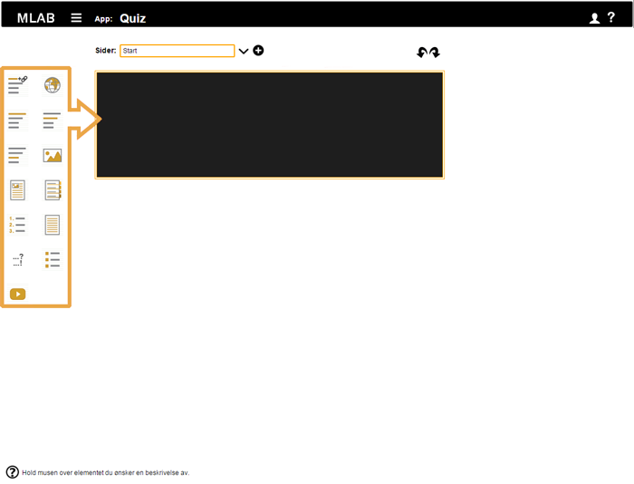

Figure 7.2 App editor with empty page with available components on the
left.

When you are inside the app editor page you can click on any of the Mlab
components that are shown on the left hand side of the window (see
Figure 7.2). When you click on a component it will immediately show up
inside the current page, ready for you to edit.

Editing content and, optionally, any settings for the component
---------------------------------------------------------------

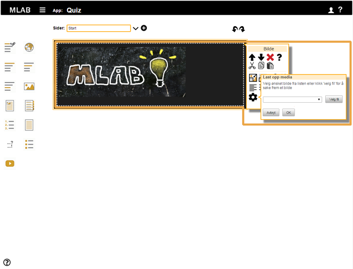

Figure 7.3 App editor with an image component selected. The component
toolbox and image selection dialog box is highlighted on the right.

A page in an app will be made up of various elements; you may have a
headline at the top, an image further down, some body text and a video.
In Appyoumake all of these elements are available as a component; different
types of components are edited in different ways. Text based components
are typically edited directly in the component. Visual components such
as videos, maps or pictures usually have a small toolbox that is
displayed as shown in Figure 7.3. In this box you select various options
such as how large an image should be, or where the centre of a map
should be.

You can get more information about a component by clicking on the
question mark (**?**) icon in the component toolbox. Help that is
specific to the component will then be displayed on the right hand side,
you can keep this displayed while

Add additional components and pages
-----------------------------------

Keep adding components until the page is finished. When you want to add
more pages you just click on the plus sign to the right of the name of
the current page (see Figure 7.4), for each page you add a title. Up to
999 pages are supported in an app.

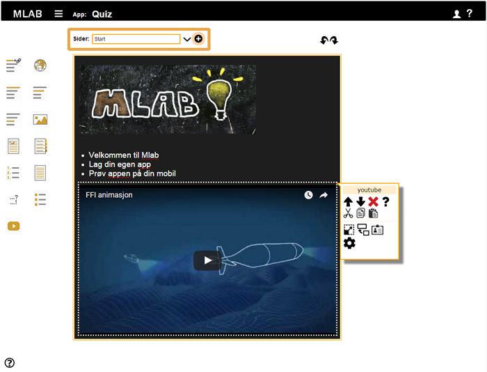

Figure 7.4 App editor with page tool highlighted near the top and the
component toolbox on the right.

Build the app and try it on your mobile or tablet 
--------------------------------------------------

The pages that make up your app must be turned into so-called “native
app”. A native app is simply a standalone file that can be copied to a
smartphone/tablet and used as any other app on that device.

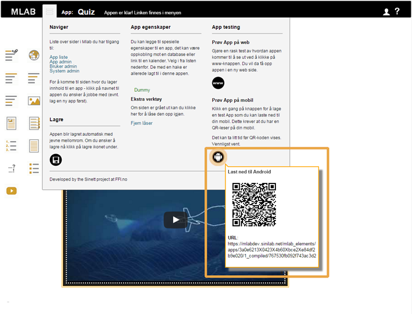

Figure 7.5 Appyoumake menu with popup QR code with link to app.

To perform this operation in Appyoumake you just click on the main menu button
and from the popup menu (see Figure 7.5 for an example of this menu) and
under the “Test app on device” option you will see on or more icons.
Each icon represents a type of smartphone (iPhone or Android, etc.).
When you click on the icon for the device you want to test it on,
Android for instance, a gauge will be displayed in the top menu bar
showing the progress, and after a few minutes the app will be ready. You
select the same menu and when you hover the mouse pointer over the icon
a QR code with the link to the app will be displayed. You can either use
a QR code reader to take a picture of the code and download the app, or
you can copy the link and send it to someone. Opening that link will
download the app.

Conclusion
==========

You should now be able to use Appyoumake, either as an administrator or an app
creator. Further help can be found online in Appyoumake itself. To open the
online help you click on the question mark (**?**) that is always
present in the top right corner of Appyoumake. This help provides information
about how to use the features available on the page you are currently
on. In addition each component has component specific help available. To
access this help click on the question mark that is displayed in the
component properties box when a component is selected in the Appyoumake app
editor.

You can also find out more about different aspects of Appyoumake from the
documents in the /docs folder.
