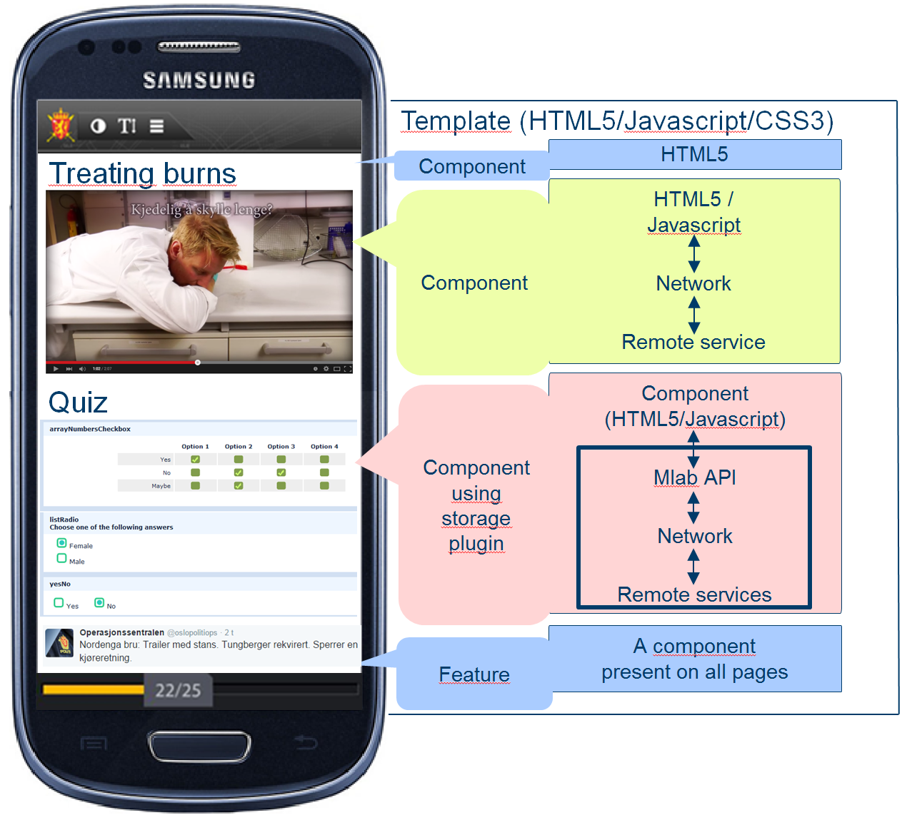

#Mlab App Builder: Component developers' guide

>Version: 1.0 (April 2016, first public release)<br>
Copyright: © Norwegian Defence Research Establishment (FFI) 2013 - 2016<br>
Initial author: Arild Bergh, Sinett 3.0, FFI<br>
Updating authors: <br>
Comment: _Only update the version number above when component specifications change_

## Who is this document for?

This document is for HTML/Javascript developers who wish to create components for the Mlab app builder. It is assumed that the reader is familiar with HTML5, Javascript and CSS, and has at least a passing understanding of PHP or other server side scripting languages.

### Additional documentation

In addition to this document you can also read more about how to create templates for Mlab in the [Mlab editor - template & design development documentation](HOWTO - Template Design & Development.md). In addition the following documents (requires access to IEEE Xplore) provide some background information on Mlab: [The Final Destination: Building Test Bed Apps for DIL Environments](http://dx.doi.org/10.1109/VTCSpring.2015.7146128) and [Distributing the disruption](http://dx.doi.org/10.1109/ICMCIS.2015.7158688). 

The Mlab source code will be available here: [https://github.com/Sinettlab/openMLAB/](https://github.com/Sinettlab/openMLAB/) 

For a complete overview of the whole Mlab ecosystem refer to "*From the death grip of PowerPoint to mobile freedom: The Mobile Learning App Builder (Mlab)*" (FFI Notat, Bergh, 2014).

### Component specific documentation:
 * [COMPONENTS REFERENCE - mlab.dt.api.js file.md](COMPONENTS REFERENCE - mlab.dt.api.js file.md)
 * [COMPONENTS REFERENCE - conf.yml file.md](COMPONENTS REFERENCE - conf.yml file.md)
 * [COMPONENTS REFERENCE - code_dt.js file.md](COMPONENTS REFERENCE - code_dt.js file.md)
 * [COMPONENTS REFERENCE - code_rt.js file.md](COMPONENTS REFERENCE - code_rt.js file.md)
 * [COMPONENTS REFERENCE - server_code.php file.md](COMPONENTS REFERENCE - server_code.php file.md)

The [Mlab source code](https://github.com/Sinettlab/openMLAB/) has a number of core/basic components and templates that are useful examples to learn from, it is recommended that you look at these when this document refers to any of these components.

This document **must** be read together with [Mlab explained.md](Mlab explained.md) which explains how Mlab works from component and  template developers point of view. This is important to understand in order to develop components that fit in with the Mlab philosophy of re-use and extendability. This document (*HOWTO - Component Development.md*) will provide all the practical information required to actually develop a component. To do this you also need to refer to additional documentation about the files that make up a component and the Mlab APIs, these are listed above under [Additional documentation](#bookmark=id.ppcd6tm3t9ce).


## The three component types illustrated and discussed

So far we have briefly [defined](#ref-appelements) the three component types that Mlab supports; regular components, features and storage plugins. Before we get down to the nitty-gritty of making our own components we shall now see how these components interact, their relationship to templates and how the app creator will access and make use of these component types when building an app.



In the figure above there are three different *components*, one *feature *and one *storage plugin* added to a *template*. Components are positioned within a special jQuery mobile page DIV (attribute *data-role="page"*) in the page they are currently working on; features and storage plugins are stored in a special DIV outside the the page area, but inside the body of the HTML5 page in *index.html*. 

The first component is a simple HTML5 element for the headline. The second one is a more complex component that displays a YouTube video, so it relies on some Javascript, a network connection and a remote service, YouTube. The third component uses data storage and a plugin has been loaded so that the result of the visual component (the questions) is stored on a remote server. Finally we have the feature, in this case an automatically updating Twitter component which at regular intervals checks a given hashtag 

These components are the building blocks of Mlab; without components app users would only see pages with headers and footers and nothing else. Yet, without templates, each component would look different and create major usability issues in the final app for app users. Therefore, the template frames the components, and the components frame different types of content, from plain text to interactive maps and from videos to quizzes.

### App creator design time interaction with the three component types

A core issue to remember about components and features is that although they can be incredibly complex, with 1000s of lines of code, to the app creator it is just a single clickable item. This is because Mlab, unlike other HTML editors such as those used by content management systems (CMS), does not allow **any** editing of the HTML code itself. This ensures that the app creator cannot accidentally create HTML code that breaks a page (which will happen if a closing bracket on an HTML tag is missing for instance). 

All changes to a component beyond text editing are therefore done through a toolbar that is displayed by Mlab when a component is activated by the app creator clicking on it. This toolbar lists available actions that is based on information found in the files conf.yml and code_dt.js, thus avoiding direct editing of the HTML5 code. These commands vary depending on what type of component it is, an image will have an upload option whereas a headline might have bold/italic options. The image below shows where this toolbar is.


Components will always have a visible part that the user can click on to make that component the current one. From the component programmer's point of view a feature is just another component: it is a HTML5 element combined with Javascript (and CSS3 for visible features), the key difference being that it has [a setting](COMPONENTS REFERENCE - conf.yml file.md) called feature which must be set to boolean "true". 

From the app creators' point of view however, features are separated out in a list of additional features that the _app creator_ can use, see illustration on the right. The code for a feature is always added to the index.html file in the app, even if a different page is being edited when the feature is added, this ensures that they are available on all pages in the app,and not just a single page. 

Additionally, if the feature does not have a visible interface, then the icon of the feature will be displayed at the bottom of the page during editing (regardless of which page is being edited). If the app creator wants to edit settings of such "invisible" features they click on the icon, and the usual component toolbox of available actions will be displayed.

When it comes to storage plugins, the app creator specifies which one they want to use for a particular component (if that component's storage_plugin setting is true in the conf.yml file) at design time. This is done by selecting a storage plugin for the currently selected component that requires storage from a list of available plugins. 

 At RT Mlab will tell the API object to load this plugin before initialising the component, the standard [storage API](#heading=h.b1vekweolexg) will then call on identically named functions inside the plugin to store or retrieve the data whenever the component calls a method that saves or loads data. This is not dissimilar to inheritance in object oriented programming, although it is implemented in a much simpler way.

## Why the difference between a feature and a storage plugin?

Could a storage plugin not be written as a feature without a visible interface? In principle, yes. However, different components may need to store data in different locations. For instance, a simple quiz that is meant for students to test themselves may only require local data storage, whereas a location tracking component may need to upload the data to an online cloud service.

Thus the key difference is that features are "applied" once per app (for instance "turn on user interaction tracking") whereas storage plugins are set up for each component (for instance "store my data on a MySQL server") as a part of the general component configuration by the app creator. 

Furthermore, storage plugins have special support in the Mlab runtime API to help it store data locally when there is no network connection available, and then attempt to store the data later when a network connection is re-established. The illustration below shows how this works at RT when a component wants to store some user input.

## Relationship between components and templates

Components rely on the [template](HOWTO - Template Design & Development.md) to define its look and feel. This is achieved by following HTML5 conventions and assigning CSS3 classes to the HTML5 elements that make up the component and then defining the properties of these classes (such as background colour or font size) in the stylesheets of the template. One should as far as possible use standard generic classes that are defined in the [template specifications](HOWTO - Template Design & Development.md). One could use specific class names as long as they are clearly documented in the component and use the correct *namespace* for the component

Components are formatted using CSS; but these CSS rules should be part of the template, and not the component itself. However, components may use a number of [classes that have been pre-defined](HOWTO - Template Design & Development.md) by Mlab to indicate the desired format for the component (or parts of the component).

**Components should under no circumstances hardwire design into the component. Remember that your component can be used in many different templates, so they should be as flexible as possible.**

## App creation workflow: Mlab automation and manipulation opportunities

A final bit to understand about the Mlab app builder before we tackle how to create your own components is how Mlab has a certain workflow when it comes to creating apps, and how this can be used to your advantage when you create your own components. A component needs to support the addition, manipulation and modification of data by the app creator and should ideally enhance and extend the app creators work at different point of the life cycle by using the opportunities found in Mlab.

Earlier we saw a simple map of the different app stages showing who and what were involved in these stages. Below we have the same overview, but now with an added line that illustrates when files in a component are loaded, and what code within them are automatically executed at certain stages. These bits of code will be discussed in the timeline below.


### App creation timeline

**User action:** App creator creates app from template. This may be a generic template for your local organisation, focusing on look and feel, or it can be a specialist task oriented template, such as a learning & testing knowledge template.

**Content:** In addition to providing navigation tools (such as search or next page, previous page buttons) and a general look and feel, the template can have two types of placeholders. One is for components that are inserted at compile time, for instance an index of all the pages in the app. The second one is for custom functions available in Mlab, currently (March 2016) this is a single function called "*getnumberofpages*". These custom functions are added at Mlab level in the *CustomPreProcessing* class.

**Mlab actions: **A new folder structure for the new app is created and the template files, which can include CSS and Javascript files as well as the basic index.html, are copied over to this new folder structure. When this is done the index.html files from this skeleton app is loaded via AJAX and Mlab prepares the DIV that has the "role='page'" for the app creator to add components to.

**User action:** The app creator adds *components* to the page by selecting them from a pre-defined list of available components. The screenshot in figure 2 above shows the foldable list of the core components for use in Mlab. 

**Content:** Whatever HTML5 content is defined by the component creator in the [conf.yml](COMPONENTS%20REFERENCE%20-%20conf.yml%20file.md) file under the *html* setting. This HTML5 code can be different for design time and runtime to facilitate better interaction when the app creator is working with the component.

**Mlab actions: **

* Mlab retrieves the HTML5 code for the component.

* If the component relies on any additional files (CSS styles or Javascript libraries) these are loaded into the browser. A script on the server is called through an AJAX call, and any such file dependencies are copied from the component folder into the relevant subfolder of the current app, this makes them available for the app at runtime.

* Mlab adds a DIV element around this HTML5 which is used to manipulate it (for drag'n'drop, etc). This container DIV will have a *data-mlab-type *attribute which tells us what component type it is, for instance the basic headline element is "*h1*". 

* In addition, if the component is set to resizable=true in the conf.yml file, then another intermediate resizing DIV is added between the container DIV mentioned above, and the internal content. This is used to manipulate the size of the visual elements (for instance scale a video or change the size of an image).

Below you can see how a component is "framed" by Mlab, here we also see two additional script containers, one stores JSON variables through the design time API function setVariable/setVariables, the other can be used to add scripts that needs to be present when component is first loaded through the setScript API function. The latter should be avoided unless absolutely necessary.


* Using an AJAX call to the server, the onCreate function in the file [server_code.php](COMPONENTS REFERENCE - server_code.php file.md) will be run (**if it exists**). Here you can have code that performs special preparation required by the component, for example downloading certain library files.

* When the AJAX call is completed, then the function onCreate in the code_dt.js file is run in the browser. Here you can put any type of initialisation code that is required before the component has been displayed. One example would be to call an external API to display a map for instance.

* Finally Mlab will call any function that is specified in the *autoexecute* setting of conf.yml. This would mostly be used to call the function that is used to obtain info from the user, such as which YouTube video to display.

**User action:** Add feature

**Content:** Same as above

**Mlab actions: ** Mlab will perform an AJAX call to the server to add the content to the index.html file. If this feature is visible (as specified in the [conf.yml](COMPONENTS%20REFERENCE%20-%20conf.yml%20file.md#user-content-ref-visible) file), the content will then be displayed in a footer or header, as specified by the component, if it has no visible elements, then it will be shown as an icon in the footer of all pages.

After this, Mlab will perform the same actions as in the previous step.

**User action:** Select storage plugin for component or feature

**Content:** Not applicable

**Mlab actions:** Mlab will request any credentials specified in the components configuration, typically these would be what is required to log into the service used by this storage plugin, for instance a Oracle server. After the user has supplied these credentials they will be stored with the component or feature using the Mlab API call *setVariables*. No callbacks are used as the storage plugin setting is only an information component.

**User action:** Delete component/feature

**Content:** Not applicable

**Mlab actions:** The onDelete function in the code_dt.js file is called in the browser if it exists. Here you can perform any additional actions required, such as removing variables or stopping a connection to a remote server. After this function is completed (or if it does not exist) Mlab will delete the outer container DIV and all HTML inside it.

**User action:** Save current page

**Content:** Existing content of the component

**Mlab actions:** 

* Mlab templates can have *rules* embedded that specifies best practices for different elements. For instance it can be that a text component should have max 500 words, and that one should only use one video per page. Before saving page, Mlab checks to see if these rules in the template have been followed. It does not enforce them by removing content, but the app creator is notified about any breeches so they can manually rectify them.

* Then, before saving the component content as a part of the overall page, Mlab calls the onSave function for each component. onSave is a required function. This function should return the HTML5 code to be stored on the Mlab server for the current page. Together with the onLoad function which is called when a user opens an existing page (see below) it provides a "round trip conversion" between the design time and runtime code. The reason for this approach (i.e. allowing for code to be different at design time and runtime) is that at design time you may need to preview information that will be live at runtime, you have to provide editing functionality that must be stripped out at runtime, etc. For instance if the component has editable text elements, then you need to remove the "contenteditable='true'" attribute for these elements. Otherwise the compiled app would also allow the app user to edit these text elements which you probably do not want to happen.

**User action:** Open existing page

**Content:** Content of the component as stored in Mlab on the server

**Mlab actions:** The component's HTML5 content **as saved** in the previous step is loaded as part of the overall page. The onLoad function (which all components must have) is then called and the component should perform any manipulation required of the HTML5 DOM inside the component container. For instance if the component has text elements that the app creator should be able to edit, then you need to add the "contenteditable='true'" attribute for these elements. 

**Comment: There are no limits to the manipulations that the component can do in the onSave/onLoad functions, see for instance the ****_quiz_**** component for some advanced examples.**

**User action:** Setting size of aspect ratio of component

**Content:** Existing content of the component

**Mlab actions:** The data attributes *data-mlab-aspectratio* and/or *data-mlab-size* in the container DIV are updated and the Mlab API is used to set the current size on the surrounding [resizer DIV](#user-content-ref-addcomponent). The onResize function in the code_dt.js file is called in the browser if it exists. Here you can manually resize or refresh any elements in the component that does not automatically get updated when the surrounding DIV is adjusted. See the *googlemap *component for an example of this.

**User action:** Preview app in browser

**Content:** Entire app

**Mlab actions: **

* Mlab initiates what we have previously referred to as the [precompilation process](#user-content-ref-precompilation). In this process Mlab goes through all the pages in the app, and for each page it processes all the components on that page. For the  first replaces the component and custom function placeholders discussed in the first stop of this timeline. 

* Then it calls the onCompile function in the [server_code.php file](COMPONENTS REFERENCE - server_code.php file.md) where the component can do further manipulation/replacement of HTML5 DOM elements. It can choose to replace any placeholders altogether (see the *index* component for an example of this) or it can amend the HTML5.

* The returned HTML5 from the previous step is added to a page that is saved in a cache directory, the content of this directory represents the final code to go into the compiled app. The root of this directory is the same as for the current version of the app. For instance, if your apps are located in /my/path/apps, then the files would go from here to here:

Start directory: /my/path/apps/unique_id/1/index.html

Destination directory: /my/path/apps/unique_id/1_cache/index.html

* When all the pages have been processed and all the relevant files copied over to the cache directory, Mlab opens a new browser window pointing to the root of the cache folder: /root_url//apps/unique_id/1_cache/index.html. The app creator can then test the app locally before compiling it.

**User action:** Compile app

**Content:** Same as in the previous step

**Mlab actions:** Same as in the previous step, except that instead of opening up the app in a local browser window for preview, the content files are uploaded to the compilation server where Cordova is called to turn these files into a standalone app for the target platforms. The compiled file is then downloaded to the Mlab server where the app creator can be download it from to test on mobile devices before sending it to the (mil-)app market.

#Part 2: Practical development information 

## Background

A component should have a clearly defined purpose, and it is recommended to break up components into multiple component that inherit functionality from each other, rather than having a single component that requires a lot of configuration. This makes it easier for the app creators to find what they are looking for, and the component can have less intricate configuration options; both these aspects makes it more user friendly. For instance, a quiz and a questionnaire are very similar in terms of what it needs to do and the code that it requires. But by splitting this into one questionnaire component and one quiz component it is much clearer what each of them does. 

In principle a component can do anything that is possible (and valid) in standard HTML5, Javascript and CSS3 code, as long as it also works under Cordova (see [Cordova's own documentation ](http://cordova.apache.org/docs/en/4.0.0/)on Javascript abilities/issues). However, components has to follow certain "rules" for it to work with the Mlab development tool. These rules include names of files, elements that have to be present in the files and certain namespaces that have to be applied. These rules are discussed in this section. 

In addition component builders can rely on a range of tools made available by Mlab, these include jQuery core libraries, API functions and predefined CSS classes, these are listed under the [Prerequisites/assumptions that components can rely on]() heading below.

Finally, components may use Cordova specific [events](http://cordova.apache.org/docs/en/4.0.0/cordova_events_events.md.html#Events) and [APIs](http://cordova.apache.org/docs/en/4.0.0/cordova_plugins_pluginapis.md.html#Plugin%20APIs) that give Javascript access to common mobile devices features, such as GPS or accelerometer information.

## How to create a component

 1. Planning the component

    1. Start by drawing up a simple specification: What should the component do, who would use it?

    1. Decide whether this should be a component, feature or storage plugin. If it's the latter, go to ["How to create a storage plugin"](user-content-ref-howto-storageplugin). For features, as they are very similar to components, first go through these steps that you are currently reading, then continue with [How to create a feature](#user-content-ref-howto-feature).

    1. Look at existing components, whether they are installed on your server or shared on Github or similar. Is there something already in existence that would do what you need to achieve?

    1. If not, see if there is something that is quite close. You could then use this as the basis for your component through the inheritance facility in Mlab. See [here](COMPONENTS%20REFERENCE%20-%20conf.yml%20file.md#user-content-ref-inherit) for a full explanation of how this works. 

    1. If you find nothing that you can base your code on, we would still strongly recommend that you look at a few examples to get an understanding of how to code a component.

    1. Draw a diagram of what the component should look like both at design time and runtime.
    
    1. Plan which of the standard Mlab template classes you should use to achieve this look. In the [HOWTO - Template Design & Development.md file](HOWTO - Template Design & Development.md) you find a complete list of predefined classes that use a special Mlab name space to avoid clashes with other classes. So for instance if you want to use a dropdown list in a dialog box requesting information from the app creator, then use the classes _mc_text, mc_display and mc_medium_ for the label, and _mc_text, mc_entry, mc_input_ for the drop down list. Make sure you understand the rationale behind the predefined classes so you can support them properly and fit in with other Mlab elements.

    1. Make sure you choose a unique name for your component. These unique names are used by Mlab to manage components at designtime. The core components have simple names like quiz and img, you may need to use a prefix to ensure uniqueness.

    1. Decide what you can achieve using **settings**, what you need to create **code** for and if you need to **get app creator input**. 

       **Settings** that are updated in the [conf.yml file](COMPONENTS REFERENCE - conf.yml file.md) will be applied automatically by the Mlab framework and are the quickest way to add functionality to your component. It is worth going through the documentation for this file and decide what you can use there. For instance, to make your component resizable, all you need to do is to set the resizable setting to true.
      
      * Think carefully about translation issues and make sure you have a default set of translation strings in the conf.yml file for all required or custom settings.

       **Code**: If you need more advanced functionality, then you should write some Javascript functionality to support that functionality, this gives you considerable flexibility. The [code_dt.js](COMPONENTS REFERENCE - code_dt.js file.md) and [code_rt.js file](COMPONENTS REFERENCE - code_rt.js file.md) files give detailed info on how to create these files.

      * Plan your code to see what will be needed both at runtime and design time (and hence should be in a shared Javascript file), and what code is required for just one of them. Split the code accordingly.

      * Decide on what functionality needs to be exposed to the app creator through component toolbox icons (for instance requesting settings information). This must then be written as custom functions in [code_dt.js](COMPONENTS REFERENCE - code_dt.js file.md), however you can of course have library functions that are called from these functions (i.e. they act as wrappers to library functions).
      
      * Does your component need (or can it benefit from) automated actions that are running when the component is added and as a part of the automated precompilation process? Using these to lessen the work load and decision making for the app creator will help the component be perceived as useful.

      * Determine if and how you need to modify the HTML5 DOM in the control at design time or runtime to support user interactions, and if you need to support automated precompilation functions that modify the control or download data. Make sure what you want to do can go through the onSave/onLoad process without losing data.

      * Which of the event callbacks (onSave, onDelete, etc) do you need to support? Read documentation for [code_dt.js](COMPONENTS REFERENCE - code_dt.js file.md) to see what you should potentially cover.

       **Get app creator input**: As components should never expose their HTML5 to the app creator you need to create one or more dialog boxes to interact with the app creator for any settings that they should provide. For instance, if you create a map component it is natural to ask the app creator where they want to centre the map on startup.

      * First check if automated [credentials](COMPONENTS REFERENCE - conf.yml file.md#ref-credentials) setting can be used to request login type information, such as URL, password, etc. If you need more, see if you should create a single dialog box with a single page, if you need so many settings that a [wizard](https://en.wikipedia.org/wiki/Wizard_(software)) style dialog box will work better or if you multiple different dialog boxes. Either way, make a simple diagram for yourself as to what the dialog box(es) should look like. Then you can make sure choices are clearly defined, that translation strings exists in the conf.yml file and make sure a function prefixed with [*custom_*](COMPONENTS%20REFERENCE%20-%20conf.yml%20file.md#user-content-ref-custom) leads to the relevant dialog box so that the user can access it from the component toolbox. Also consider adding the relevant function to the [autorun_on_create](COMPONENTS%20REFERENCE%20-%20conf.yml%20file.md#user-content-ref-autorun_on_create) setting so that the user can be prompted for the details automatically without having to manually click a button.

      * In addition to the visual aspect of a component, the component may need to store data to configure the component's behaviour. For instance, the "googlemap" component needs to request information from the app creator as to where the centre of the map is, the zoom level, etc. To store this data the component can utilise the Mlab API *setVariable()* method. setVariable() uses this HTML element "\<script class=mlab_storage\>" inside the surrounding DIV to store variables in a JSON format like this:  *{myPlace: xxx, last_edited: date, and: so on}*. There is also a *setVariables()* method that will erase all old settings and replace them with the object sent to this function.
      
 1. Putting together the component elements

  A component is made up of three required files, two optional files and external libraries. Together these files define how a component looks, what it can do, and can even generate HTML and Javascript on the fly to create advanced interactive behaviour in the final RT app. At this stage you should have made a clear plan, as outlined in the previous section, and the time has come to do the practical implementation.

  * Edit the conf.yml file (Required)

    This [YAML format file](http://en.wikipedia.org/wiki/YAML) contains all the configuration info for a component. This includes any HTML to display, image placeholders, version number, etc. All supported entries in this file are described [here](COMPONENTS REFERENCE - conf.yml file.md); go through this list and edit your conf.yml accordingly. It is worth copying an existing example to get the right syntax. To validate your YAML syntax use [http://codebeautify.org/yaml-validator](http://codebeautify.org/yaml-validator) or [http://yaml-online-parser.appspot.com/](http://yaml-online-parser.appspot.com/).
    
    Pay particular attention to the [HTML entry](COMPONENTS REFERENCE - conf.yml file.md#user-content-ref-html) here, this is what will be displayed to the app creator/app user. It is a HTML fragment, and it can be different for designtime and runtime, and the final (i.e. runtime) code can also be modified at design time (when the page it is on is saved) or it can be changed in the precompilation process.

  * Create the icon.png file (Required)

    This is the icon for the component that the app creator sees in the Mlab app editor once the component is installed. Make sure the icon is meaningful, if wellknown software such as Microsoft Office has a familiar icon it is worth creating something that resembles this so your users can recognize it. Preferably the icon should be a 40x40 pixels image, it must be in the PNG file format. If the size is different it will be resized by the browser to fit.

  * Create and code the code_dt.js file (Required)

    This Javascript file is the main file for the design time component code. It is described in detail [here](COMPONENTS REFERENCE - code_dt.js file.md), but in short you should add the functions onLoad and onSave as a minimum, and also add onCreate for components that require some initialisation. Apart from that this file can contain any Javascript necessary for design time interaction with the app creator.

  * Create and code the code_rt.js (Optional)

    This file should contain all Javascript functionality that will be required when the component is loaded as part of an app installed on smartphones/tablets. This includes both initialisation methods (connecting to services for instance) and code that is providing the functionality within the app, such as providing user interaction with the component. It is described in detail [here](COMPONENTS REFERENCE - code_rt.js file.md).

  * Create and code server_code.php (Optional)

    Add any code that needs to run on a server (and not inside the web browser) in response to certain Mlab events, such as when the component is added to a page in the app at design time or before the app is compiled. For instance, it would be possible to log on to a remote server and retrieve data that would be displayed inside the component. For more information see [here](COMPONENTS REFERENCE - server_code.php file.md). 

  * Code (if necessary) or copy any additional library files and add links to them (Optional)<a id="ref-additional_library_files"></a>

    To facilitate the use of libraries and/or reuse existing code you can tell Mlab to include additional external files with the app. These files could be existing libraries (for instance jQuery plugin) or libraries that you write to share code between design time and runtime (as the code_dt.js and code_rt.js files are only loaded at design time and runtime respectively). The files can be of Javascript or CSS3 format and must be in the /css and /js directories. As well as creating/copying these files their names must be added to the [required_libs setting in the conf.yml file](COMPONENTS REFERENCE - conf.yml file.md#user-content-ref-required_libs).

You can also load external (i.e. online) libraries but keep in mind that Mlab apps may be used in situation where Internet connectivity is not available, or intermittent. You use the same the [required_libs setting in the conf.yml file](COMPONENTS REFERENCE - conf.yml file.md#user-content-ref-required_libs) as above.

## How to create a feature

Features are broadly similar to regular components; here we will only discuss the differences between the two in terms of developing a feature. The key thing to remember is that a feature is available throughout the app, and not on a particular page only, this is the main cause for the differences outlined below.

* A feature is always added to one of three shared "features DIVs" on the index.html page, and not the current page. There is one DIV for components without a UI, and two for visible features, one for those displayed at the top of the pages (header) and one for those displayed at the bottom of the page (footer).

* Because of this, the onSave call is executed when the component is changed by the app creator and NOT when the rest of the current page is saved. Likewise, the onLoad function is called immediately after an onSave is executed, and not when a page is loaded into the app editor.

* The [*feature*](COMPONENTS REFERENCE - conf.yml file.md#user-content-ref-feature) setting in conf.yml must be a boolean true.

* Decide whether your feature requires a UI or not. If you do have a UI make sure you set [*visible*](COMPONENTS REFERENCE - conf.yml file.md#user-content-ref-visible) to true in the conf.yml file. If not it should be false or left out. 

* Without a GUI make sure your app creator configuration dialog explains enough about the feature so that the lack of GUI does not stop the app creator from understanding what is going on. For instance, if you plan to track how a user reads pages in the app (how long, how many at a time, when stop, etc.), then mention this.

## How to create a storage plugin

A storage plugin consists of a basic conf.yml file plus a single Javascript file, code_rt.js. No other files are required. The key purpose of the storage plugin is to provide functions for storing and retrieving data remotely, these functions should mirror those generic functions found in the [Mlab runtime API file](COMPONENTS REFERENCE - mlab.api.js file.md#data).

* The [conf.yml file](COMPONENTS REFERENCE - conf.yml file.md) is typically much smaller than for components, the required settings are:

  * category: storage_plugin (**must be storage_plugin**)

  * name: mysql_dummy (can be anything without a space, must be unique as for components)

  * tooltip (Same as tooltip for regular components)

* credentials: optional but very useful, see above for a discussion on this. If the storage plugin handles this at runtime by asking for info then, or it is embedded in the storage plugin this is not be required.

* The [code_rt.js file](COMPONENTS REFERENCE - code_rt.js file.md) contains storage functions with the same names as those found in the standard [runtime API file](COMPONENTS REFERENCE - mlab.api.js file.md#data). The idea is that the plugin "shadows" the local storage functions in the original API, such as getAllConfig() or setState(). At runtime the component will always call the relevant function in the API to store or retrieve data through the [*mlab.api*]() object. The API then checks to see if a plugin is assigned to the component. If so, it calls the same named function in the plugin, otherwise it executes the local code. 

  **A storage plugin must provide support for ALL the data storage functions in the API, see [here](COMPONENTS REFERENCE - mlab.api.js file.md#data) for a complete list of these.**
  
  **All storage functions you create should use callbacks, the function that calls the callback should always return true to avoid bad network connectivity causing the app to hang. The callback should check that paramaters returns and take appropriate actions if they are ampty, set to false, etc.**

  The API has many functions not related to the storage of data at all. These should not be replicated by the storage plugin, but they may however be used by the storage plugin. For example, it may use the getCredentials() method in the RT API to get login details for the service it provides (if required). Refer to [API Other Functions](COMPONENTS REFERENCE - mlab.api.js file.md#data) for more information on this. The plugin will have access to these additional functions through the *this.api *object which is added by Mlab as the plugin is loaded. 

  At design time, when a plugin is selected for a component by the app creator a number of automated actions take place. This is an alternative to the calling of the onCreate function that happens when a component is added. These actions are as follows: 

  1. The **code_rt.js **file on the server is copied to the application and renamed to **PLUGINNAME_code_rt.js**, where PLUGINNAME is the unique name given to the plugin.

  1. The copied file is added to the include_comp.txt file so it is added to the app and loaded at runtime by code in the [mlab.api.js](COMPONENTS REFERENCE - mlab.api.js file.md#data) *function onMlabReady()*.

  1. If *credentials* is set to an array in the conf.yml file, then the credentials will be requested from the app creator and stored in the component.

  1. The name of the storage plugin selected (and the credentials if specified) are saved to the component through the [setVariable()](COMPONENTS REFERENCE - mlab.dt.api.js file.md#user-content-ref-setVariable) API.

## Deploying a component/feature/storage plugin

When you are finished coding / updating all the files in your component/feature/storage plugin, you must package it and then deploy it to a working Mlab app builder installation. 

 * Packaging the component: This is just a matter of "zipping" the files that make up a component. When doing this you must perform the zip operation from **inside** the folder that contains the files, i.e. **no** folders should be surrounding the first set of files. Sub-folders named *css* or *js* are allowed and [must be used as described above](#user-content-ref-additional_library_files).

 * Deploying the component: To do this you need admin rights (see [MANUAL - Mlab App Builder, basic.md](MANUAL - Mlab App Builder, basic.md)) to Mlab. Components should always be installed through the Mlab admin tools rather than uploaded to the website. The reason for this is that Mlab will check the validity of the component files before adding the component to Mlab, plus components must be added to the Mlab database so that different user groups can be given access (or not) to the indiidual components.

   
   
   When you are logged in to Mlab with admin rights select _App admin_ from the main menu. Once inside the App admin page, click on the _Components_ tab. Next click the **+** (plus sign) button and a small dialog box will be displayed. Here you check the _Enabled_ box to give immediate access to the component, select which groups should have access to this component and finally click the _Choose file_ button to select the ZIP file created in the previous step. When all this is done click on the _Save_, if there are no problems with the component you should now be able to use the component in the app editor.

## Best practices + tips and tricks for creating components

Mlab is very flexible, and in combination with external services (such as Google Maps or Twitter) and Cordova's sensor access facilities through Javascript it provides a lot of opportunities for innovative components to be created. Although there are many ways to create a component, there are some common practices that it is worth observing, although they are not enforced. They are therefore somewhat different from enforced rules such as filename and required functions.

* Respect your namespace!<a id="ref-namespace"></a>

   This is perhaps the most important rule to observe. As mentioned earlier, a page in an Mlab app is simply a HTML5 web page. Although the HTML DOM is hierarchical, names of classes used for styling, _data_ attributes, etc. are in effect global, i.e. anyone can access them. So if two totally different components use the same name (which is stored in a _data-mlab-type_ attribute) it would be impossible to refer to the correct component when changes should be applied. Likewise, if you use something simple like "image" for a class name and then supply some custom styles with your component, chances are that others have used the same name on their images, and your CSS styles will affect other components. 
   
   The solution is the idea of a [namespace](https://en.wikipedia.org/wiki/Namespace), this is bascially a voluntary hierarchical way of naming your HTML5 elements, Javascript functions/variables and CSS3 classes. These elements/variables may be attached to components inside the component, or be used temporary for a dialog box requesting information from the app creator. 
   
   The Mlab namespace hierarchy is as follows:
    * mlab_ (fixed top level name for anything relating to Mlab, means that it will not be confused with names in external libraries such as a jQuery plugin)
      * dt_/ct_/rt_/cp_ (dt (design time) ct (compile time) and rt (runtime) indicates which of the [Mlab app stages](Mlab%20explained.md#app-stages) this should apply to. The generic cp_ (for component) option should be used when the name needs to be used across different stages)
        * componentname_ (the unique name of your component)
          * mystring (the final part of the namespace, this is anything you choose, you only have to make sure this part is unique within your own component.

   Examples:
   * mlab_dt_quiz_labels (could be used to style labels used in the quiz component)
   * mlab_rt_googlemaps_currentlocation (could be used as a Javascript variable name to hold the current location for a Google map)
   
   Related to the namespace issue we have a few other issues:

   * Avoid the use of global variables. Mlab cannot enforce this, but it is bad practice and should be avoided at all costs. Instead use this.my_variable to store data inside the component, or for longer term storage, the *setVariable()* API function.

   * If, despite all this, you do have to use a global variable, attach it to the systemwide *document* variable and use a namespace that starts with *mlab_dt_mycomp_* (or rt instead of dt for runtime variables), [see above](#user-content-ref-namespace) for an explanation of this namspace.

  * Generally one should avoid the use of the ID attributes for an HTML element. The HTML5 ID attribute must be unique for an entire document and in Mlab multiple pages may be loaded into the document at the same time, and/or the component is used several times. This would cause any use of this ID (for instance in calls to jQuery) to fail. Instead you should identify elements inside your component using unique combinations of HTML data tags and/or classes. For instance, if you have two images, a thumbnail and a full size version of the image, these could be identified by assigning them classes such as mlab_cp_img_thumb and mlab_cp_img_full, this would be for CSS3 styling purposes. To manipulate the element or read information from it, it would be more appropriate to use the data attribute, again using a namespace. You then get, for instance, data-mlab-dt-mycomponent-element="somevalue".

    If it is necessary to use unique IDs then you should use the getGUID() API call, this will return a guaranteed unique ID. Use cases for this includes some Javascript APIs that use a unique ID to identify a DIV to use for its content. In such cases you should set the unique ID of the DIV before calling other Javascript functions. See the *googlemap* component for an example of this.

* Make sure you work on the correct element when you access parts of your component:

  There is an external DIV that is added to your component to manipulate it at design and runtime, for resizable components there is one more inside the first DIV used to set the size of your content. The outer DIV is always passed as an argument to Javascript functions contained in the component's code_dt.js. This code therefore needs to use jQuery to find the actual content before trying to manipulate it. For instance, an image component (refer to the *img* component code) will obtain the actual element to work on like this: 
 ```Javascript
this.myFunction = function (el) {
  var my_actual_component = $(el).find("img");*
}
```

  If you are using Javascript functions internally that are not invoked by Mlab (for instance buttons that register user clicks), then you should have your own code for accessing the correct element, the first step would be to traverse the HTML5 DOM upwards until you find the outer, surrounding, DIV. In the example below you get the [_event_ variable](https://developer.mozilla.org/en-US/docs/Web/Guide/Events/Event_handlers) as a parameter. Here the object that was clicked (for instance) is found in the event.currentTarget variable, using this we search for the first DIV that has a data attribute called _data-mlab-type_, this is always present in the added outer DIV.
 ```Javascript
this.myOtherFunction = function (event) {
  el = $(event.currentTarget).parents("DIV[data-mlab-type]");
  var my_actual_component = $(el).find("img");*
}
```

* Keep Javascript inside the actual component HTML5 code to a minimum.

 Mlab supports the storage of Javascript code inside the component through the setScript() DT API function, but it should only be used when absolutely necessary. In general you should rely on storing variables (usually obtained from the app creator at design time) inside the component using the _setVariable()/setVariable()_ API functions and then use these in conjunction with the code in code_dt.js or code_rt.js files to add design or runtime user interactivity.

  However, this is not always possible, hence the existence of this function, for instance the ****_googlemap_**** component requires very specific code to run when page of component is loaded.**

* Use %% (double percentage signs) around placeholders that are to be replaced by data either at DT, CT or RT. For example you may have an index component that replaces a placeholder with a list of all the pages in the app. This list is not final until CT, but you may want to show a indicator at DT and replace it with the final index at CT. In this case use (for instance) %%index%% and replace it using Javascript at DT and the backend PHP code at CT.

* Use placeholders for content that depends on user input to avoid components that are initially empty. This way the user will always see something on screen to relate to. For instance if you want to upload an image, use a placeholder image until the user has selected an image to use. This can be set in the [predefined HTML](COMPONENTS REFERENCE - conf.yml file.md#user-content-ref-html) for the component (for instance as a background image) or in the [onCreate function](COMPONENTS REFERENCE - code_dt.js file.md#user-content-ref-oncreate) called by Mlab when the component is first added.

* Use URI (text) encoded images wherever possible and not image files. This makes components more portable and requires no file management behind the scenes.

* Use the *custom* entry in the conf.yml to store anything that is used at DT but is not part of the core Mlab functionality. This could be default settings for the component or an API key to use for a service. Such items should not be stored in the HTML code itself.

* Support locales by using them as "keys" in objects that have the translated strings as the value. There are certain entries in conf.yml (such as tooltip) that requires this, but you can also store your own messages under the *messages* key in the cont.yml file. The format is like this:

  my_key: { nb_NO: Norsk melding, en_GB: English message, default: Default message }*

* When a component can have different uses, break it up into multiple inheriting components rather than creating a single massive component with many configuration options.

  Map components are a good example of this philosophy. You can, if you want to, make a single component with all the functionality of, let's say, Google Maps. Then you would need a myriad of configuration options that would go against the core idea of a simple to use app builder. Instead you could create a simple map component as the parent, and then inherit this in multiple components, for example one for using pins to show positions of something, another to track and display your current position, a third one to display incoming data by location, and so on.

## Prerequisites/assumptions that components can rely on

Mlab is relying heavily on the open source jQuery Javascript framework, both at DT and RT. Component can therefore safely assume the presence of the core jQuery library, the core jQuery UI library (although you may need to add your own jQuery plugins if required) and the jQuery Mobile library. These are loaded both at design time and runtime, although specific plugins (such as the [jQuery slider](http://jqueryui.com/slider/)) must be loaded by the component itself by adding them to the [library requirements](COMPONENTS REFERENCE - conf.yml file.md#user-content-ref-required_libs).

In addition to these libraries, Mlab has a design time and runtime API that provides support for common tasks. Click on the titles below for a complete summary of the functions available in these APIs.

#### [API - Designtime](COMPONENTS REFERENCE - mlab.dt.api.js file.md)

These API functions are for use by components at DT (i.e. these are not available at RT). When a component is initialised this object is added by Mlab to an internal variable called api. The functions are then invoked through the component's this.api variable, so to set the global dirty flag for instance, you use "this.api.setDirty();"

#### [API - Runtime](COMPONENTS REFERENCE - mlab.api.js file.md)

These API functions are for use by components at RT (i.e. these are not available at DT). When a component is initialised this object is added by Mlab to an internal variable called api. The functions are then invoked through the component's this.api variable, so to get all configuration data for example, one can use "this.api.getAllConfig();"

----END MLAB COMPONENT DEVELOPERS' GUIDE---

