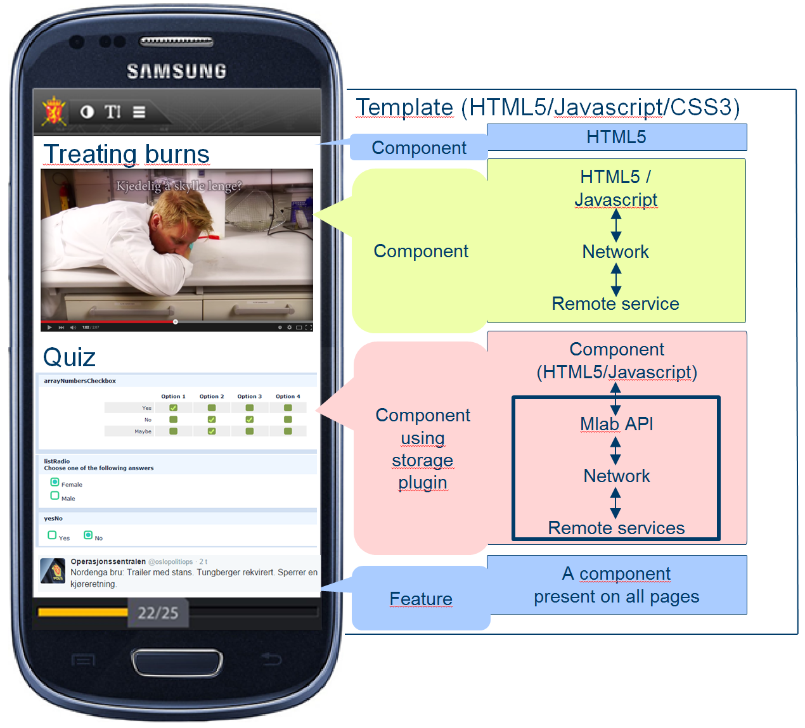
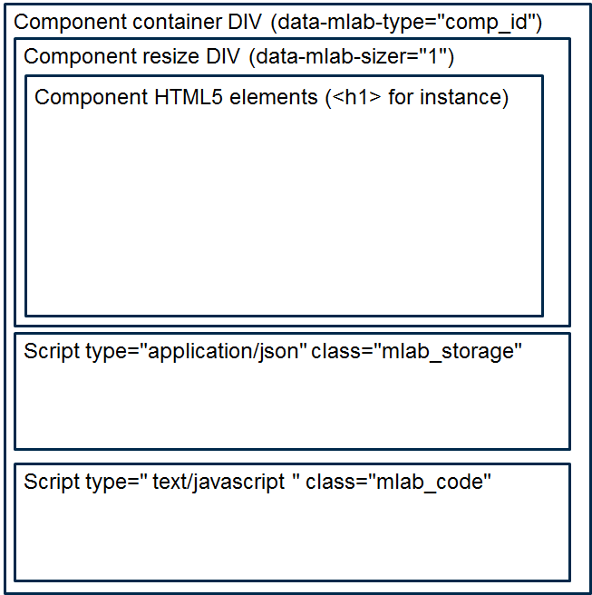

#Mlab App Builder: Template developers' guide

>Version: 1.0 (April 2016, first public release) 
Copyright: © Norwegian Defence Research Establishment (FFI) 2013 - 2016 
Initial author: Cecilie Jackbo Gran, Sinett 3.0, FFI 
Updating authors:  
Comment: _Only update the version number above when template specifications change_

## Who is this document for?

This document is for web designers and HTML/Javascript developers who wish to create templates for the Mlab app builder. It is assumed that the reader is familiar with general design rules for mobile apps as well as general web teknologies such as HTML5, Javascript and CSS.

### Additional documentation

In addition to this document you can also read more about how to create components for Mlab in the [Mlab editor - component development documentation](HOWTO - Component Development.md). In addition the following documents (requires access to IEEE Xplore) provide some background information on Mlab: [The Final Destination: Building Test Bed Apps for DIL Environments](http://dx.doi.org/10.1109/VTCSpring.2015.7146128) and [Distributing the disruption](http://dx.doi.org/10.1109/ICMCIS.2015.7158688). 

The Mlab source code will be available here: [https://github.com/Sinettlab/openMLAB/](https://github.com/Sinettlab/openMLAB/) 

For a complete overview of the whole Mlab ecosystem refer to "*From the death grip of PowerPoint to mobile freedom: The Mobile Learning App Builder (Mlab)*" (FFI Notat, Bergh, 2014).

### Template specific documentation:
 * [TEMPLATES REFERENCE - frontpage.html file.md](TEMPLATES REFERENCE - frontpage.html file.md)
 * [TEMPLATES REFERENCE - page.html file.md](TEMPLATES REFERENCE - page.html file.md)
 * [TEMPLATES REFERENCE - conf.yml file.md](TEMPLATES REFERENCE - conf.yml file.md)

The [Mlab source code](https://github.com/Sinettlab/openMLAB/) has a basic template that is a useful example to learn from, it is recommended that you look at the files that this template consists of in reference to this document.

This document **must** be read together with [Mlab explained.md](Mlab explained.md) which explains how Mlab works from template and  component designers/developers point of view. This is important to understand in order to develop components that fit in with the Mlab philosophy of re-use and extendability. This document (*HOWTO - Component Development.md*) will provide all the practical information required to actually develop a component. To do this you also need to refer to additional documentation about the files that make up a component and the Mlab APIs, these are listed above under [Additional documentation](#bookmark=id.ppcd6tm3t9ce).

## The role of the template illustrated and discussed

In the [Mlab explained.md](Mlab explained.md) document we discussed the different parts that make up an Mlab app. Before we get down to the nitty-gritty of making our own templates we shall now see what their relationship to components and the overall app building process is.

In the figure above some different types of *components* have been added to a *template*. These components are the building blocks of Mlab; without components app users would only see pages with headers and footers and nothing else. Without templates however, each component would look different and create major usability issues for app users in the final app. We can say that templates frame the components, and components frame different types of content, from plain text to interactive maps; from videos to quizzes. 

Components are formatted using CSS classes; but to ensure that components have a matching look the CSS rules for these classes must be part of the templates, and not each individual component. To support present and future components component developers should use standard generic classes that are defined in the [style specifications](TEMPLATES REFERENCE - CSS styling.md), the template designers then style these classes. 

**One should ideally have different templates for different app types; this way one can better support the app creators and app users by providing relevant navigation tools and formatting that matches the content in the best possible way.**

### App creation activities relevant to the template

As a template has to support Mlab apps both at design time and runtime it is worth going through briefly how the process works for creating, editing and running the app. The complete flow of the design time to runtime process will be like this:

1. App creator creates a new app from a template. 

  A folder structure for the new app is created and the template files, which can include CSS and Javascript files as well as the basic index.html (called frontpage.html in the template), are copied over to this new folder structure. When this is done the index.html file from this skeleton app is loaded via AJAX and Mlab prepares the DIV that has the "role='page'" for the app creator to add components to. 
  
  **Template relevance:** At this point not much, the app editing displays only the content of the "role='page'" DIV, i.e. the navigation tools are not show to the app creator at design time. Mlab adds the HTML that the component consists of inside 

1. App creator adds a *component* to the page.

  The screenshot in figure 2 above shows the foldable list of the components available for use in Mlab, a component is added by selecting it from this list. When added, Mlab adds a DIV element around the HTML5 that the component consists of, this DIV is used to manipulate the component (for drag'n'drop, etc). This container DIV will have a *data-mlab-type* attribute which tells us what component type it is, for instance the basic headline element is called "*h1*". In addition, if the component is set to resizable=true in the conf.yml file, then another intermediate resizing DIV is added between the container DIV mentioned above, and the internal content. This is used to manipulate the size of the visual elements (for instance scale a video or change the size of an image).
  
  If the component relies on any additional files (CSS styles or Javascript libraries) these are loaded into the browser. A script on the server is called through an AJAX call, and any such file dependencies are copied from the component folder into the relevant subfolder of the current app, this makes them available for the app at runtime.

  

  **Template relevance:** At this point any CSS rules whose selector(s) match elements in the component will be applied by the browser. These rules *may* be overwritten by component specific CSS. Although component developers are encouraged not to use custom CSS if at all possible it may be required by jQuery plugins for instance.

1. App is viewed at runtime (either in-browser preview window or as a compiled app)

  First Cordova loads the index.html file into a web viewer on the mobile device, or a new browser window opens up with the same file if you are previewing the app. Index.html will then load all the Javascript and CSS3 files that are linked from this page, this includes the template specific files plus any files that are required by any of the components in the app.
  
  Next the mlab.api global object is created, this is the Mlab API as discussed in the [frontpage.html](TEMPLATES REFERENCE - frontpage.html file.md#user-content-ref-use-mlabapi). This is then accessible to use by Javascript code in the template. Next the mlabInitialiseApp is called (if it exists in the template, it is optional), here the template can initialise its own variables, run Javascript code that manipulates the HTML DOM if required, initialise the mlab.api.navigation object if used., etc.

  Finally the content of the first page (stored in 000.html) is loaded and the app is ready to be used.
  
  **Template relevance:** Any elements outside the main page content (such as navigation buttons, etc.) is displayed in full and all the CSS styling will be applied both to the template content and the components on the page. In other word it is now that you see the full template implementation. In addition you now have access to Javascript and the [Mlab runtime API functions](Mlab API - runtime.md) which can be useful to perform Mlab/app specific actions.
  

#Practical design info

##How to create a template

1. Planning
 
    1. Start by drawing up a simple specification: What type of apps is this template for, who would use it?

    1. Decide on what you need to support apart from the content that will be available through components. Do you need navigation features? Do you need to have standard disclaimers built in? Are there any usability features you need, such as font size change? Should you have a help function?

    1. Look at existing templates, whether they are installed on your server, shared on Github or similar. Is there something already in existence that would do what you need to achieve, perhaps only requiring a change of logos, colours, etc? 

    1. If you find nothing that you can base your template on, it is still recommend that you look at a few examples to get an understanding of how to code a template.

    1. Draw a diagram of what the template area(s) that frame the content should look like at runtime/preview (at design time it is only the main content area that is visible).
    
    1. Look at some existing components to get an idea of how they should be styled using the standard Mlab classes hierarchy [described here](TEMPLATES REFERENCE - CSS styling.md). 

    1. Determine if you need any advanced functionality that you need Javascript to achieve (and not pure CSS rules) and/or if you need to use external Javascript/CSS libraries.

    1. Make sure you choose a unique name for your template. These unique names are used by Mlab to manage templates at designtime.

1. Putting together the template elements
  
  A template is made up of several HTML5, Javascript and CSS files plus images and configuration files. Some of these are required, others are optional. Some of these files are standard Mlab files that you simply copy into your template, others you create yourself, either from scratch or from existing files you amend. Together these files consitute the overall template which the app creator can use to create a new app, and the template frames the content (as mentioned before), without the app creator needing to worry about it.

    * Create the [conf.yml](TEMPLATES REFERENCE - conf.yml file.md) file (required)

      This [YAML format file](http://en.wikipedia.org/wiki/YAML) contains configuration information for the template. This includes best practices rules, name of the template, etc. All supported entries in this file are described [here](TEMPLATES REFERENCE - conf.yml file.md); go through this list and edit your conf.yml accordingly. It is worth copying an existing example to get the right syntax. To validate your YAML syntax use [http://codebeautify.org/yaml-validator](http://codebeautify.org/yaml-validator) or [http://yaml-online-parser.appspot.com/](http://yaml-online-parser.appspot.com/).

    * Create the [frontpage.html](TEMPLATES REFERENCE - frontpage.html file.md) file (required)
    
      This is the core file of the template, all pages in an app will be loaded into this HTML5 file at runtime and at design time a specially designated DIV is used by Mlab to display any components that the app creator adds to the app. It contains the layout that frames the content of the components in an app as well as links to Javascript, CSS and media files. See the detailed description of this file to learn more about what it should contain.

    * Edit the [page.html](TEMPLATES REFERENCE - page.html file.md) file (required, but existing example may be enough)
    
      This should contain only the basic outline of a HTML5 file, in most cases you can simply use a copy of this file from an existing template.
    
    * Create the thumbnail.jpg file (required)
    
      This is a small image of what the template looks like. 300 x 500 pixels is recommended, it will be scaled to this size on the fly if it uses a different size. This image is displayed in the list of templates available to give the app creator a basic idea of what the template looks like. In addition to the name of the template this will help them select the right template for their project. You may therefore want to create a simplified version that gives a good idea of different elements it contains rather than just taking a screenshot of a page and resizing it.

     * Copy standard stylesheet files (not required, but highly recommended)
     
       It is recommended to use a so called [reset stylesheet](http://meyerweb.com/eric/tools/css/reset/) as the first CSS file in your template, and additionally use the main jQuery Mobile stylesheet. The former ensures that all web viewers display the app template the same by setting line spacing, font type, etc., to standard values. The latter provides the basic jQuery mobile features by styling buttons, check boxes etc. in a way that makes it easy to use on a smaller screen. See the end of this section about naming and placement these files.
     
     * Create the core stylesheet files (required)
     
       By convention Mlab places the majority of the styling for the template in two main files, with two subsidiary files if required. The styling needs to carefully consider the special requirements of the Mlab app editor development, as discussed above, however the actual styling itself is no different than standard web based styling. See the end of this section about naming and placement these files.
       
        * [style.css (and possibly, style_dt.css and/or style_rt.css) ](TEMPLATES REFERENCE - CSS styling.md)
        
          The custom styling for the template (but not the components, see below) goes in this file, the files with the _dt and _rt suffixes are for design time and runtime specific styling if and when required. This file should contain all the styles required to position the template elements, assign the design (colurs, font sizes, etc) and so on.
          
        * [mlab_component.css](TEMPLATES REFERENCE - CSS styling.md)
        
          This is the styling for all Mlab components, read the [Mlab CSS documentation](TEMPLATES REFERENCE - CSS styling.md) carefully to learn how to use this file. 
          
          **Additional stylesheets can also be added if required, Mlab/Cordova apps follow general web page rules, so as long as the CSS file links are added to [frontpage.html](TEMPLATES REFERENCE - frontpage.html file.md) then these stylesheets will be added to the compiled app.**
       
     * Copy the core Javascript files (required)
      
       Three standard jQuery libraries must be included as a minimum: The main jQuery library (jqueryXXX.js), the UI library jquery-uiXXX.js and the mobile apps functionality in jquery-mobileXXX.js (XXX is the version numbers which obviously varies) See the end of this section about naming and placement these files.
          
       Then there is the [Mlab API file](Mlab API - runtime.md) called mlab.api.js which is also required for all templates. This contains custom functionality related to Mlab that many components will make use of. You can also use the functions here in [frontpage.html](TEMPLATES REFERENCE - frontpage.html file.md) for custom functionality such as navigating between pages. 
       
       **This API file is likely to be updated over time to add new features and/or fix bugs. You should use the latest version when you create a new template, you may also need to copy this file manually to your existing templates and then update the template by [deploying it again](#user-content-ref-deploy)**
     
     * Create any additional Javascript files for custom functionality/copy additional libraries (optional)
       
       As with CSS files, there is no limit to the number of Javascript files you can add to a project. So if you create a very advanced template you may want to put this functionality in separate Javascript files, rather than have it all in the frontpage.html file. You may also use additional Javascript libraries that need to be copied into the template, for instance jQuery plugins. See the end of this section about naming and placement these files.
     
     * Add any media files required (optional)
     
       If you use any additional media files you should also copy these into the relevant directories in your template (sSee the end of this section about naming and placement these files). However, for image files we strongly recommend that these are embedded in stylesheets and/or HTML5 files as [data URIs](https://developer.mozilla.org/en-US/docs/Web/HTTP/data_URIs). Data URIs allow a text version of a file to be embedded in the main file, this reduces the chance of files missing from the final compiled app and makes it easier to update the template in the future. It also reduces the risk of incorrect paths to images resulting in broken links.
    
##Naming and placing files
       
  Javascript and CSS libraries frequently have version numbers in the file name. These embedded version numbers (such as jquery.mobile-1.4.0.css) makes it easy to distinguish between different version when you use these libraries. However, it is recommended that this is removed and a standard Mlab naming convention is used. This means that updated files can be applied to a template (and potentially to existing apps based on the template) without requiring editing of the frontpage.html (or index.html) file. If you follow the Mlab convention the files should have this naming format: *library-sublibrary-title.ext*. For example will the jQuery mobile library be called *jquery-mobile.js* whereas the CSS for a mobile plugin called dropdown would be *jquery-mobile-dropdown.css*.
  
  The layout of a template directory is as follows:
  
|Path|Explanation|
| ------------- | ------------- |
|/|The root folder, put frontpage.html, page.html, conf.yml and thumbnail.jpg here|
|/css|All stylesheet files should go in here|
|/css/img|Images for stylesheets go in here (but see about [media files and data URIs](#user-content-ref-mediafiles) for why this should be avoided if possible|
|/img|Any images not applied by CSS, such as logos, go here|
|/js|Javascript files go here|
|/media|Additional media files, for instance videos|
      
##Deploying a template 

Templates must be uploaded as a ZIP archive using the built in _Add Template_ facility in the _App Admin_ section of Mlab. When "zipping" the files one must do this from **inside **the folder that contains the files, i.e. **no** folders should be surrounding the first set of files. Sub-folders (such as *css* or *js*) are allowed and must be used as described below. The name of the ZIP file (excluding the .zip extension) must match the name of the template itself. So if the template is named _mytemplate_, then the filename should be _mytemplate.zip_.

