#Mlab App Builder User Manual

>Version: 1.0 (April 2016, first public release) 
Copyright: © Norwegian Defence Research Establishment (FFI) 2013 - 2016 
Initial author: Arild Bergh & Cecilie Jackbo Gran, Sinett 3.0, FFI 
Updating authors:  
Comment: _Only update the version number above when Mlab features change_

**This is a basic manual that will provide a brief walkthrough of the features of Mlab and how to use them.**

*The mention of a feature in this document does not imply or guarantee that this feature is implemented at the current time!*

##What is Mlab?
Mlab is an app creation framework and eco-system that enables non-programmers to create mobile apps and to distribute these apps through private app markets. Mlab is a framework as it facilitates ​the creation, distribution and maintenance of apps (and the content in those apps). At the same time it is ​an eco-system because it can be extended by (web) designers, researchers and programmers, for the benefit of those who have knowledge, skills and experience to share, but do not have the development skills to create apps from scratch.

The key aspects of Mlab that differentiates it from other app builder tools is that it is very extensible via components and templates (see below) as well as server based code that is run when certain actions take place. This means that parts of the app can consist of automatically generated content, in combination with manually entered content. All apps are created from individual HTML5 pages together with Javascript and CSS source files as well as media files such as videos or images. These pages are built up of Mlab components that are added to an Mlab template, both of which are also HTML5/Javascript/CSS3 based. The pages in the app are compiled using the open source tool Cordova. This tool can compile HTML5 pages into an app for a number of smartphone/tablet operating systems such as Android, iOS and Windows Phone. 

It is important to stress that Mlab components can be highly interactive, despite using HTML5 there is no limitation to information only apps. Furthermore, through the Cordova framework Mlab apps can access a number of smartphone facilities such as GPS or text messaging to interact with the user.

##Mlab areas
Although Mlab facilitates the easy editing of potentially very complex apps for smart devices, the Mlab App Builder has a neat and compact set of features divided in two user areas and only three different page types (excluding login and welcome pages). 

The first area is the main app editing area, this is available to all app creators (the users who will be using Mlab to edit apps). This consists of only two interactive web pages, one where they see a list of all the apps they have access to and where they can create a new app, send apps to the market, create new versions, etc. The second page is the main app editing page, this is where app creators do the editing of the app; add pages, add components to a page, add content to components, etc. 

The other area is the admin area which achieves all management funtions in only one pahge type. This area has two levels, regular admin and system admin. The regular administrator can edit database information about users and user groups, categories, components and templates, **but only for the groups they have been assigned to by a system administrator**. In addition they can send apps to the app market and withdraw/delete these same apps, again only apps belonging to groups they are assigned to. The system administrator can do everything that the regular admin can do, but for everything/everyone that is recorded in the system.

#Areas common to all users
##Navigating through Mlab
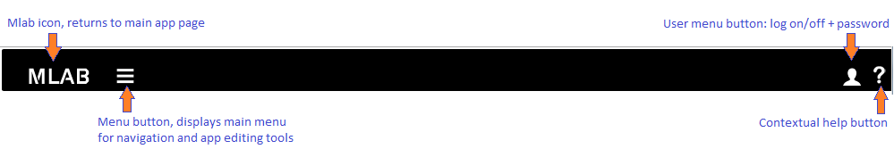

On all pages there is a menu bar at the top of the page, this will let you navigate to different parts of Mlab. The main menu is not available until you have logged in.

##Start page before logging in
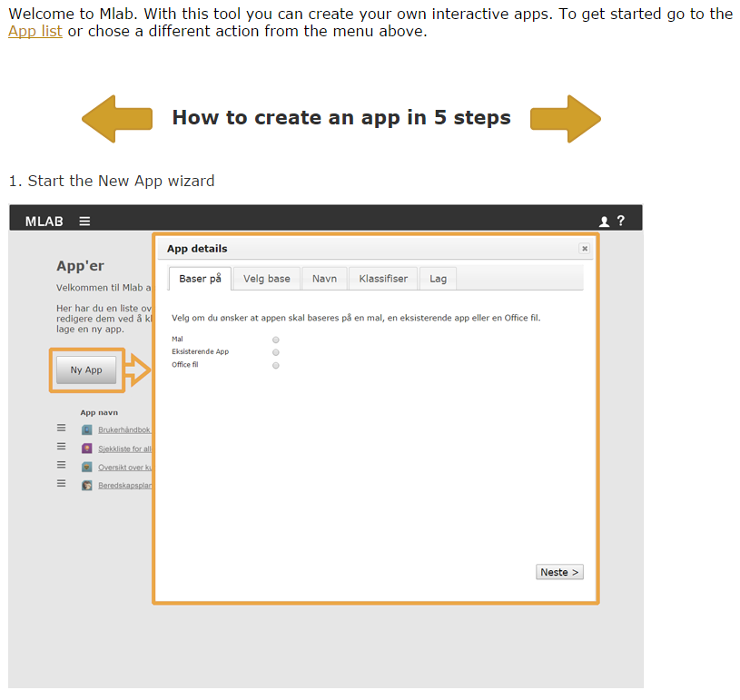

The initial page (before login) explains the steps required to create an app. Apart from login and help there are no actions available here.

##Logging in
Login is straight forward, go to http://mlab_url_com/login (replace mlab_url_com with your own server URL) or click on the "Login" menu that appears when you click on the user menu button on the menubar. Enter the email address you were set up with and your password. *If you don't have access you must contact an administrator to get an account.*

##Start page after logging in
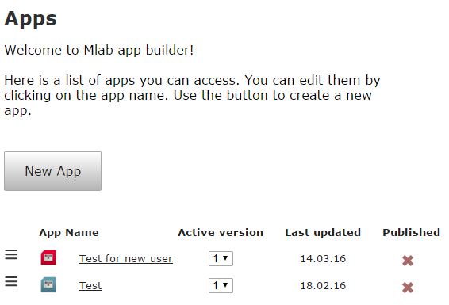

The first page displayed for all users after they log in, regardless of whether they are admin or not, is the app list, this will list all apps that the currently logged in user has access to.

#Admin areas/pages

The admin pages are divided into three sections, each with multiple tabs, providing easy access to relevant and related data editing. The three sections are available from the main menu dropdown list and are as follows:
 * App admin (leads to *Categories, Components, Templates*, explained further down in this document)
 * User admin  (leads to *Users, Groups*, explained further down in this document)
 * System admin (leads to *Categories*, explained further down in this document)

##Groups and access explained
The core role of the admin user, apart from approving or rejecting apps for inclusion in the (mil-)app market, is to set users' access to different features of Mlab. This includes the access (or not) to admin areas, as well as acess to individual components, templates, apps and categories. Access rights are always set through the membership of groups. Let us say that a user *Matt* belongs to groups *All* and *Teaching*, and user *Camilla* belongs *All* and *Admin*. If you then have created 4 apps, where app 1 and 3 belongs to the groups *All* and app 2 belongs to *Teaching* and app 4 belongs to *Admin*. Matt can then see apps 1, 2 and 3; whereas Camilla can see apps 1, 3 and 4.

##Groups and access editing
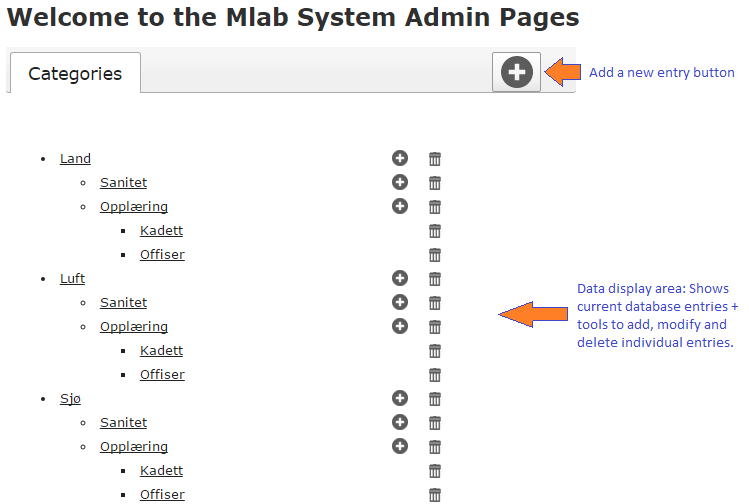

All admin pages have similar features. At the top you have a row of tabs, one for each type of data you can work with, each tab has a "add new entry" button, clicking on this will bring up a small dialog box to edit the new entry. When you click on add user for instance, a dialog box like the one below comes up. You just enter the relevant information (Mlab will prompt you if you leave out a required field) and click save. If you do not want to add the new entry, just press the "Esc" button on your keyboard or click the close button (**X**) in the top right hand side of the dialog box. 

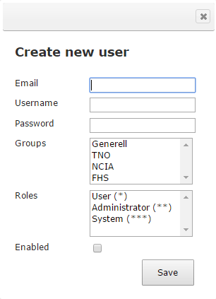

<h2>Admin sub sections explained</h2>
  * Groups: This is, as explained above, the key means of limiting access to different components, templates, categories and apps. You can create 
  * Users
  * Categories: Categories are used to classify an app so that the app end users (those that will eventually install and use the apps on their smart devices) can find apps that are relevant to them
  
  
  * Components
  * Templates

#App editing areas/pages
The app editing has, as mentioned before, two pages. The first one is the app list seen in the image shown in the start page section above. 

##App list, actions available
This option is available from a button above the app list:

 * Create new app

   This will start the "New App wizard" which will let you choose what to base the app on (a template, an existing app or a Word/PowerPoint file), then will request information such as app name and description, categories it belongs to and the icon to use as a representation of the app on the smart devices where it will later be installed.

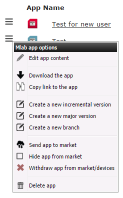

The remaining options are available from a popup menu shown when you click on the menu icon outside an app name in the app list (see illustration above):

 * Edit app content

   Opens up the app editing page, see below for more details.
 * Download the app

   Compiles the app in the background and then provides a link to downloads the app to install it on a local smart device (used for debugging purposes).
 * Copy link to the app

   Same as previous, but then copies the link to the clipboard so it can be pasted into an email, etc.
 * Create a new incremental version

   Creates a new version of the app with the version number incremented by 0.1.
 * Create a new major version

   Creates a new version of the app with the version number incremented by 1.
 * Create a new branch

   Copies the app to a new app with a new name and version number 1.0.
 * Send app to market [not implemented]

   This will first compile an app, and then upload the compiled app file to the app market. It will include additional meta data from the database entry for the app in question (such as name, description, categories, etc). After this action is concluded the app can be browsed and searched for on the app market, and users can install it on their devices (assuming they have access to the app market).
 * Hide app from market [not implemented]

   This will hide the app on the app market so no new users can install it, but it will still be working on devices where it has already been installed.
 * Withdraw app from market/devices [not implemented]

   This will hide the app on the app market so no new users can install it, in addition the app market will send a message to the app itself to uninstall when next time it connects to the app market.
 * Delete app [not implemented]

   If an app has **not** been sent to the app market *and* it has not been used to create new versions (regardless of whether it has been sent to the app market), then this will delete the app, both the database entry for it and all related files. This cannot be undone.

#App editor
The app editor page contains a lot of functionality, most of it hidden, to facilitate the easy creation of app. These are the 5 steps you need to follow in order to create an app.

1. **Start the "New App" wizard from the app list. Once the wizard is completed the app will be opened for editing.**
  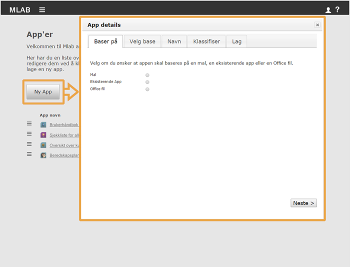

2. **Click on a component to add it to the current page**
  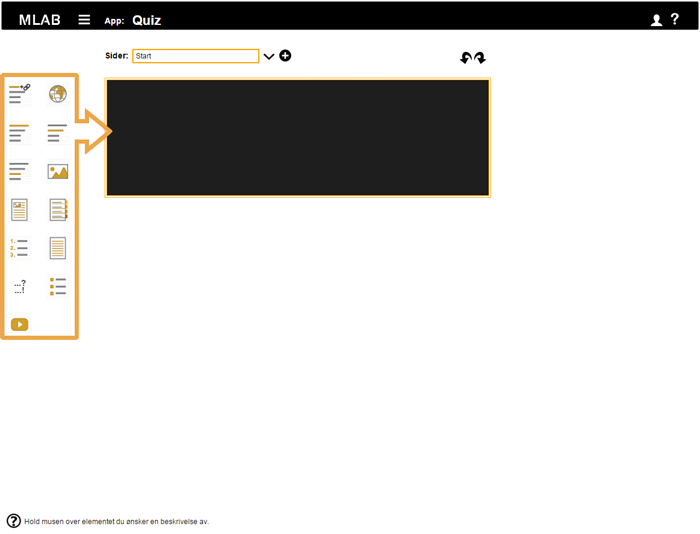

3. **Editing content, and optionally, any settings for the component**
  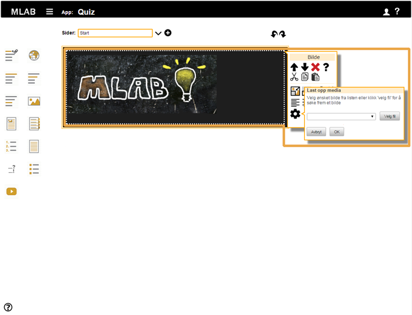

4. **Add additional components and pages to the app until it is finished, up to 999 pages are supported. Pages can be added by clicking the plus sign to the right of the name of the current page.**
  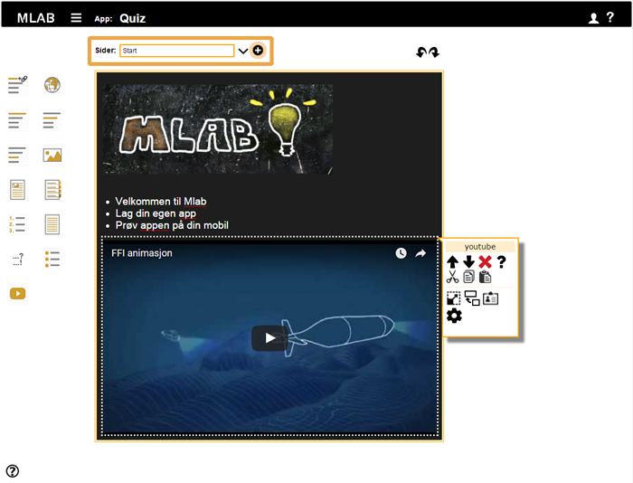

5. **Build the app and try it on your mobile or tablet**
  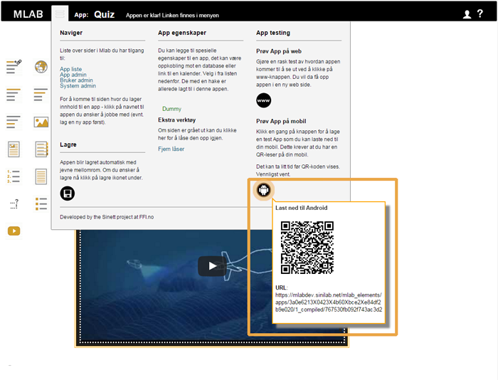
