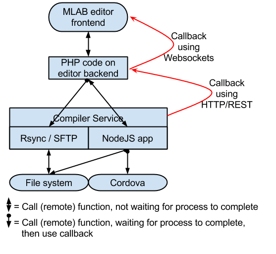
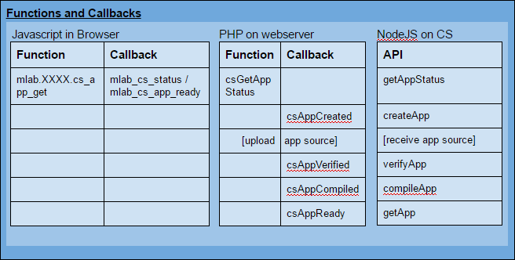

#Mlab compiler service - API and callbacks

>Version: 1.0 (April 2016, first public release)<br>
Copyright: © Norwegian Defence Research Establishment (FFI) 2013 - 2016<br>
Initial author: Arild Bergh, Sinett 3.0, FFI<br>
Updating authors: <br>
Comment: _Only update the version number above when compiler API changes_

# Background

MLAB is using the Cordova framework which takes an HTML5 app (consisting of HTML/CSS/ Javascript + media files) and compiles this to a native app for a wide range of mobile operating systems. It does this by creating a skeleton app that bootstraps a web viewer and then load the HTML5 files so it can be run on mobile devices such as Android and iOS. As MLAB is meant to provide a simple way for regular users to create apps in a web browser, a key challenge is to provide a seamless way to compile the HTML5 apps that the user has created into apps on the different platforms supported by Cordova.

Sinett will use a "compiler service" (CS) for this purpose, this service will be developed in NodeJS and will run on the server that undertakes the compilation, presenting a very simple API through HTTP to the MLAB builder. This service will NOT require any database access, it relies on the file system / Cordova file structure.

# Compiler Service data flow

All API calls will return an immediate response, callback functions will be specified by the client in the call and are used to send actual data back whereas the initial API call always returns TRUE with one exception. This exception is getAppStatus which is used to find out the current status of the app on the CS. Given the architecture of MLAB these are steps in this process:

1. In the web browser the MLAB editor uses AJAX to send a request to the PHP backend on the MLAB editor server, as a part of this it specifies the callback name to use.

   More than one PC can use compiler service at same time, and it may be that same login is used on more than one PC, or that one PC has more than one tab opened. We therefore prefix all connections between PHP editor backend and NodeJS compiler service with the unique ID generated for the different tabs on the web client. Thus, all invocations of PHP functions from the frontend need to send the window UID as first param, listening clients of the websocket are then stored in a JS object with uid as key. On the MLAB editor server, apps are stored in folders called {version}_compiled/{platform}_{checksum}.{ext} where ext = .apk or .ipa, the other variables comes from the Mlab editor database & user input.

2. The PHP function sets a flag and spawns a new instance and returns true to the calling web page.

3. The spawned process calls the relevant API function on the CS, as a part of this it specifies the callback URL to use.

4. The API function on the CS spawns the relevant process and returns true the calling PHP function.

    1. When the spawned process is completed, returns data to PHP function.

    2. The earlier spawned PHP function returns data to browser using websockets.

5. The PHP function returns true to the calling Javascript function.



The flow of these calls are shown in the figure above.

The API (and related data storage on the server running the PHP code) is designed so that the MLAB editor frontend can access the functionality it requires with a single call, in other words we do away with a format of connect, request function, close connection. 

The CS will not have any knowledge about users, access rights, the app market, etc., it simply handles the compilation process and the related file management tasks. However, it will use a single passphrase that is stored on both server and exchanged with each API call to ensure that the system should be granted access. Without this anyone could use any server for compilation purposes. 

### **Supporting non-blocking PHP calls**

PHP does not support non-blocking calls, i.e. natively it will not return control to the calling web browser until all code is executed. In order to return control immediately and then continue with the compilation work a workaround is required. We will use *nohup* (starts a process without waiting for it to complete) and *cURL* (loads a web or PHP page). In this way we trigger a separate PHP function which will have access to all the environment variables (parameters.yml, etc).

We need to set up the Symfony route in /app/config/security.yml so it does NOT require login (although the page will be loaded from within the original PHP environment it will lose the cookie/session data when calling the page via cURL). 

This new "web page" will need to know only three things, the unique id of the web browser window that we generate when an app builder window is opened, the user id of the current user and the app id of the app to be compiled.

Data will be sent back to the original web page using web sockets, what to send and where will be stored in a MySQL database. The unique browser window ID (which is also used to lock files) is used to determine the channel/chat room to use.

### **Reducing compilation requests**

The following will be implemented in order to avoid requesting compilation of the app if it has not changed or if different users on different connections want a copy:

1. A new *compiled* field will be added to the *app* table. This will contain the MD5 checksum of the folder where the app source code is stored when it was last compiled. The PHP functions will first get the checksum of the app source code and compare to this, if it matches it will just send this file to the browser.

2. When the app file is returned from the CS, it will be stored locally on the webserver in a folder called /compiled, which is on the same level as the /www folder.

3. The checksum of current app source code is submitted to the CS, if another user has requested compilation the CS can then just return the file without further ado.
 
### **File structure**

The CS will have one directory tree on the CS server where files should be placed according to app_id and version. The app_id = the unique reverse domain name assigned to each app, for instance , no names are used, the version is as specified by the user and stored in the MLAB backend database. The CS expects to find these files in a directory tree like this:

*app_root/app_id/app_version*

## **API overview**

Below is an overview of the function names in the three different environments; Javascript in the browser, PHP on the web server and NodeJS on the compiler server. The callbacks are specified in the originating call, so no hard coding is required on the receiving end. For Javascript to PHP this will be a string which specifies the first parameter sent back to the open Websocket, here we use a SWITCH statement to execute the relevant code. From NodeJS to PHP we'll use a custom header called Callback to specify what URL to call, in addition a 202 status is returned, this is the correct status for a REST request that is asynchronous.

Initially the MLAB frontend only uses a single call to the webserver, csAppGet. The PHP function on the back end then takes care of everything that is required to obtain the compiled app, gradually moving down in a hierarchy of functions. As it calls on different functions it will send back update messages to the front end using Websockets until in the end .



### **API functions**

The functions are listed in the order of usage as specified in the table above. See [File structure](#heading=h.ksrggd1lord7) for details on the variables app uid and app version which are used throughout.

*getAppStatus(passphrase, [app_uid], [app_version], [platform])*

>**Description:** This function is used to request relevant status about one or more apps. 

>**Internal actions:** It should obtain the information described in the return and send it back as an JSON structure. **If no ID is specified it should send back info for all versions of all apps. If no version is specified it should send back info for all versions of specified app. If no platform is specified it should send back info for all platforms.**

>**Return:** This call is not asynchronous. JSON structure: This can be an associative array of arrays (app uid and version is keys for 1st and 2nd level respectively), single associative array (app version is key) or single entity, depending on what is requested. These are the members (Please note: The keys below are the value of the variable followed by a sub level object, NOT the name of the variable followed by the value!):
```JSON
{
  app_uid (uid, e.g. no.ffi.sinett.appname): {
    app_version (float): {
    app_name: string,
    platform_name: {
      compiled: bool,
      compiled_date: date,
      checksum: md5 checksum
      }
    }
  }
}
```

>Using this structure means that one can directly access info rather than having to iterate through lists (the vast majority of times this call will be about state of the current app). This would be a valid call for instance:
```JSON
if (var[curr_app_id][curr_app_version]["ios"].compiled_date > D) {
  blah blah
}
```

*createApp(passphrase, app_uid, app_version, tag)*

>**Description:** This function is used to tell the CS about a new app, or a new version of the app that is being created. The **tag** is used by the PHP server and is echoed back to the calling server.

>**Internal actions:** It should check if the app/version exists or not, if it does not exist it should create it using Cordova's *create* function. 

>**Return:** True

>**Callback**: When task is done it calls /php.server/callback/csAppCreated, parameters are passphrase (loaded from local settings file), *app_uid* (uid sent in the original call), *app_version* (version sent in the original call), reult (true of successful, otherwise false), tag (same as the tag parameter supplied in the URL from Mlab);

*Uploading files*

>**Description:** To compile an app, the HTML5, js, css and other media files are transferred to the compiler service. Separate to the API functions will be a file upload facility to send these files from the MLAB backend to the CS. 

>**Internal actions:** For the sake of efficiency this will be done using existing cross platform utilities such as RSYNC or SFTP. For the initial version only RSYNC will be supported. In practical terms this means that the PHP code on the MLAB backend server initiates a local system call which is executed synchronously until all files have been uploaded. At this point no calls to the NodeJS CS server are issued. The rsync module should be password protected and access should be limited by ip-address. 

>**Return:** Output from RSYNC.

*verifyApp(passphrase, app_uid, app_version, checksum, tag)*

>**Description:** This function is used to tell the CS that an upload has been done and ask it to verify the checksum of the /www directory content. The actual upload will be done through rsync. This is required so that the MLAB builder knows that it can safely ask files to be compiled etc. (more than one person might work on an app and initiate compilations at different stages)..

>**Internal actions:** It should check if the app/version exists and that the contents of the /www directory matches the checksum supplied. 

>**Return:** True

>**Callback**: When task is done it calls /php.server/callback/csAppVerified with parameters passphrase (loaded from local settings file), app_uid, app_version, checksum, result (if checksum matches it should return *true*, otherwise *false*), tag (same as the tag parameter supplied in the URL from Mlab).

*compileApp(passphrase, app_uid, app_version, checksum, platform, tag)*

>**Description:** This will initiate a compilation of the app from CS. checksum = the file content checksum as per previous function, platform = name of platform to compile for (see connect for possible values), callback = URL to call when the file is ready.

>**Internal actions:** It should check if the app/version exists and the checksum matches what is supplied (can use same functions as uploadVerify), if all these criteria are fulfilled then it will check if the latest version is already compiled (so need to store code checksum and version number together with the app file), if not it will compile it. When done it will call the callback URL (with the URL of the file to download as the GET parameter).

>To avoid two users compiling an app at the same time this will set a flag in the root folder of the app_id/version path, if this is set it will loop until it is removed or we have a timeout situation, and then return info as if it had compiled it itself.

>**Return:** True

>**Callback**: When task is done it calls /php.server/callback/csAppCompiled. Parameters are passphrase (loaded from local settings file), app_uid, app_version, checksum (of app directory, as in earlier calls), checksum_exec_file (checksum of file that is output from compiler), platform, result (outcome of compilation, true or false), tag (same as the tag parameter supplied in the URL from Mlab).

*getApp(passphrase, app_uid, app_version, checksum, platform)*

>**Description:** This function is used to request a compiled app from CS. checksum = the file content checksum as per previous function, platform = name of platform to compile for (see [Compilation Service configuration](#heading=h.1wsclrrnvqen) for list of possible values).

>**Internal actions:** It should check if the app/version exists and the checksum matches what is supplied (can use same function as verifyApp).

>**Return:** This call is not asynchronous. If all the criteria above are fulfilled then it will return the app file, otherwise it will return a JSON structure with error information.

*getAppChecksum(passphrase, app_uid, app_version, platform)*

>**Description:** This function is used to request the checksum of a compiled app from CS. platform = name of platform to compile for (see [Compilation Service configuration](#heading=h.1wsclrrnvqen) for list of possible values).

>**Internal actions:** It should check if the app/version exists and calculate the md5 checksum of the compiled file.

>**Return:** This call is not asynchronous. If all the criteria above are fulfilled then it will return the app checksum, otherwise it will return a JSON structure with error information.

##Sending apps to the MLAB App market

*This will be done from the MLAB backend server, thus no functionality is required for this on the CS.*

##Compilation Service configuration

A local configuration file stores the following information:

* cordova_bin_path: Path to Cordova executables used to create, build, etc., apps.
* cordova_apps_path: Path to root of Cordova apps data, see [File structure](#heading=h.ksrggd1lord7) above.
* cordova_user: User name to execute Cordova executables as, used on servers where Cordova requires a user home directory.
* passphrase: unique string to allow access.
* platform: name of the platform the remaining information relates to. Can be one of the following (always lower case): android, ios, windows, blackberry, tizen. Further names may be specified later.
    * platform specific info, paths etc.

### **Example configuration file**

>```JSON
{
	cordova_bin_path: "/opt/cordova/bin/",
	cordova_apps_path: "/var/mlab_elements/apps/",
	key: "sinett_is_cool",
	ios: {
		sdk_path: "/opt/ios/sdk/"
	},
	android: {
		sdk_path: "/opt/android/"
	}
}
```

For additional references see:
 * [https://www.openshift.com/blogs/day-27-restify-build-correct-rest-web-services-in-nodejs](https://www.openshift.com/blogs/day-27-restify-build-correct-rest-web-services-in-nodejs)
 * [http://blog.smartbear.com/apis/understanding-soap-and-rest-basics/](http://blog.smartbear.com/apis/understanding-soap-and-rest-basics/) 
 * [http://blog.miguelgrinberg.com/post/writing-a-javascript-rest-client](http://blog.miguelgrinberg.com/post/writing-a-javascript-rest-client) 
 * [http://www.sanwebe.com/2013/05/chat-using-websocket-php-socket](http://www.sanwebe.com/2013/05/chat-using-websocket-php-socket)
