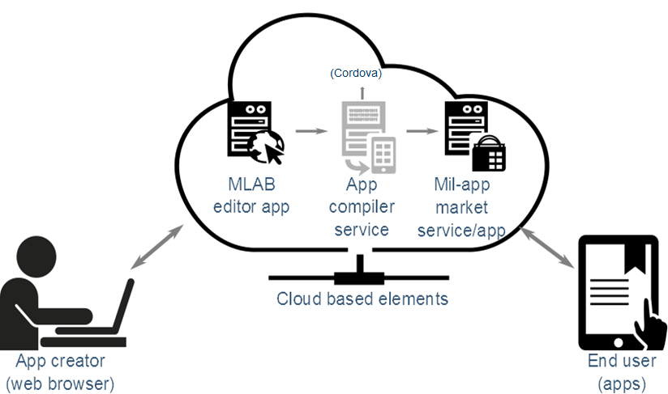
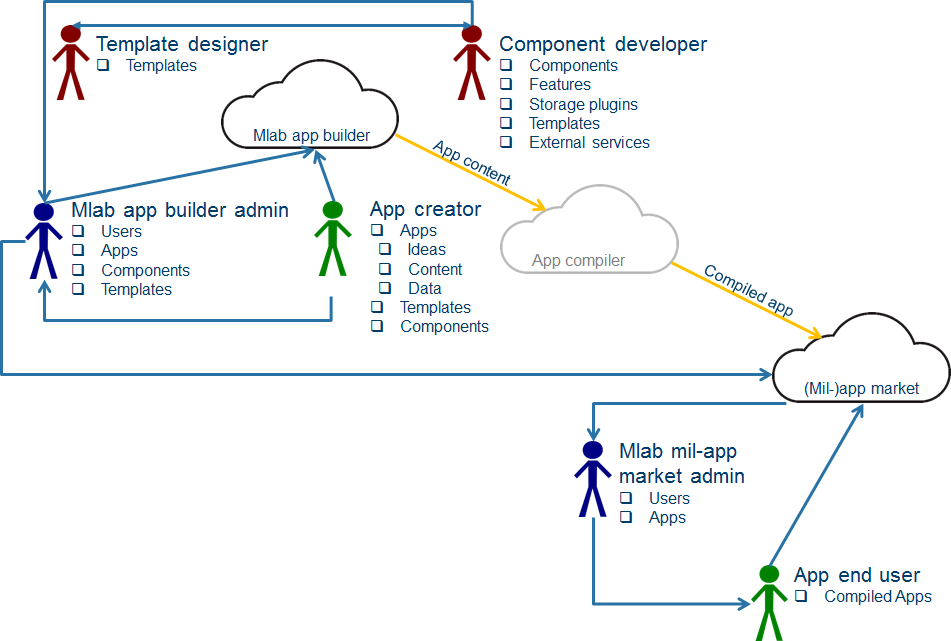
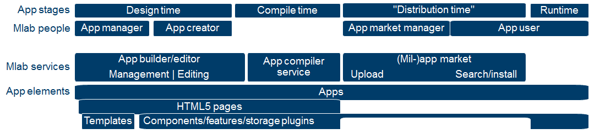

# Mlab explained for template and component developers

>Version: 1.0 (April 2016, first public release) 
Copyright: © Norwegian Defence Research Establishment (FFI) 2013 - 2016 
Initial author: Arild Bergh, Sinett 3.0, FFI 
Updating authors:  
Comment: _Only update the version number above when component OR template specifications change_

## Who is this document for?

This document is for HTML/Javascript developers who wish to create components for the Mlab app builder. It is assumed that the reader is familiar with HTML5, Javascript and CSS, and has at least a passing understanding of PHP or other server side scripting languages.

## Mlab overview

Mlab is an app creation **framework** and **eco-system** that enables non-programmers to create mobile apps and to distribute these apps through private app markets. Mlab is a framework as it facilitates the creation, distribution and maintenance of apps (and the content in those apps). At the same time it is an eco-system because it can be extended by (web) designers, researchers and programmers, for the benefit of those who have knowledge, skills and experience to share, but do not have the development skills to create apps from scratch.

*Figure 1: Mlab app workflow*

The key aspects of Mlab that differentiates it from other app builder tools is that it is very extensible via components and templates (see below) as well as server based code that is run when certain actions take place. This means that parts of the app can consist of automatically generated content, in combination with manually entered content. All apps are created from individual HTML5 pages (see next section for a definition of terms) together with Javascript and CSS source files as well as media files such as videos or images. These pages are built up of components that are added to a template. The pages in the app are compiled using the open source tool [Cordova](http://cordova.apache.org/). This tool can compile HTML5 pages into an app for a number of smartphone/tablet operating systems such as Android, iOS and Windows Phone. 

It is important to stress that Mlab components can be highly interactive, despite using HTML5 there is no limitation to information only apps. Furthermore, through the Cordova framework Mlab apps can access a number of smartphone facilities such as GPS or text messaging to interact with the user.

## Summary of Mlab terms/concepts

The Mlab services (and this documentation) use a few core terms to refer to people who have different roles in the Mlab eco-system, various stages in the app life cycle and the elements that make up the apps. It is worth making sure that you understand these terms before you continue.

### Technical terms

These terms are fairly basic, but it is worth being clear about exactly how they are used in the Mlab documentation.

* **HTML5** is really the name of the (currently) latest standard for the language use to make web pages. In this paper it will be used to mean components, pages in the app or templates for apps that also include Javascript code and CSS3 styling to make them fully interactive. In Mlab we have HTML5 pages as well as HTML4 components and templates.

* **Compiled app** is the executable app that is installed on an *app user's* (see below) mobile device. It is compiled by sending all the HTML5 pages and related files (images, videos, etc) to the Mlab *compilation service* (see below) [Cordova](http://cordova.apache.org/).

* **Version numbers** are used in the templates and components source code to indicate to the *Mlab app administrator* (see below) which version of the component/template they are working with. Apps are also assigned 

### People

There are a number of different people that will interact in the Mlab eco system, some for a short while to provide a service, others as long term participants that create apps or use the compiled apps. A simple overview of who is involved and their relationship to the three _Mlab services_ (see below) is pictured here.

*Figure: Mlab eco system: roles and interactions*

* **User groups**: All users that access the Mlab _app builder_ (see below) belongs to one or more user groups. These groups are used by the _Mlab administrator_ (see below) to decide who has access to different _apps_, _templates_ and _components_  (see below for these definitions).

* **Template designer:** Before an app can be built a designer will usually provide a design for what a particular app type should look and feel/work like, this design will be applied to a HTML5 based *template *(see below). 

* **Template developer**: Not all template designers implement their own design, they may therefore need the help of a developer to turn the design into HTML5 pages and possibly program additional functionality (in Javascript) in the HTML5 based *template *(see below). 

* **Component developers** are responsible for creating the *components* (see below) used by the *app creators* (see below) to create a page in an app.

  _Templates_ (see below) are more dependent on designers than programmers, and _components_ (see below) are more dependent on programmers than designers, but there is considerable overlap between the roles of the designer and the developer in these two tasks.

* **The app creator** is the person using Mlab to create an app. The app creator is anyone with access to the _Mlab app editor_ (see below), it can be an instructor, a researcher or someone else who wants to build an app. 

* **The Mlab administrator** deals with accepting and publishing (sending apps to the app market) apps as well as giving user groups access to components, templates and individual apps.

* **The Mlab app market administrator** deals with maintaining the app market, they can recall an app or set up and remove users access to groups which in turn decides who can access different apps.

* **App user** / **end user** is the person that will be using the _compiled app_ that has been developed by the _app creator_. App users will typically get apps by downloading them from the _app market_.

### Mlab services (see also [App creation stages](#bookmark=id.3b7nxjv4rczu))

* **(App) builder/app editor** is the core part of the Mlab eco system. It has two parts to it, one is the tool that the _app creator_ (see above) uses to create individual apps. This is often referred to as the **app editor**. The other part is the admin tools used by an _Mlab administrator_ (see above) to determine who has access to what in Mlab.

  The app builder/editor is a web based app that requires a general web server that supports PHP and MySQL (or a similar database). It will only work in newer browsers such as Google Chrome or Mozilla Firefox.

* **The (app) compiler service** is an automated service without a user interface that takes care of turning the Mlab app HTML5 pages into a standalone app that can be installed on an app user's mobile device. The Mlab app builder communicates automatically with this server through a network connection. This service requires a NodeJS server. Physically this can be the same server as the one running the app builder/editor server, or it can be somewhere different. Multiple app builder/editor services could pot6entially share a joint compilation service if required.

* **(Mil-app) market** is the Mlab equivalent of Apple's App Store or Google's Play store.This is where the apps are made accessible by _app creators_ (through _app administrators_) for _app users_ to search for, browse and install apps. Unlike the official app markets there are no reviews and/or ratings here. It is assumed that users need the app to perform their jobs, so the focus is on categorisation and descriptions. The point is that is must be easy to browse and search for apps by categories or keywords, this hopefully means that it is easier to find apps relevant to your field of work.

### App elements

An app created in Mlab is made up of different elements, however all these elements are based on HTML5 and/or Javascript and possible CSS3 code.

* **App** is the term to indicate the final product, an executable app running on iOS, Android, etc. However it also used to discuss the editable collection of HTML5 pages 

* **(App) pages** are the individual HTML5 pages that make up an app. There are two different types of pages in an app, the first (index.html) page is loaded by the Cordova framework when the app is run 

* **Templates** contain the core styles and layout of an app in the form of one HTML5 file for the front page of the app, and another file for all other pages. The HTML in these two files is supported by Javascript and CSS files as per usual for HTML5 pages. App templates usually include the headers and footers of an app (areas where you put the organisation logo, tools for navigating through the app, menu buttons, etc) and the font family/size/colour to use throughout the app. 

* A **component** is one or more valid HTML5 statements, including Javascript, formatted using CSS. At its simplest it can be a single HTML5 compatible element, such as "\<h1>Headline</h1>". This particular example creates a paragraph that is a headline. However, it can be much more complex than this through the use of compound HTML5 elements and Javascript. This means that a component can have actions and interactions (for instance displaying a message when it is clicked on) in addition to the content itself. Components support basic inheritance, that is, a new component can inherit all the features of an existing component and then add their own on top of this.

* **Features** Some components may not have a visual interface or they are used throughout an app, and not only in a single page. An example of the former may be a component with the ability to track how students interact with an app. For example, how much time do they spend on each page, and in what order did they read the pages? This type of information is invaluable when it comes to improving apps and would be a useful component for an app creator to have at their disposal. An example of the latter could be a social media feature which displays a constant stream of news on top of the current page, regardless of which page is being viewed.

* **Storage plugins** A component may need to be able to store data, either locally on the mobile device, or on a remote server. Rather than each component writing its own code to deal with this, there will be a specific component type referred to as "storage plugin"; this has no HTML5 code, it is just [a Javascript file](COMPONENTS REFERENCE - code_rt.js file.md). As the name implies, this is not a standalone component, but a type of component that the RT API uses to store data off the mobile device it is running on. If a component wishes to store data but does not specify a storage plugin, then the data will be stored locally on the mobile device using [HTML5 storage facilities](http://en.wikipedia.org/wiki/Web_storage). A key aspect of the storage plugin is that if the mobile device has intermittent network access, then data will be stored locally until such a time that access is restored. Data should therefore not be lost due to missing network connections.

### App stages

There are different stages that an app passes through, some of them are automated, some involve the *app creator*. **A template or component can query the api function ****[getMode(**)](#bookmark=id.3jeszrpg3jwo)** to get the current execution environment, this will .**

* **Design time** (DT) is when the app creator is building an app using Mlab. Typically this stage requires a lot of interaction with the app creator in terms of requesting input and showing them how the component will look in the app once it is ready. For instance, a Google map might be added. The app creator must specify where it should be centred and how large it should be. The resulting map will then be displayed in real time in the web browser so the app creator can confirm that everything is correct (i.e Mlab components are [WYSIWYG ](https://en.wikipedia.org/wiki/WYSIWYG)("What You See is What You Get")). This WYSIWYG feature will in this case require the generation of some code on the fly to support the correct display of the map at design time as the _googlemap_ component shows. 

* **Compile time** (CT) refers to the point when the app is prepared (by Mlab) for compilation into a standalone app (by Cordova). At this point some elements in a component may need to be generated, for instance an index page with a list of all the pages in the app is created by taking the titles of the individual HTML5 pages and add them to a single pre-defined HTML element so the user can click a link to jump to that location in the app.

    * **The precompilation process** is a term that refers to what Mlab does with the HTML5 pages that have been created by the _app creator_ during the _design time_ editing process before it sends these pages to the _compilation service_. In this stage Mlab executes any scripts that are linked to the individual components and allow these scripts to update the HTML5 code in the page. This is a very powerful feature as it means components are not limited to what HTML5/Javascript offers, it can also use server side scripts/applications to manipulate the content. This can range from downloading an address book or a file for offline access to adding custom, native code to the app, for instance a Java applet that monitors sensors on the smart device.

* **Runtime** (RT) is the time when the final, compiled app is being used by the intended end user on that end user's mobile device(s). At this point there are no more changes to the app itself, but the app may collect and/or display data to the user based on how it was built by the app creator. The components can also access the runtime API which facilitates data storage, etc.

From the component developers' point of view, RT represents the final "product" whereas DT and CT are the stages where HTML/Javascript code may be generated in response to settings and (in the case of DT) app creator input.

A visual representation of how (most of) the different parts that make up the Mlab eco-system connects and overlaps can be seen in the figure below. For the sake of clarity we have added a 4th "pseudostage" called distribution time, this is when the app is available in the app market, but before it is downloaded by the end user.

